# Claude Code Agentic Patterns - Documentation

> Complete reference for understanding and implementing agentic patterns with Claude Code CLI

---

## Quick Navigation

| Document | Content |
|----------|---------|
| [01-TERMINOLOGY](01-OFFICIAL-TERMINOLOGY.md) | Claude Code components (Subagent, Command, Skill, Hook) |
| [02-ARCHITECTURE](02-LAYER-ARCHITECTURE.md) | 5-Layer system architecture |
| [03-PATTERNS-ANTHROPIC](03-ANTHROPIC-RESEARCH-PATTERNS.md) | 6 theoretical patterns from Anthropic |
| [04-PATTERNS-CLAUDE-CODE](04-CLAUDE-CODE-PATTERNS.md) | 7 implementation patterns for Claude Code |
| [05-USE-CASES](05-USE-CASES.md) | **Real-world validated use cases** |
| [06-PATTERN-SELECTION](06-PATTERN-SELECTION-GUIDE.md) | Decision tree for choosing patterns |
| [07-MAPPING-GLOSSARY](07-MAPPING-GLOSSARY.md) | Cross-reference and definitions |
| [08-STYLE-GUIDE](08-STYLE-GUIDE.md) | Colors, emojis, Mermaid standards |

---

## Emoji Quick Reference

```
┌─────────────────────────────────────────────────────────────────────────────┐
│                           EMOJI QUICK REFERENCE                             │
├─────────────────────────────────────────────────────────────────────────────┤
│                                                                             │
│  COMPONENTS                          CLAUDE CODE PATTERNS                   │
│  ──────────                          ────────────────────                   │
│  👤 User                             🏎️ Direct Execution                    │
│  🦴 Slash Command                    🎪 Subagent Orchestration              │
│  🧠 Main Agent                       🚂 Parallel Tool Calling               │
│  📚 Skill                            🧬 Master-Clone                        │
│  🤖 Subagent                         🧙 Wizard Workflow                     │
│  📤 Task tool                        🖥️ Multi-Window Context                │
│  🔌 MCP Tool                         🎓 Progressive Skills                  │
│  💾 State                            🎛️ Programmatic Orchestration          │
│  🪝 Hook                                                                    │
│  ❓ AskUserQuestion                  ANTHROPIC RESEARCH PATTERNS            │
│                                      ───────────────────────                │
│  STATUS                              ⛓️ Prompt Chaining                     │
│  ──────                              🚦 Routing                             │
│  ✅ Success    ❌ Error              🛤️ Parallelization                     │
│  ⚠️ Warning    🔄 Progress           🎭 Orchestrator-Workers                │
│  ⏳ Pending    ⏭️ Skip               👨‍🔧 Evaluator-Optimizer                 │
│                                      🐔 Autonomous Agents                   │
│  PHASES                                                                     │
│  ──────                                                                     │
│  🏗️ Phase 1 (Foundation)                                                   │
│  🔗 Phase 2 (Formatting)                                                    │
│  📝 Phase 3 (Content)                                                       │
│  🔮 Phase 4 (Synthesis)                                                     │
│                                                                             │
└─────────────────────────────────────────────────────────────────────────────┘
```

---

## Two Pattern Classifications

```
┌─────────────────────────────────────────────────────────────────────────────┐
│                     AGENTIC PATTERNS ECOSYSTEM                              │
├─────────────────────────────────────────────────────────────────────────────┤
│                                                                             │
│  ┌─────────────────────────────┐    ┌─────────────────────────────┐        │
│  │  ANTHROPIC RESEARCH (6)     │    │  CLAUDE CODE IMPL (7+1)     │        │
│  │  ─────────────────────────  │    │  ─────────────────────────  │        │
│  │  • ⛓️ Prompt Chaining       │    │  🏎️ Direct Execution (base) │        │
│  │  • 🚦 Routing               │    │  • 🎪 Subagent Orchestration│        │
│  │  • 🛤️ Parallelization       │    │  • 🎓 Progressive Skills    │        │
│  │  • 🎭 Orchestrator-Workers  │    │  • 🚂 Parallel Tool Calling │        │
│  │  • 👨‍🔧 Evaluator-Optimizer   │    │  • 🧬 Master-Clone          │        │
│  │  • 🐔 Autonomous Agents     │    │  • 🖥️ Multi-Window Context  │        │
│  │                             │    │  • 🎛️ Programmatic Orch.    │        │
│  │  Source: "Building          │    │  • 🧙 Wizard Workflows      │        │
│  │  Effective Agents" paper    │    │  Source: Claude Code CLI    │        │
│  └─────────────────────────────┘    └─────────────────────────────┘        │
│                                                                             │
│                         ↓ MAPS TO ↓                                         │
│                                                                             │
│  ┌─────────────────────────────────────────────────────────────────┐       │
│  │                    CLAUDE CODE COMPONENTS                        │       │
│  │  ─────────────────────────────────────────────────────────────  │       │
│  │   🤖 Subagent  │  🦴 Slash Command  │  📚 Skill  │  🪝 Hook     │       │
│  └─────────────────────────────────────────────────────────────────┘       │
│                                                                             │
└─────────────────────────────────────────────────────────────────────────────┘
```

---

## At a Glance: Key Concepts

### Components (What you build)

| Component | Emoji | Definition | File Location |
|-----------|-------|------------|---------------|
| **Subagent** | 🤖 | Specialized agent spawned via `Task` tool | `.claude/agents/*.md` |
| **Slash Command** | 🦴 | User-invokable command starting with `/` | `.claude/commands/*.md` |
| **Skill** | 📚 | Reusable capability the agent possesses | `.claude/skills/*.md` |
| **Hook** | 🪝 | Shell command triggered by events | `.claude/settings.json` |

### Layers (How they interact)

```mermaid
%%{init: {'theme': 'base', 'themeVariables': {'lineColor': '#64748b'}}}%%
flowchart TB
    classDef user fill:#6366f1,stroke:#4f46e5,stroke-width:2px,color:#ffffff
    classDef main fill:#8b5cf6,stroke:#7c3aed,stroke-width:2px,color:#ffffff
    classDef subagent fill:#ec4899,stroke:#db2777,stroke-width:2px,color:#ffffff
    classDef tool fill:#f59e0b,stroke:#d97706,stroke-width:2px,color:#ffffff
    classDef state fill:#10b981,stroke:#059669,stroke-width:2px,color:#ffffff

    subgraph L1["👤 User Layer"]
        U["👤 User Input"]:::user
    end

    subgraph L2["🧠 Main Agent Layer"]
        MA["🧠 Claude Code Main Agent"]:::main
    end

    subgraph L3["🔀 Delegation Layer"]
        CMD["🦴 Slash Commands"]:::user
        SKILL["📚 Skills"]:::main
    end

    subgraph L4["🔌 Execution Layer"]
        SA["🤖 Subagents"]:::subagent
        TOOLS["🔌 Tools"]:::tool
    end

    subgraph L5["💾 State Layer"]
        MEM["💾 Memory/Context"]:::state
        FILES["💾 File System"]:::state
    end

    U --> MA
    MA --> CMD
    MA --> SKILL
    MA --> SA
    MA --> TOOLS
    CMD --> SA
    SA --> TOOLS
    TOOLS --> FILES
    SA --> MEM

    style L1 fill:#e0e7ff,stroke:#6366f1,stroke-width:2px
    style L2 fill:#f3e8ff,stroke:#8b5cf6,stroke-width:2px
    style L3 fill:#fce7f3,stroke:#ec4899,stroke-width:2px
    style L4 fill:#fef3c7,stroke:#f59e0b,stroke-width:2px
    style L5 fill:#ecfdf5,stroke:#10b981,stroke-width:2px
```



### Critical Rule

> **🤖 Subagents cannot spawn other subagents.**
>
> All delegation must go through the 🧠 Main Agent.

---

## How to Read This Documentation

### If you're new to agentic patterns:
1. Start with [01-OFFICIAL-TERMINOLOGY](01-OFFICIAL-TERMINOLOGY.md)
2. Then [02-LAYER-ARCHITECTURE](02-LAYER-ARCHITECTURE.md)
3. Finally explore patterns as needed

### If you're choosing a pattern:
1. Check [05-USE-CASES](05-USE-CASES.md) for real-world examples
2. Use [06-PATTERN-SELECTION-GUIDE](06-PATTERN-SELECTION-GUIDE.md) for decision trees

### If you're implementing:
1. Check [04-CLAUDE-CODE-PATTERNS](04-CLAUDE-CODE-PATTERNS.md) for implementation details
2. Use [07-MAPPING-GLOSSARY](07-MAPPING-GLOSSARY.md) for term lookups

---

## Relationship Map

```mermaid
mindmap
  root((Agentic System))
    Components
      🤖 Subagent
        📤 Task tool spawns
        Autonomous execution
        Cannot spawn subagents
      🦴 Slash Command
        User invokes with /
        Triggers workflows
      📚 Skill
        Reusable capability
        Loaded on demand
      🪝 Hook
        Event-driven
        Shell commands
    Layers
      👤 User Layer
      🧠 Main Agent Layer
      🔀 Delegation Layer
      🔌 Execution Layer
      💾 State Layer
    Research Patterns
      ⛓️ Prompt Chaining
      🚦 Routing
      🛤️ Parallelization
      🎭 Orchestrator-Workers
      👨‍🔧 Evaluator-Optimizer
      🐔 Autonomous Agents
    Implementation Patterns
      🏎️ Direct Execution
      🎪 Subagent Orchestration
      🎓 Progressive Skills
      🚂 Parallel Tool Calling
      🧬 Master-Clone
      🖥️ Multi-Window Context
      🎛️ Programmatic Orchestration
      🧙 Wizard Workflows
```



---

## Cross-Platform Compatibility

These patterns originate from Claude/Anthropic but many apply across AI frameworks:

| Pattern | Claude | GPT Agents | Gemini ADK | LangGraph |
|:--------|:------:|:----------:|:----------:|:---------:|
| 🎪 Subagent Orchestration | ✅ | ✅ Handoffs | ✅ Multi-agent | ✅ Subgraphs |
| 🎓 Progressive Skills | ✅ | ❌ | ❌ | ❌ |
| 🚂 Parallel Tool Calling | ✅ | ✅ | ✅ ParallelAgent | ✅ Fan-out |
| 🧬 Master-Clone | ✅ | ✅ Dynamic | ✅ Custom | ✅ Send API |
| 🖥️ Multi-Window Context | ✅ | ⚠️ Sessions | ⚠️ ctx.state | ✅ Checkpointing |
| 🎛️ Programmatic Orchestration | ✅ | ✅ | ✅ Workflows | ✅ StateGraph |
| 🧙 Wizard Workflows | ✅ | ⚠️ | ✅ Tool Confirm | ✅ interrupt() |

**Legend:** ✅ Native | ⚠️ Partial | ❌ Not supported

> **Note**: 🎓 Progressive Skills uses Claude Code's unique `.md`-based skill system. Other frameworks have "tools" but not this pattern.

---

## Version & Sources

| Source | Version/Date | URL |
|--------|--------------|-----|
| Claude Code Docs | 2025 | https://docs.anthropic.com/en/docs/claude-code |
| Building Effective Agents | Dec 2024 | Anthropic Research Paper |
| Anthropic Cookbook | 2025 | https://github.com/anthropics/anthropic-cookbook |

---

*Last updated: 2025-11-26*
