# Layer Architecture

> Understanding the 5-layer system architecture of Claude Code agentic systems

---

## Overview

Claude Code operates through a layered architecture where each layer has specific responsibilities and communication patterns.

```
┌─────────────────────────────────────────────────────────────────────────────┐
│                         5-LAYER ARCHITECTURE                                │
├─────────────────────────────────────────────────────────────────────────────┤
│                                                                             │
│  ┌─────────────────────────────────────────────────────────────────────┐   │
│  │  👤 LAYER 1: USER LAYER                                             │   │
│  │  Human input, 🦴 /commands, natural language prompts                │   │
│  └────────────────────────────────┬────────────────────────────────────┘   │
│                                   │                                         │
│                                   ▼                                         │
│  ┌─────────────────────────────────────────────────────────────────────┐   │
│  │  🧠 LAYER 2: MAIN AGENT LAYER                                       │   │
│  │  Claude Code - orchestration, decision-making, routing              │   │
│  └────────────────────────────────┬────────────────────────────────────┘   │
│                                   │                                         │
│                    ┌──────────────┼──────────────┐                         │
│                    ▼              ▼              ▼                          │
│  ┌─────────────────────────────────────────────────────────────────────┐   │
│  │  🔀 LAYER 3: DELEGATION LAYER                                       │   │
│  │  🦴 Slash Commands, 📚 Skills - workflow definition                 │   │
│  └────────────────────────────────┬────────────────────────────────────┘   │
│                                   │                                         │
│                                   ▼                                         │
│  ┌─────────────────────────────────────────────────────────────────────┐   │
│  │  🔌 LAYER 4: EXECUTION LAYER                                        │   │
│  │  🤖 Subagents, 🔌 Tools - actual work execution                     │   │
│  └────────────────────────────────┬────────────────────────────────────┘   │
│                                   │                                         │
│                                   ▼                                         │
│  ┌─────────────────────────────────────────────────────────────────────┐   │
│  │  💾 LAYER 5: STATE LAYER                                            │   │
│  │  Memory, Files, Context - persistence and state management          │   │
│  └─────────────────────────────────────────────────────────────────────┘   │
│                                                                             │
└─────────────────────────────────────────────────────────────────────────────┘
```

---

## 👤 Layer 1: User Layer

### Purpose
Entry point for all interactions with the system.

### Components

| Component | Emoji | Description | Example |
|-----------|-------|-------------|---------|
| **Natural Language** | 👤 | Free-form requests | "Fix the authentication bug" |
| **Slash Commands** | 🦴 | Structured invocations | `/generate fr-FR` |
| **File References** | 📁 | Code/doc references | `@src/auth.ts` |

### Mermaid Diagram

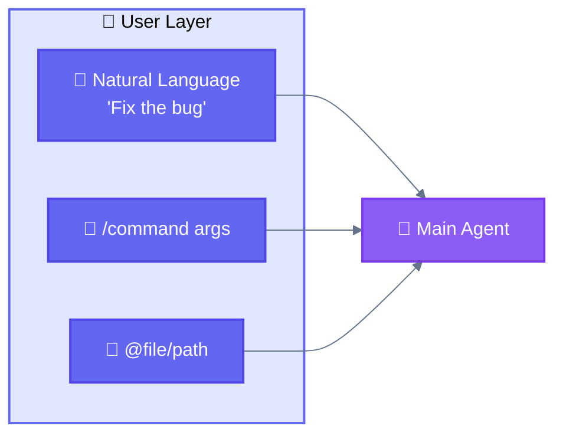

### Key Behaviors
- All input normalized before reaching 🧠 Main Agent
- 🦴 Slash commands expand to full prompts
- File references inject content

---

## 🧠 Layer 2: Main Agent Layer

### Purpose
Central orchestrator that interprets intent and coordinates execution.

### Responsibilities

| Responsibility | Description |
|----------------|-------------|
| **Intent Recognition** | Understand what user wants |
| **Pattern Selection** | Choose appropriate execution pattern |
| **Task Delegation** | Spawn 🤖 subagents or use 🔌 tools |
| **Result Synthesis** | Combine results into coherent response |

### Critical Rule

> **The 🧠 Main Agent is the ONLY entity that can spawn 🤖 Subagents.**
>
> 🤖 Subagents cannot spawn other subagents. All delegation flows through the 🧠 Main Agent.

### Mermaid Diagram

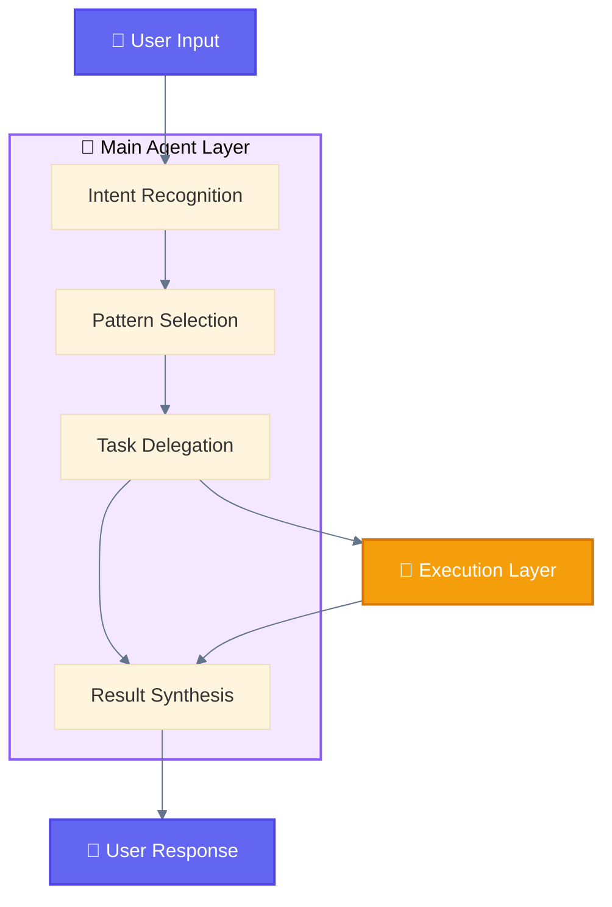

### Decision Points

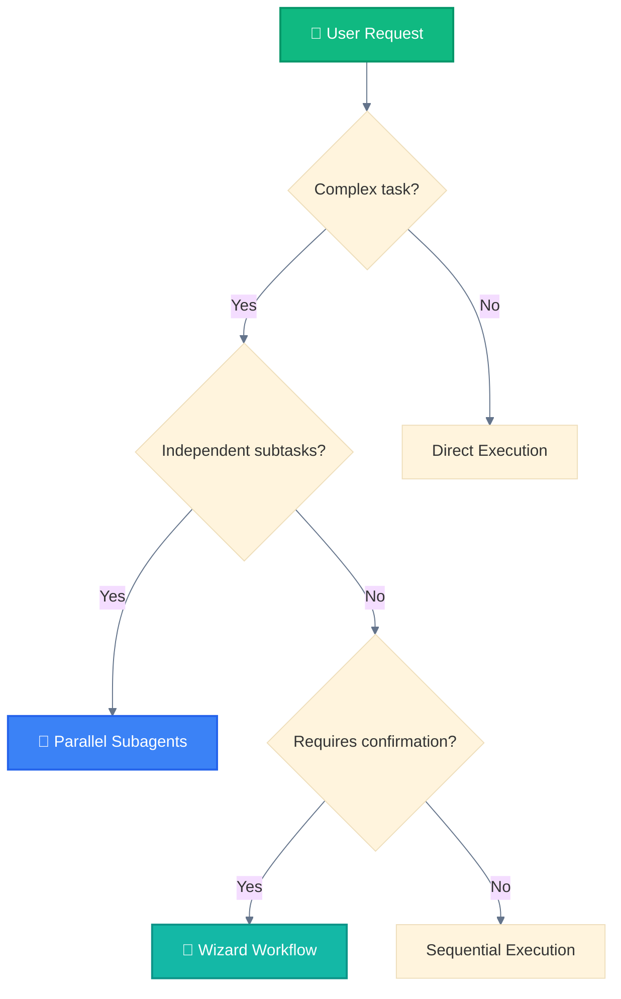

---

## 🔀 Layer 3: Delegation Layer

### Purpose
Defines workflows and provides reusable capabilities to the 🧠 Main Agent.

### Components

| Component | Emoji | Role | Triggered By |
|-----------|-------|------|--------------|
| **Slash Commands** | 🦴 | Define multi-step workflows | User `/command` |
| **Skills** | 📚 | Provide methodologies | Context matching |

### 🦴 Slash Command Flow

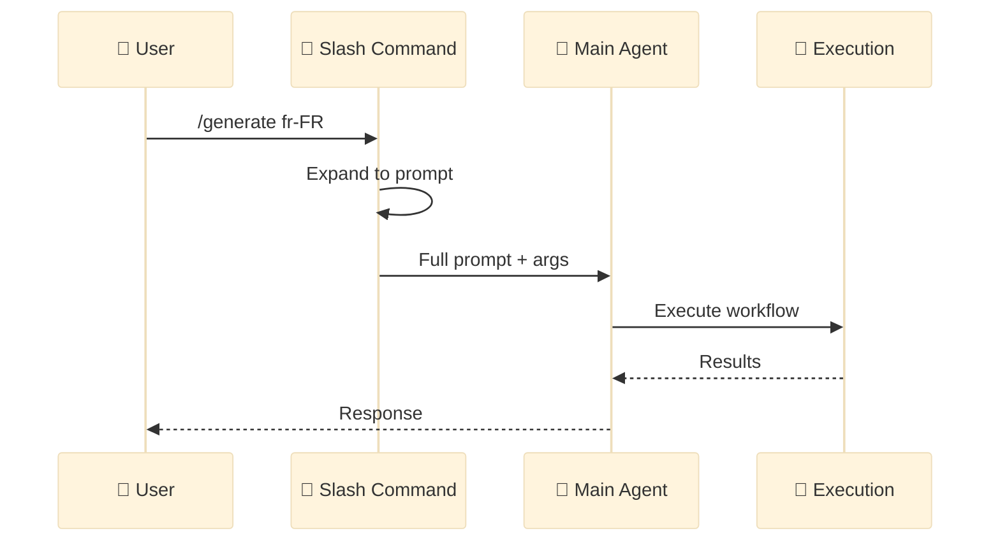

### 📚 Skill Loading

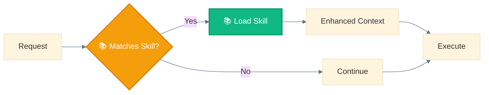

---

## 🔌 Layer 4: Execution Layer

### Purpose
Where actual work happens - code execution, file operations, API calls.

### Components

| Component | Emoji | Function | Spawned By |
|-----------|-------|----------|------------|
| **Subagents** | 🤖 | Autonomous task execution | 📤 Task tool |
| **Tools** | 🔌 | Direct operations | 🧠 Main Agent / 🤖 Subagents |

### 🤖 Subagent Lifecycle

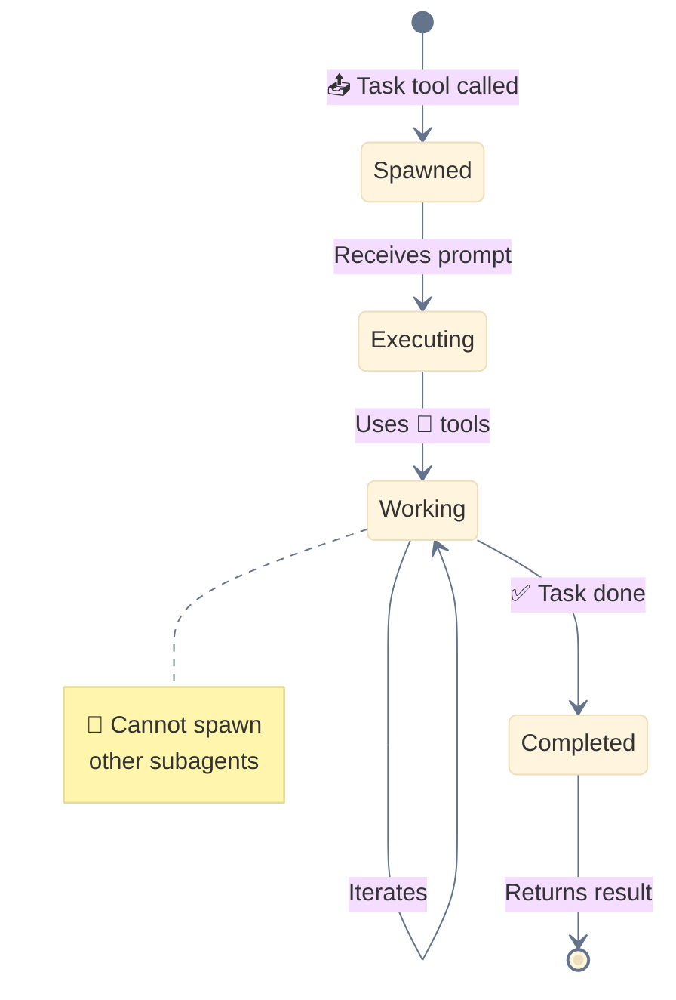

### 🔌 Tool Categories

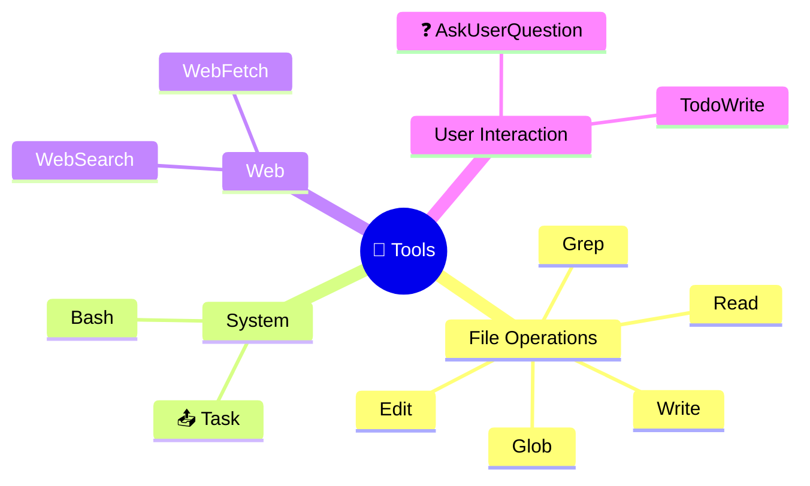

### 🚂 Parallel Execution

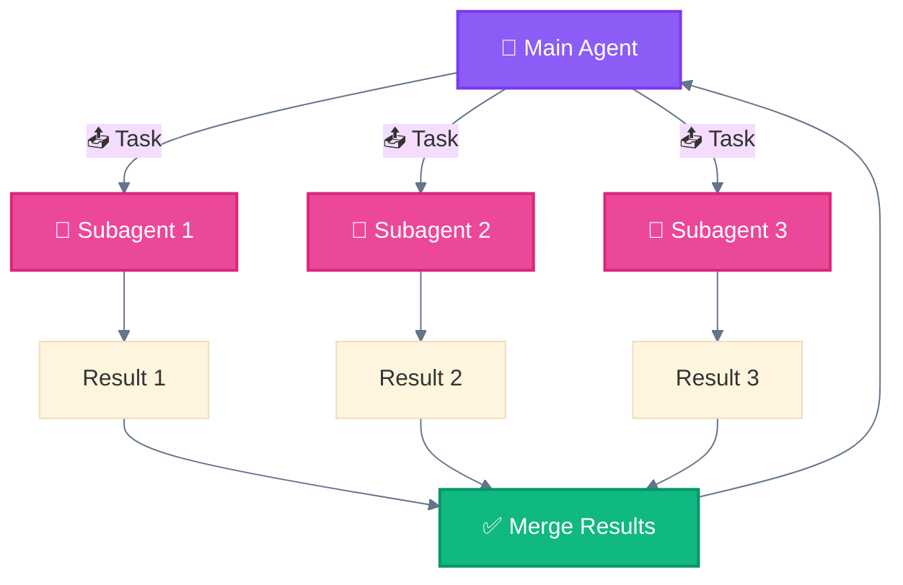

---

## 💾 Layer 5: State Layer

### Purpose
Persistence, memory, and context management across interactions.

### Components

| Component | Emoji | Type | Scope |
|-----------|-------|------|-------|
| **Memory** | 💾 | In-session context | Conversation |
| **Files** | 📁 | Persistent storage | Project |
| **CLAUDE.md** | 📋 | Project instructions | Project |
| **Checkpoints** | 🖥️ | Resume points | Workflow |

### 💾 State Flow

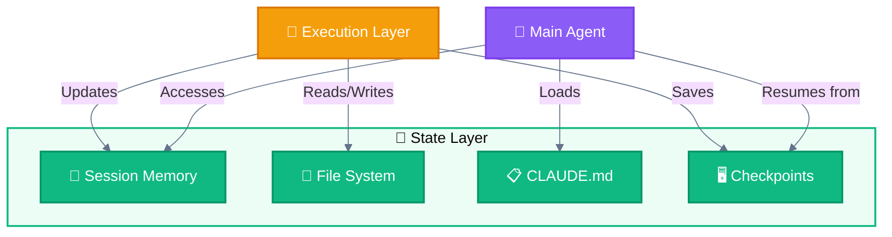

### 🖥️ Checkpointing for Long Workflows

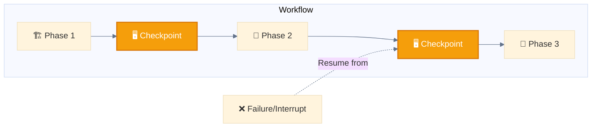

---

## Complete Layer Interaction

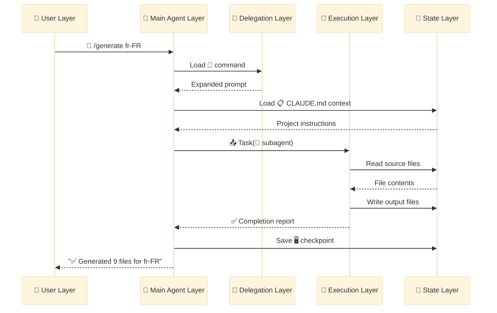

---

## Layer Responsibilities Matrix

| Layer | Emoji | Input | Process | Output |
|-------|-------|-------|---------|--------|
| **User** | 👤 | Human action | Normalize | Prompt/Command |
| **Main Agent** | 🧠 | Prompt | Orchestrate | Delegation calls |
| **Delegation** | 🔀 | Command/Context | Define workflow | Structured task |
| **Execution** | 🔌 | Task | Execute | Results |
| **State** | 💾 | Data | Persist | Stored state |

---

## Anti-Patterns

### ❌ Wrong: 🤖 Subagent Spawning 🤖 Subagent

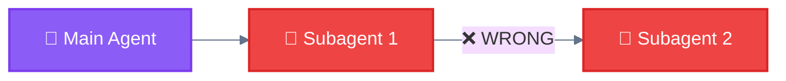

### ✅ Correct: 🧠 Main Agent Orchestrates All

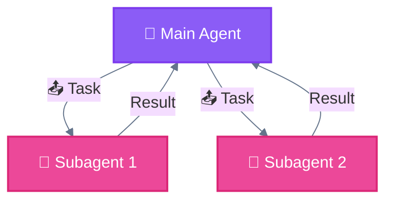

---

*See [03-ANTHROPIC-RESEARCH-PATTERNS.md](03-ANTHROPIC-RESEARCH-PATTERNS.md) for theoretical patterns →*
