<h1 align="center">Claude Code Agentic Patterns</h1>

<p align="center">
  <strong>Design patterns for building agentic AI systems with Claude Code CLI</strong>
</p>

<p align="center">
  <em>Curated collection of validated orchestration patterns from official Anthropic documentation</em>
</p>

<p align="center">
  
  
  
  
</p>

---

## Overview

```mermaid
mindmap
  root((Agentic Patterns))
    Components 4
      🤖 Subagent
      🦴 Slash Command
      📚 Skill
      🪝 Hook
    Anthropic Research 6
      ⛓️ Prompt Chaining
      🚦 Routing
      🛤️ Parallelization
      🎭 Orchestrator-Workers
      👨‍🔧 Evaluator-Optimizer
      🐔 Autonomous Agents
    Claude Code Impl 7
      🎪 Subagent Orchestration
      🎓 Progressive Skills
      🚂 Parallel Tool Calling
      🧬 Master-Clone
      🖥️ Multi-Window Context
      🎛️ Programmatic Orchestration
      🧙 Wizard Workflows
```



---

## Quick Start

| I want to... | Read this |
|--------------|-----------|
| **Learn the basics** | [01-OFFICIAL-TERMINOLOGY.md](01-OFFICIAL-TERMINOLOGY.md) |
| **Understand architecture** | [02-LAYER-ARCHITECTURE.md](02-LAYER-ARCHITECTURE.md) |
| **See real examples** | [05-USE-CASES.md](05-USE-CASES.md) |
| **Choose a pattern** | [06-PATTERN-SELECTION-GUIDE.md](06-PATTERN-SELECTION-GUIDE.md) |
| **Implement a pattern** | [04-CLAUDE-CODE-PATTERNS.md](04-CLAUDE-CODE-PATTERNS.md) |

---

## Two Pattern Classifications

This documentation covers **two complementary pattern sets**:

### Anthropic Research Patterns (6) - Theoretical

| Pattern | Description |
|---------|-------------|
| ⛓️ Prompt Chaining | Sequential steps, each feeding the next |
| 🚦 Routing | Direct inputs to specialized handlers |
| 🛤️ Parallelization | Execute independent tasks simultaneously |
| 🎭 Orchestrator-Workers | Central coordinator with specialized workers |
| 👨‍🔧 Evaluator-Optimizer | Iterative improvement via feedback loops |
| 🐔 Autonomous Agents | Self-directed with minimal human guidance |

> Source: Anthropic's "Building Effective Agents" (Dec 2024)

### Claude Code Implementation Patterns (7) - Practical

| # | Pattern | Description | Complexity |
|---|---------|-------------|:----------:|
| 1 | **🎪 Subagent Orchestration** | Delegate to specialized agents with isolated context | Medium |
| 2 | **🎓 Progressive Skills** | On-demand loading of modular capabilities | Medium |
| 3 | **🚂 Parallel Tool Calling** | Maximize performance with simultaneous execution | Low |
| 4 | **🧬 Master-Clone** | Dynamic self-spawning for independent domains | High |
| 5 | **🖥️ Multi-Window Context** | State persistence across context windows | High |
| 6 | **🎛️ Programmatic Orchestration** | Code-based agent control | Medium |
| 7 | **🧙 Wizard Workflows** | Multi-step with user confirmation | Medium |

---

## Components

| Component | Emoji | Location |
|-----------|:-----:|----------|
| **Subagent** | 🤖 | `.claude/agents/*.md` |
| **Slash Command** | 🦴 | `.claude/commands/*.md` |
| **Skill** | 📚 | `.claude/skills/*/SKILL.md` |
| **Hook** | 🪝 | `.claude/settings.json` |

```
.claude/
├── agents/           # 🤖 Subagent definitions
│   └── *.md
├── commands/         # 🦴 Slash Command definitions
│   └── *.md
├── skills/           # 📚 Skill definitions
│   └── skill-name/
│       └── SKILL.md
└── settings.json     # 🪝 Hooks configuration
```

---

## Documentation Structure

| File | Content |
|------|---------|
| [00-OVERVIEW.md](00-OVERVIEW.md) | Entry point, quick reference, emoji guide |
| [01-OFFICIAL-TERMINOLOGY.md](01-OFFICIAL-TERMINOLOGY.md) | Components: 🤖 Subagent, 🦴 Command, 📚 Skill, 🪝 Hook |
| [02-LAYER-ARCHITECTURE.md](02-LAYER-ARCHITECTURE.md) | 5-Layer system architecture |
| [03-ANTHROPIC-RESEARCH-PATTERNS.md](03-ANTHROPIC-RESEARCH-PATTERNS.md) | 6 theoretical patterns from Anthropic |
| [04-CLAUDE-CODE-PATTERNS.md](04-CLAUDE-CODE-PATTERNS.md) | 7 implementation patterns |
| [05-USE-CASES.md](05-USE-CASES.md) | Real-world validated examples |
| [06-PATTERN-SELECTION-GUIDE.md](06-PATTERN-SELECTION-GUIDE.md) | Decision trees for choosing patterns |
| [07-MAPPING-GLOSSARY.md](07-MAPPING-GLOSSARY.md) | Cross-reference & definitions |
| [08-STYLE-GUIDE.md](08-STYLE-GUIDE.md) | Colors, emojis, Mermaid standards |

---

## Key Concepts

### Critical Rule

> **🤖 Subagents cannot spawn other 🤖 subagents.**
> All delegation must go through the 🧠 Main Agent.

### Pattern Selection

```mermaid
flowchart LR
    START((Task)) --> D{Destructive?}
    D -->|Yes| WIZ[🧙 Wizard]
    D -->|No| C{Complex?}
    C -->|No| DIRECT[🏎️ Direct]
    C -->|Yes| I{Independent?}
    I -->|Yes| PAR[🚂 Parallel]
    I -->|No| SUB[🎪 Subagent]

    style WIZ fill:#14b8a6,color:#fff
    style PAR fill:#3b82f6,color:#fff
    style SUB fill:#ec4899,color:#fff
```



```
Simple Task (1 step)          → 🏎️ Direct execution
Medium Task (2-4 steps)       → 🎓 Progressive Skills
Complex Task (5+ steps)       → 🎪 Subagent Orchestration
Destructive Operation         → 🧙 Wizard Workflows (mandatory)
Long-Running (>10 min)        → 🖥️ Multi-Window Context
```

---

## Cross-Platform Compatibility

| Pattern | Claude | GPT Agents | Gemini ADK | LangGraph |
|:--------|:------:|:----------:|:----------:|:---------:|
| 🎪 Subagent Orchestration | ✅ | ✅ Handoffs | ✅ Multi-agent | ✅ Subgraphs |
| 🎓 Progressive Skills | ✅ | ❌ | ❌ | ❌ |
| 🚂 Parallel Tool Calling | ✅ | ✅ | ✅ ParallelAgent | ✅ Fan-out |
| 🧬 Master-Clone | ✅ | ✅ Dynamic | ✅ Custom | ✅ Send API |
| 🖥️ Multi-Window Context | ✅ | ⚠️ Sessions | ⚠️ ctx.state | ✅ Checkpointing |
| 🎛️ Programmatic Orchestration | ✅ | ✅ | ✅ Workflows | ✅ StateGraph |
| 🧙 Wizard Workflows | ✅ | ⚠️ | ✅ Tool Confirm | ✅ interrupt() |

**Legend:** ✅ Native | ⚠️ Partial | ❌ Not supported

> **Note**: 🎓 Progressive Skills uses Claude Code's unique `.md`-based skill system.

---

## References

| Resource | URL |
|----------|-----|
| Claude Code Docs | https://docs.anthropic.com/en/docs/claude-code |
| Agent SDK | https://docs.anthropic.com/docs/en/agent-sdk |
| Building Effective Agents | Anthropic Research Paper (Dec 2024) |
| Anthropic Cookbook | https://github.com/anthropics/anthropic-cookbook |

---

<p align="center">
  <sub>Built with Claude Code | Based on official documentation | November 2025</sub>
</p>
