<div align="center">

# Agentic AI Systems 🐔

<strong>Workflows & Agents for AI orchestration | Explained simply</strong>

<sub>Mermaid diagrams 📊 • Clear examples 💡 • Chicken metaphors 🐔🐦
Because complex patterns deserve simple explanations.</sub>


<!-- Credibility -->
<a href="https://docs.anthropic.com/en/docs/claude-code">
  
</a>
<a href="https://www.anthropic.com/research/building-effective-agents">
  
</a>
<a href="https://github.com/hesreallyhim/awesome-claude-code">
  
</a>

<br/>

<!-- Stats -->


</div>

---

## Why This Repo? 🪺

Building effective AI agents requires proven patterns, not guesswork.

This repository distills **official Anthropic documentation** into actionable designs:

| What you get | Why it matters |
|--------------|----------------|
| 📊 **Mermaid diagrams** | See the architecture, don't just read about it |
| 💡 **Clear examples** | Copy-paste ready, not abstract theory |
| 🗺️ **Decision guides** | Know which pattern fits your use case |
| 🐔 **Chicken metaphors** | Remember patterns, not jargon |

*Why chickens? Because 🐔 Main Agent spawning 🐦 Subagents
is way easier to remember than "hierarchical agent orchestration".*

---

## Overview

```mermaid
mindmap
  root((Agentic Systems))
    Baseline 1
      🏎️ Direct Execution
    Workflows 5
      ⛓️ Prompt Chaining
      🚦 Routing
      🛤️ Parallelization
      🦑 Orchestrator-Workers
      🩻 Evaluator-Optimizer
    Agents 1
      🐉 Autonomous Agents
    Components 4
      🐦 Subagent
      🦴 Slash Command
      📚 Skill
      🪝 Hook
    Mechanisms 2
      📚 Progressive Skills
      🎛️ Programmatic Orchestration
```



---

## Quick Start

| I want to... | Read this |
|--------------|-----------|
| **Learn the basics** | [Agentic Systems Overview](concepts/README.md) |
| **Understand architecture** | [5-Layer Architecture](implementation/architecture/README.md) |
| **See real examples** | [Use Cases](guides/use-cases/README.md) |
| **Choose a pattern** | [Selection Guide](guides/README.md) |
| **Implement workflows** | [Workflows](concepts/workflows/README.md) |
| **Implement agents** | [Agents](concepts/agents/README.md) |
| **Learn components** | [Components](implementation/components/README.md) |
| **Look up terms** | [Glossary](reference/glossary.md) |

---

## Agentic Systems

> **Agentic Systems** = Umbrella term for any system using LLMs with tools and control flow.
> Encompasses **Baseline** (simple), **Workflows** (predefined), and **Agents** (dynamic).
>
> Based on [Building Effective Agents](https://www.anthropic.com/engineering/building-effective-agents) (Anthropic, Dec 2024)

> **Anthropic Progression:** 🧱 Building Block → Workflows → Agents
> First the Augmented LLM block, then workflows composed of these blocks, then agents that reuse blocks in loops with real-world feedback.

### Baseline — Pattern #0 (Single Augmented LLM)

| # | Pattern | Description | Complexity |
|---|---------|-------------|:----------:|
| 0 | **🏎️ Direct Execution** | Single augmented LLM call - no orchestration | None |

### Workflows (5) — Predefined Code Paths

| # | Workflow | Description | Complexity |
|---|----------|-------------|:----------:|
| 1 | **⛓️ Prompt Chaining** | Sequential steps, each feeding the next | Low |
| 2 | **🚦 Routing** | Direct inputs to specialized handlers | Low |
| 3 | **🛤️ Parallelization** | Execute independent tasks simultaneously | Medium |
| 4 | **🦑 Orchestrator-Workers** | Delegate to specialized subagents | High |
| 5 | **🩻 Evaluator-Optimizer** | Iterative improvement via feedback loops | Medium |

### Agents (1) — Dynamic Self-Direction

| # | Agent | Description | Complexity |
|---|-------|-------------|:----------:|
| 6 | **🐉 Autonomous Agents** | Self-directed with minimal human guidance | Very High |

### Mechanisms (Claude Code specific)

> ⚠️ These are Claude Code implementation patterns, not official Anthropic terminology.

| Mechanism | Description |
|-----------|-------------|
| **📚 Progressive Skills** | On-demand loading of modular capabilities (implements 🚦 Routing) |
| **🎛️ Programmatic Orchestration** | External code controls agent invocation (implements ⛓️ Chaining) |

### Workflow Variants (Claude Code specific)

> ⚠️ These are patterns we've identified in Claude Code usage. They build on Anthropic's core patterns but are not official Anthropic terminology.

| Variant | Parent | Description |
|---------|--------|-------------|
| **🧙 Wizard Workflow** | ⛓️ Prompt Chaining | Multi-step with user confirmation |
| **🚂 Parallel Tool Calling** | 🛤️ Parallelization | Multiple tools in single message |
| **🧬 Master-Clone** | 🛤️ Parallelization | Isolated clones for independent domains |
| **🖥️ Multi-Window Context** | 🐉 Autonomous Agents | State persistence across sessions |

---

## Components

| Component | Emoji | Location |
|-----------|:-----:|----------|
| **Subagent** | 🐦 | `.claude/agents/*.md` |
| **Slash Command** | 🦴 | `.claude/commands/*.md` |
| **Skill** | 📚 | `.claude/skills/*/SKILL.md` |
| **Hook** | 🪝 | `.claude/settings.json` |

```
.claude/
├── agents/           # 🐦 Subagent definitions
│   └── *.md
├── commands/         # 🦴 Slash Command definitions
│   └── *.md
├── skills/           # 📚 Skill definitions
│   └── skill-name/
│       └── SKILL.md
└── settings.json     # 🪝 Hooks configuration
```

---

## Documentation Structure

| Section | Content |
|---------|---------|
| **[concepts/](concepts/README.md)** | Agentic Systems theory |
| ↳ [workflows/](concepts/workflows/README.md) | 7 workflow files (Building Block + 6 patterns) |
| ↳ [agents/](concepts/agents/README.md) | 2 agent files (Autonomous + Multi-Window) |
| **[implementation/](implementation/README.md)** | How to build |
| ↳ [components/](implementation/components/README.md) | 4 component files (Subagent, Command, Skill, Hook) |
| ↳ [architecture/](implementation/architecture/README.md) | 5 layer files (User → State) |
| **[guides/](guides/README.md)** | Pattern selection |
| ↳ [use-cases/](guides/use-cases/README.md) | 6 validated use cases |
| **[reference/](reference/README.md)** | Quick lookups |
| ↳ [glossary.md](reference/glossary.md) | A-Z definitions |
| ↳ [visual-standards.md](reference/visual-standards.md) | Colors, emojis, diagrams |
| ↳ [built-in-subagents.md](reference/built-in-subagents.md) | General-purpose, Plan, Explore |

---

## Key Concepts

### Critical Rule

> **🐦 Subagents cannot spawn other 🐦 subagents.**
> All delegation must go through the 🐔 Main Agent.

### Pattern Selection

```mermaid
%%{init: {'theme': 'base', 'themeVariables': {'lineColor': '#64748b'}}}%%
flowchart LR
    START((Task)) --> D{Destructive?}
    D -->|Yes| WIZ[🧙 Wizard]
    D -->|No| C{Complex?}
    C -->|No| DIRECT[🏎️ Direct]
    C -->|Yes| I{Independent?}
    I -->|Yes| PAR[🚂 Parallel]
    I -->|No| SUB[🦑 Subagent]

    style DIRECT fill:#64748b,color:#fff
    style WIZ fill:#14b8a6,color:#fff
    style PAR fill:#3b82f6,color:#fff
    style SUB fill:#ec4899,color:#fff
```



```
Simple Task (1 step)          → 🏎️ Direct execution
Medium Task (2-4 steps)       → 📚 Progressive Skills
Complex Task (5+ steps)       → 🦑 Orchestrator-Workers
Destructive Operation         → 🧙 Wizard Workflows (mandatory)
Long-Running (>10 min)        → 🖥️ Multi-Window Context
```

---

## Cross-Platform Compatibility

| Pattern | Claude | GPT Agents | Gemini ADK | LangGraph |
|:--------|:------:|:----------:|:----------:|:---------:|
| 🦑 Orchestrator-Workers | ✅ | ✅ Handoffs | ✅ Multi-agent | ✅ Subgraphs |
| 📚 Progressive Skills | ✅ | ❌ | ❌ | ❌ |
| 🚂 Parallel Tool Calling | ✅ | ✅ | ✅ ParallelAgent | ✅ Fan-out |
| 🧬 Master-Clone | ✅ | ✅ Dynamic | ✅ Custom | ✅ Send API |
| 🖥️ Multi-Window Context | ✅ | ⚠️ Sessions | ⚠️ ctx.state | ✅ Checkpointing |
| 🎛️ Programmatic Orchestration | ✅ | ✅ | ✅ Workflows | ✅ StateGraph |
| 🧙 Wizard Workflows | ✅ | ⚠️ | ✅ Tool Confirm | ✅ interrupt() |

**Legend:** ✅ Native | ⚠️ Partial | ❌ Not supported

> **Note**: 📚 Progressive Skills uses Claude Code's unique `.md`-based skill system.

---

## References

| Resource | URL |
|----------|-----|
| Claude Code Docs | https://docs.anthropic.com/en/docs/claude-code |
| Agent SDK | https://docs.anthropic.com/docs/en/agent-sdk |
| Building Effective Agents | Anthropic Research Paper (Dec 2024) |
| Anthropic Cookbook | https://github.com/anthropics/anthropic-cookbook |

---

## Repository Structure

```
.
├── README.md                              # This file
├── concepts/                              # Agentic Systems theory
│   ├── README.md                          # Main hub: Building Block → Workflows → Agents
│   ├── workflows/                         # 7 workflow patterns
│   │   ├── README.md                      # Decision tree, workflow index
│   │   ├── 00-building-block.md           # Augmented LLM foundation
│   │   ├── 01-baseline.md                 # Direct Execution
│   │   ├── 02-prompt-chaining.md          # Sequential + Wizard variant
│   │   ├── 03-routing.md                  # Classification routing
│   │   ├── 04-parallelization.md          # Parallel + variants
│   │   ├── 05-orchestrator-workers.md     # Subagent delegation
│   │   └── 06-evaluator-optimizer.md      # Iterative improvement
│   └── agents/                            # 2 agent patterns
│       ├── README.md                      # Workflows vs Agents
│       ├── autonomous-agents.md           # Self-directed agents
│       └── multi-window-context.md        # Checkpointing
├── implementation/                        # How to build
│   ├── README.md                          # Components overview
│   ├── components/                        # 4 Claude Code components
│   │   ├── README.md                      # Comparison table
│   │   ├── subagent.md                    # Task tool, permissions
│   │   ├── slash-command.md               # User-invoked workflows
│   │   ├── skill.md                       # Progressive loading
│   │   └── hook.md                        # Event automation
│   └── architecture/                      # 5-layer system
│       ├── README.md                      # Layer overview
│       ├── 01-user-layer.md               # Entry point
│       ├── 02-main-agent-layer.md         # Orchestration
│       ├── 03-delegation-layer.md         # Commands + Skills
│       ├── 04-execution-layer.md          # Tools + Subagents
│       └── 05-state-layer.md              # Persistence
├── guides/                                # Practical guidance
│   ├── README.md                          # Selection guide
│   └── use-cases/                         # 6 validated examples
│       ├── README.md                      # Quick reference
│       ├── multi-agent-research.md
│       ├── production-code-review.md
│       ├── multi-locale-generation.md
│       ├── intelligent-personal-assistant.md
│       ├── customer-support-automation.md
│       └── data-pipeline-migration.md
└── reference/                             # Quick lookups
    ├── README.md                          # Reference index
    ├── glossary.md                        # A-Z definitions
    ├── visual-standards.md                # Colors, emojis
    └── built-in-subagents.md              # Pre-configured agents
```

---

## Contributing

We welcome contributions! This repository aims to be the definitive collection of Claude agentic systems.

### Ways to Contribute

- **Add new workflows/agents** - Document systems from Anthropic sources
- **Improve existing content** - Add examples, clarify explanations
- **Fix issues** - Correct errors, update outdated information
- **Add translations** - Help make patterns accessible globally

### Contribution Requirements

All contributions must:

1. **Reference official sources** - Link to Anthropic docs, blog posts, or official examples
2. **Include code examples** - Provide working, tested code snippets
3. **Follow the pattern format** - Use the established template structure
4. **Add Mermaid diagrams** - Visual explanations where helpful

See [CONTRIBUTING.md](CONTRIBUTING.md) for detailed guidelines.

---

## License

MIT License - See [LICENSE](LICENSE) for details.

---

<p align="center">
  <sub>Built with Claude Code | Based on official documentation | November 2025</sub><br/>
  <sub>Independent community resource - not affiliated with Anthropic</sub>
</p>

<p align="center">
  <a href="https://github.com/ThibautMelen">
    
  </a>
  &nbsp;&nbsp;❤️&nbsp;&nbsp;
  <a href="https://github.com/SuperNovae-studio">
    
  </a>
  &nbsp;&nbsp;🏴‍☠️
</p>
