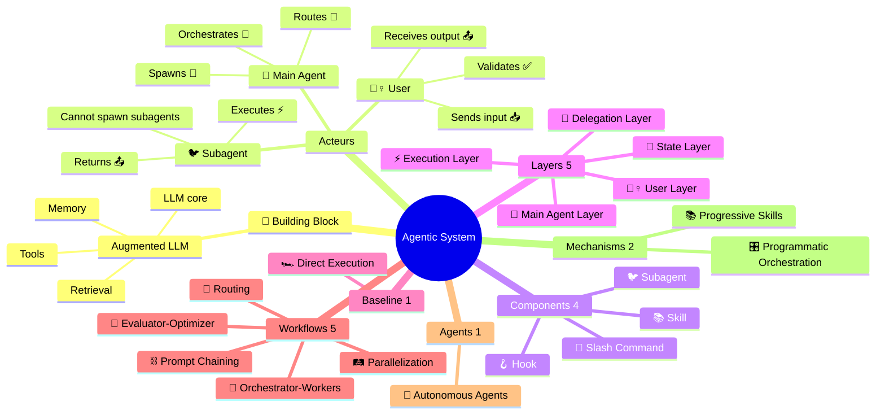

<div align="center">

[🏠 Home](../README.md) • **📚 Concepts**

</div>

---

# Agentic Systems

> Complete reference for understanding and implementing agentic workflows & agents with Claude Code CLI

## What are Agentic Systems?

**Agentic Systems** = Umbrella term for any system using LLMs with tools and control flow.
Encompasses **Baseline** (simple), **Workflows** (predefined), and **Agents** (dynamic).

> Source: [Building Effective Agents](https://www.anthropic.com/engineering/building-effective-agents) (Dec 2024)

---

## 🧱 Building Block: Augmented LLM

The foundation of ALL agentic systems. Not to be confused with our Components.

```
┌─────────────────────────────────────────────────────────────────────────────┐
│                    🧱 BUILDING BLOCK = AUGMENTED LLM                         │
│                       (foundation for ALL patterns)                          │
├───────────────┬───────────────┬───────────────┬─────────────────────────────┤
│   Retrieval   │    Tools      │    Memory     │            LLM              │
│   (RAG/docs)  │   (actions)   │   (context)   │           (core)            │
└───────────────┴───────────────┴───────────────┴─────────────────────────────┘
```

> **Key Distinction:**
> - **🧱 Building Block** = Augmented LLM (Anthropic's foundation concept)
> - **Components** = Claude Code abstractions (🐦 Subagent, 🦴 Slash Command, 📚 Skill, 🪝 Hook)
> - **Layers** = Our architectural organization (🙋‍♀️ User → 🐔 Main Agent → Delegation → Execution → State)

---

## Anthropic Taxonomy

```
┌─────────────────────────────────────────────────────────────────────────────┐
│                         AGENTIC SYSTEMS (umbrella)                           │
│─────────────────────────────────────────────────────────────────────────────│
│                    🧱 BUILDING BLOCK → WORKFLOWS → AGENTS                    │
├─────────────────────────────────────────────────────────────────────────────┤
│                                                                             │
│  BASELINE (1)                    WORKFLOWS (5)          AGENTS (1)          │
│  ────────────                    ─────────────          ──────────          │
│  0. 🏎️ Direct Execution         1. ⛓️ Prompt Chaining  6. 🐉 Autonomous    │
│     (single augmented LLM)      2. 🚦 Routing                               │
│                                  3. 🛤️ Parallelization                      │
│                                  4. 🦑 Orchestrator-Workers                 │
│                                  5. 🩻 Evaluator-Optimizer                  │
│                                                                             │
│  CODE controls the flow ─────────────────────► LLM controls the flow        │
│                                                                             │
└─────────────────────────────────────────────────────────────────────────────┘
```

---

## Dispatch Table

### Baseline + Workflows

| # | Pattern | Emoji | Description | Key Characteristic |
|---|---------|-------|-------------|-------------------|
| 0 | **Baseline (Direct)** | 🏎️ | Single augmented LLM call | Fastest, simplest |
| 1 | **Prompt Chaining** | ⛓️ | Sequential steps, output→input | Deterministic flow |
| 2 | **Routing** | 🚦 | Classify then dispatch | Dynamic path selection |
| 3 | **Parallelization** | 🛤️ | Concurrent independent tasks | Speed via concurrency |
| 4 | **Orchestrator-Workers** | 🦑 | 🐔 spawns specialized 🐦 | Delegation pattern |
| 5 | **Evaluator-Optimizer** | 🩻 | Generate → Evaluate → Improve | Quality refinement |

→ **Details:** [workflows/](workflows/)

### Agents

| # | Agent | Emoji | Description | Key Characteristic |
|---|-------|-------|-------------|-------------------|
| 6 | **Autonomous Agents** | 🐉 | Self-directed with feedback | Maximum autonomy |

→ **Details:** [agents/](agents/)

### Workflow Variants (Claude Code specific)

> ⚠️ These are patterns we've identified in Claude Code usage, not official Anthropic terminology.

| Variant | Parent | Emoji | Description |
|---------|--------|-------|-------------|
| **Wizard Workflow** | ⛓️ Prompt Chaining | 🧙 | Human checkpoints via AskUserQuestion |
| **Parallel Tool Calling** | 🛤️ Parallelization | 🚂 | Multiple tools in single response |
| **Master-Clone** | 🛤️ Parallelization | 🧬 | Same agent, parallel instances |
| **Multi-Window Context** | 🐉 Autonomous | 🖥️ | Multiple Claude Code sessions |

### Implementation Mechanisms (Claude Code specific)

> ⚠️ These are Claude Code implementation patterns, not official Anthropic terminology.

| Mechanism | Emoji | Description |
|-----------|-------|-------------|
| **Progressive Skills** | 📚 | Load skills on-demand based on context |
| **Programmatic Orchestration** | 🎛️ | Code-controlled agent workflows (Agent SDK) |

---

## Navigation

### Concepts

| Section | Description |
|---------|-------------|
| [workflows/](workflows/) | Building block + 5 workflow patterns + variants |
| [agents/](agents/) | Autonomous agents + Multi-Window Context |

### Implementation

| Section | Description |
|---------|-------------|
| [../implementation/components/](../implementation/components/) | 🐦 Subagent, 🦴 Command, 📚 Skill, 🪝 Hook |
| [../implementation/architecture/](../implementation/architecture/) | 5-Layer system architecture |

### Guides

| Section | Description |
|---------|-------------|
| [../guides/README.md](../guides/README.md) | Selection guide and pattern decision tree |
| [../guides/use-cases/](../guides/use-cases/) | Real-world validated use cases |

### Reference

| Section | Description |
|---------|-------------|
| [../reference/glossary.md](../reference/glossary.md) | A-Z terminology |
| [../reference/visual-standards.md](../reference/visual-standards.md) | Emojis, colors, Mermaid |
| [../reference/built-in-subagents.md](../reference/built-in-subagents.md) | General-purpose, Plan, Explore |

---

## Cross-Platform Compatibility

These workflows/agents originate from Claude/Anthropic but many apply across AI frameworks:

| System | Claude | GPT Agents | Gemini ADK | LangGraph |
|:-------|:------:|:----------:|:----------:|:---------:|
| 🦑 Orchestrator-Workers | ✅ | ✅ Handoffs | ✅ Multi-agent | ✅ Subgraphs |
| 📚 Progressive Skills | ✅ | ❌ | ❌ | ❌ |
| 🚂 Parallel Tool Calling | ✅ | ✅ | ✅ ParallelAgent | ✅ Fan-out |
| 🧬 Master-Clone | ✅ | ✅ Dynamic | ✅ Custom | ✅ Send API |
| 🖥️ Multi-Window Context | ✅ | ⚠️ Sessions | ⚠️ ctx.state | ✅ Checkpointing |
| 🎛️ Programmatic Orchestration | ✅ | ✅ | ✅ Workflows | ✅ StateGraph |
| 🧙 Wizard Workflows | ✅ | ⚠️ | ✅ Tool Confirm | ✅ interrupt() |

**Legend:** ✅ Native | ⚠️ Partial | ❌ Not supported

---

## Relationship Map



---

## Version & Sources

| Source | Version/Date | URL |
|--------|--------------|-----|
| Claude Code Docs | 2025 | https://docs.anthropic.com/en/docs/claude-code |
| Building Effective Agents | Dec 2024 | Anthropic Research Paper |
| Anthropic Cookbook | 2025 | https://github.com/anthropics/anthropic-cookbook |

---

<div align="center">

**━━━━━━━━━━━━━━━━━━━━━━━━━━━━━━━━━━━━━━━━━━━━━━━━**

[🏠 Home](../README.md)

</div>
