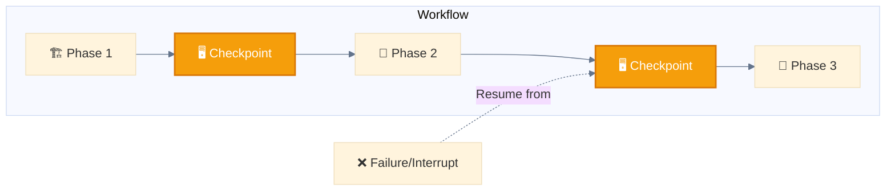

<div align="center">

[🏠 Home](../../README.md) • [📚 Concepts](../README.md) • [Agents](./) • **🖥️ Multi-Window Context**

</div>

---

# Variant: 🖥️ Multi-Window Context

> **Definition:** Implement checkpointing to save 💾 state and resume from interruptions in long-running workflows across multiple Claude Code sessions.

---

## Diagram


---

## When to use Multi-Window Context

- Large-scale generation (1000+ files)
- Long research tasks
- Multi-day workflows
- Error recovery needs
- Context window limitations

---

## Implementation Pattern

```
Session 1:
  1. Work on Phase 1
  2. Save checkpoint (progress, decisions, context)
  3. Continue until context limit or interruption

Session 2:
  1. Load checkpoint
  2. Resume from saved state
  3. Continue execution
```

---

## Flow Example

```
🖥️ MULTI-WINDOW CONTEXT
Session 1: 🙋‍♀️📥 ──► 🐔📋 ──► 🐔⚡ ──► 🖥️💾 ──► [Context Limit]
                                      ↓
Session 2: 🖥️💾 ──► 🐔⚡ ──► 🐔👀 ──► 🐔💭 ──► 💁‍♀️📤
```

---

## Checkpointing for Long Workflows



---

## Checkpoint Data Structure

```json
{
  "workflow_id": "wf_2025_001",
  "current_phase": 2,
  "completed_tasks": ["task_1", "task_2"],
  "pending_tasks": ["task_3", "task_4"],
  "state": {
    "variables": {},
    "context_summary": "..."
  },
  "resume_point": "checkpoint_2",
  "timestamp": "2025-11-28T10:00:00Z"
}
```

---

## Use Cases

| Use Case | Why Multi-Window? |
|----------|-------------------|
| **Large-scale generation** | 1000+ files exceed context limits |
| **Long research tasks** | Days of research need persistence |
| **Multi-day workflows** | Cannot complete in single session |
| **Error recovery** | Resume after failures |
| **Team handoffs** | Different operators continue work |

---

<div align="center">

**━━━━━━━━━━━━━━━━━━━━━━━━━━━━━━━━━━━━━━━━━━━━━━━━**

[← 🐉 Autonomous Agents](autonomous-agents.md) • [Agents](./)

</div>
