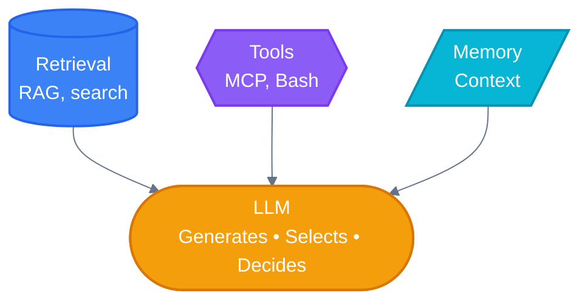
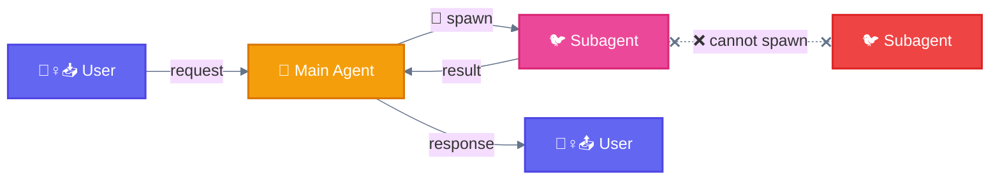

[🏠 Home](../../README.md) • [📚 Concepts](../README.md) • [⚙️ Workflows](./) • **🧱 Building Block**

---

# Building Block: The Augmented LLM

> The basic building block of agentic systems is an LLM enhanced with **retrieval**, **tools**, and **memory**.

---

## Diagram

---

## Key Components

| Component | Description | Examples |
|-----------|-------------|----------|
| **Retrieval** | Access to external knowledge | RAG, docs, search |
| **Tools** | Ability to take actions | MCP, Bash, API calls |
| **Memory** | Context persistence | Conversation history, state |
| **LLM** | Core reasoning engine | Claude, GPT, etc. |

---

## Key Insight

> **Focus on tailoring capabilities to your specific use case and ensuring they provide an easy, well-documented interface for the LLM.**

All workflows assume each LLM call has access to these augmented capabilities.

---

## Terminology

| Symbol | Term | Description |
|:------:|------|-------------|
| 🐔 | **Main Agent** | Claude Code orchestrator (the hen that coordinates) |
| 🐦 | **Subagent** | Delegated worker spawned via Task (the bird) |
| 🪺 | **Spawn (Task)** | Action to create 🐦 subagents (via Task built-in tool) |
| 📚 | **Skill** | Loaded knowledge that enhances 🐔 capabilities |
| 🚧 | **Gate** | Checkpoint that validates output before proceeding |

---

## Hierarchy

> **Rule:** 🐦 Subagents CANNOT spawn other 🐦 subagents (flat hierarchy)

---

**━━━━━━━━━━━━━━━━━━━━━━━━━━━━━━━━━━━━━━━━━━━━━━━━**

[⚙️ Workflows](./) • [01 Baseline →](01-baseline.md)

