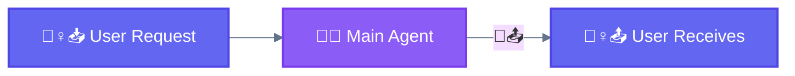

[🏠 Home](../../README.md) • [📚 Concepts](../README.md) • [⚙️ Workflows](./) • **🏎️ Baseline**

---

# 0. 🏎️ Baseline (Direct Execution)

> **Definition:** Single augmented LLM call without orchestration — the foundation before adding workflow complexity. Not counted as a workflow by Anthropic, but included here to show the full progression.

---

## Diagram

---

## Characteristics

| Property | Value |
|----------|-------|
| **Complexity** | None |
| **Parallelism** | None |
| **Human-Loop** | None |
| **Iteration** | None |

---

## When to use this workflow

- Simple, single-step tasks
- No need for specialization
- Quick operations (file read, simple edit, search)

---

## Examples where direct execution is useful

- "What's in the config.json file?"
- "Add a console.log statement to this function"
- "Search for usages of `useState`"

---

## When NOT to use

- Complex multi-step workflows
- Tasks requiring multiple specializations
- Large-scale operations

---

**━━━━━━━━━━━━━━━━━━━━━━━━━━━━━━━━━━━━━━━━━━━━━━━━**

[← 00 Building Block](00-building-block.md) • [⚙️ Workflows](./) • [02 Prompt Chaining →](02-prompt-chaining.md)

