<div align="center">

[🏠 Home](../../README.md) • [📚 Concepts](../README.md) • [⚙️ Workflows](./) • **🛤️ Parallelization**

</div>

---

# 3. 🛤️ Parallelization

> **Definition:** Execute independent tasks simultaneously and aggregate outputs programmatically. Manifests in two key variations: **Sectioning** and **Voting**.

---

## Core Concept

```mermaid
%%{init: {'theme': 'base', 'themeVariables': {'lineColor': '#64748b'}}}%%
flowchart LR
    classDef user fill:#6366f1,stroke:#4f46e5,stroke-width:2px,color:#ffffff
    classDef main fill:#8b5cf6,stroke:#7c3aed,stroke-width:2px,color:#ffffff
    classDef parallel fill:#3b82f6,stroke:#2563eb,stroke-width:2px,color:#ffffff

    IN["🙋‍♀️📥"]:::user --> SPLIT["🐔🔀 Split"]:::main
    SPLIT -->|"🐔🪺"| A["🐦⚡"]:::parallel
    SPLIT -->|"🐔🪺"| B["🐦⚡"]:::parallel
    SPLIT -->|"🐔🪺"| C["🐦⚡"]:::parallel
    A -->|"🐦📤"| MERGE["🐔🌀 Merge"]:::main
    B -->|"🐦📤"| MERGE
    C -->|"🐦📤"| MERGE
    MERGE -->|"🐔📤"| OUT["💁‍♀️📤"]:::user
```



---

## Key Insight

```
┌─────────────────────────────────────────────────────────────────────────────┐
│  ⚠️  IMPORTANT: Parallelization vs Orchestrator-Workers                    │
├─────────────────────────────────────────────────────────────────────────────┤
│                                                                             │
│  In Parallelization, all spawned subagents are IDENTICAL.                   │
│  Same prompt, same capabilities. They are INTERCHANGEABLE.                  │
│                                                                             │
│  🛤️ Parallelization:        🐦⚡ = 🐦⚡ = 🐦⚡   (clones)                      │
│  🦑 Orchestrator-Workers:  🐦🔒 ≠ 🐦⚡ ≠ 🐦🎨   (specialists)                │
│                                                                             │
└─────────────────────────────────────────────────────────────────────────────┘
```

---

## Characteristics

| Property | Value |
|----------|-------|
| **Complexity** | Medium |
| **Parallelism** | High |
| **Human-Loop** | Optional |
| **Iteration** | None |

---

## 2 Types of Parallelization

### Type 1: 🛤️ Sectioning (Split DATA)

Break a task into independent subtasks run in parallel, then combine ALL results.

```mermaid
%%{init: {'theme': 'base', 'themeVariables': {'lineColor': '#64748b'}}}%%
flowchart LR
    classDef user fill:#6366f1,stroke:#4f46e5,stroke-width:2px,color:#ffffff
    classDef main fill:#8b5cf6,stroke:#7c3aed,stroke-width:2px,color:#ffffff
    classDef parallel fill:#3b82f6,stroke:#2563eb,stroke-width:2px,color:#ffffff

    S_IN["🙋‍♀️📥 100 files"]:::user --> S_SPLIT["🐔🛤️"]:::main
    S_SPLIT -->|"🐔🪺"| S1["🐦⚡ Files 1-50"]:::parallel
    S_SPLIT -->|"🐔🪺"| S2["🐦⚡ Files 51-100"]:::parallel
    S1 -->|"🐦📤"| S_MERGE["🐔🌀 Combine ALL"]:::main
    S2 -->|"🐦📤"| S_MERGE
    S_MERGE -->|"🐔📤"| S_OUT["💁‍♀️📤"]:::user
```



**Examples:**
- Guardrails: One instance processes queries, another screens for inappropriate content
- Evals: Each LLM call evaluates a different aspect of model performance

### Type 2: 🗳️ Voting (Same TASK, pick BEST)

Run the same task multiple times to get diverse outputs, then select the best.

```mermaid
%%{init: {'theme': 'base', 'themeVariables': {'lineColor': '#64748b'}}}%%
flowchart LR
    classDef user fill:#6366f1,stroke:#4f46e5,stroke-width:2px,color:#ffffff
    classDef main fill:#8b5cf6,stroke:#7c3aed,stroke-width:2px,color:#ffffff
    classDef parallel fill:#3b82f6,stroke:#2563eb,stroke-width:2px,color:#ffffff
    classDef wizard fill:#14b8a6,stroke:#0d9488,stroke-width:2px,color:#ffffff
    classDef success fill:#10b981,stroke:#059669,stroke-width:2px,color:#ffffff

    V_IN["🙋‍♀️📥 Write headline"]:::user --> V_COPY["🐔🔀 3 attempts"]:::main
    V_COPY -->|"🐔🪺"| V1["🐦⚡ Version A"]:::parallel
    V_COPY -->|"🐔🪺"| V2["🐦⚡ Version B"]:::parallel
    V_COPY -->|"🐔🪺"| V3["🐦⚡ Version C"]:::parallel
    V1 -->|"🐦📤"| VOTE{"🐔🗳️ Compare"}:::wizard
    V2 -->|"🐦📤"| VOTE
    V3 -->|"🐦📤"| VOTE
    VOTE -->|"🐔✅ B wins"| BEST["🏆 Best"]:::success
```



**Examples:**
- Code vulnerability review with multiple prompts
- Content moderation with different vote thresholds

---

## Summary

| Type | Workers | Input | Output |
|------|---------|-------|--------|
| **🛤️ Sectioning** | IDENTICAL | Different DATA chunks | Combine ALL |
| **🗳️ Voting** | IDENTICAL | Same DATA | Pick ONE best |

---

## When to use this workflow

Parallelization is effective when the divided subtasks can be parallelized for speed, or when multiple perspectives are needed for higher confidence results.

---

## When NOT to use

- Tasks depend on each other's output
- Sequential order matters
- Limited resources

---

## Variant: 🚂 Parallel Tool Calling

Execute multiple independent 🔧 tool calls in a single message for efficiency.

```mermaid
%%{init: {'theme': 'base', 'themeVariables': {'lineColor': '#64748b'}}}%%
flowchart TB
    classDef main fill:#8b5cf6,stroke:#7c3aed,stroke-width:2px,color:#ffffff
    classDef parallel fill:#3b82f6,stroke:#2563eb,stroke-width:2px,color:#ffffff
    classDef state fill:#10b981,stroke:#059669,stroke-width:2px,color:#ffffff

    MA["🐔 Main Agent"]:::main -->|Single Message| TOOLS

    subgraph TOOLS["🚂 Parallel Tool Calls"]
        T1["🔧 Read file1.ts"]
        T2["🔧 Read file2.ts"]
        T3["🔧 Read file3.ts"]
    end

    T1 --> RESULTS["✅ All Results"]:::state
    T2 --> RESULTS
    T3 --> RESULTS

    RESULTS --> MA

    style TOOLS fill:#dbeafe,stroke:#3b82f6,stroke-width:2px
```



---

## Variant: 🧬 Master-Clone

Spawn multiple isolated 🐦 instances handling independent domains with no shared state.

```mermaid
%%{init: {'theme': 'base', 'themeVariables': {'lineColor': '#64748b'}}}%%
flowchart TB
    classDef main fill:#8b5cf6,stroke:#7c3aed,stroke-width:2px,color:#ffffff
    classDef subagent fill:#ec4899,stroke:#db2777,stroke-width:2px,color:#ffffff
    classDef state fill:#10b981,stroke:#059669,stroke-width:2px,color:#ffffff

    MA["🐔 Main Agent"]:::main

    MA -->|"Context: fr-FR"| C1["🐦 Clone: fr-FR"]:::subagent
    MA -->|"Context: es-ES"| C2["🐦 Clone: es-ES"]:::subagent
    MA -->|"Context: de-DE"| C3["🐦 Clone: de-DE"]:::subagent

    C1 -->|9 files| R1[Result: fr-FR]
    C2 -->|9 files| R2[Result: es-ES]
    C3 -->|9 files| R3[Result: de-DE]

    R1 --> MERGE["✅ Merge Results"]:::state
    R2 --> MERGE
    R3 --> MERGE

    MERGE --> MA
```



---

<div align="center">

**━━━━━━━━━━━━━━━━━━━━━━━━━━━━━━━━━━━━━━━━━━━━━━━━**

[← 03 Routing](03-routing.md) • [⚙️ Workflows](./) • [05 Orchestrator-Workers →](05-orchestrator-workers.md)

</div>
