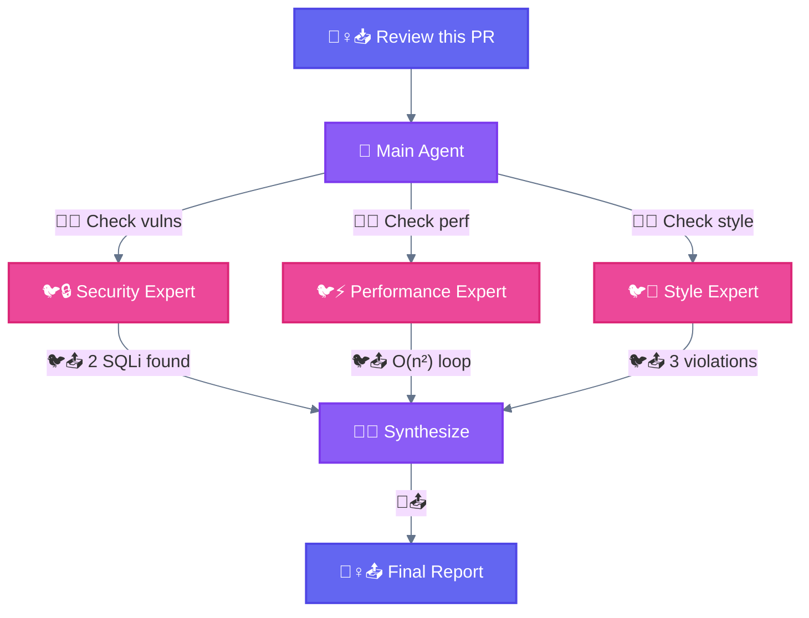

<div align="center">

[🏠 Home](../../README.md) • [📚 Concepts](../README.md) • [⚙️ Workflows](./) • **🦑 Orchestrator-Workers**

</div>

---

# 4. 🦑 Orchestrator-Workers

> **Definition:** A central LLM dynamically breaks down tasks, delegates them to worker LLMs, and synthesizes their results.

---

## Diagram



---

## Key Insight

```
┌─────────────────────────────────────────────────────────────────────────────┐
│  🦑 ORCHESTRATOR-WORKERS: Different specialists                             │
├─────────────────────────────────────────────────────────────────────────────┤
│                                                                             │
│  Each 🐦 subagent has a DIFFERENT expertise and does a DIFFERENT task.     │
│                                                                             │
│  Key difference from 🛤️ Parallelization: subtasks aren't pre-defined,      │
│  but determined by the orchestrator based on the specific input.            │
│                                                                             │
│  Analogy: Hospital team → Different experts collaborate                     │
│           (Chef + Pastry + Sommelier, not 3 cooks making same recipe)      │
│                                                                             │
│  Compare:                                                                   │
│  - 🛤️ Parallelization: Same worker + Different data (assembly line)        │
│  - 🦑 Orchestration: Different workers + Same data (expert team)           │
│                                                                             │
└─────────────────────────────────────────────────────────────────────────────┘
```

---

## Characteristics

| Property | Value |
|----------|-------|
| **Complexity** | High |
| **Parallelism** | High |
| **Human-Loop** | Optional |
| **Iteration** | As needed |

---

## When to use this workflow

This workflow is well-suited for complex tasks where you can't predict the subtasks needed. The key difference from parallelization is its flexibility—subtasks aren't pre-defined, but determined by the orchestrator based on the specific input.

---

## Examples where orchestrator-workers is useful

| Use Case | Orchestration |
|----------|---------------|
| Coding products | Make complex changes to multiple files dynamically |
| Search tasks | Gather and analyze from multiple sources |
| PR Review | Security + Performance + Style experts |

---

## 🐔 Main Agent Responsibilities

| Responsibility | Description |
|----------------|-------------|
| **Decomposition** | Break complex task into subtasks |
| **Assignment** | Route subtasks to appropriate 🐦 subagents |
| **Monitoring** | Track 🐦 subagent progress |
| **Synthesis** | Combine results into coherent output |

---

## 🐦 Subagent Definition

```markdown
# .claude/agents/code-reviewer.md

---
name: code-reviewer
description: Reviews code for quality, security, and best practices
tools: Read, Grep, Glob
---

You are a senior code reviewer specializing in security and quality.

## Your Task
Review the provided code and report:
1. Security vulnerabilities
2. Performance issues
3. Code quality concerns
4. Suggested improvements

## Output Format
- ❌ CRITICAL: Issues requiring immediate attention
- ⚠️ WARNING: Should be addressed
- ℹ️ INFO: Suggestions for improvement
```

---

## Critical Rules

| Rule | Explanation |
|------|-------------|
| **No nested subagents** | 🐦 Subagents cannot spawn other 🐦 subagents |
| **Isolated context** | Each 🐦 subagent starts fresh, no shared memory |
| **Report to orchestrator** | Results flow back to 🐔 Main Agent only |

---

## When NOT to use

- Simple tasks not worth decomposition overhead
- Workers need heavy inter-communication

---

<div align="center">

**━━━━━━━━━━━━━━━━━━━━━━━━━━━━━━━━━━━━━━━━━━━━━━━━**

[← 04 Parallelization](04-parallelization.md) • [⚙️ Workflows](./) • [06 Evaluator-Optimizer →](06-evaluator-optimizer.md)

</div>
