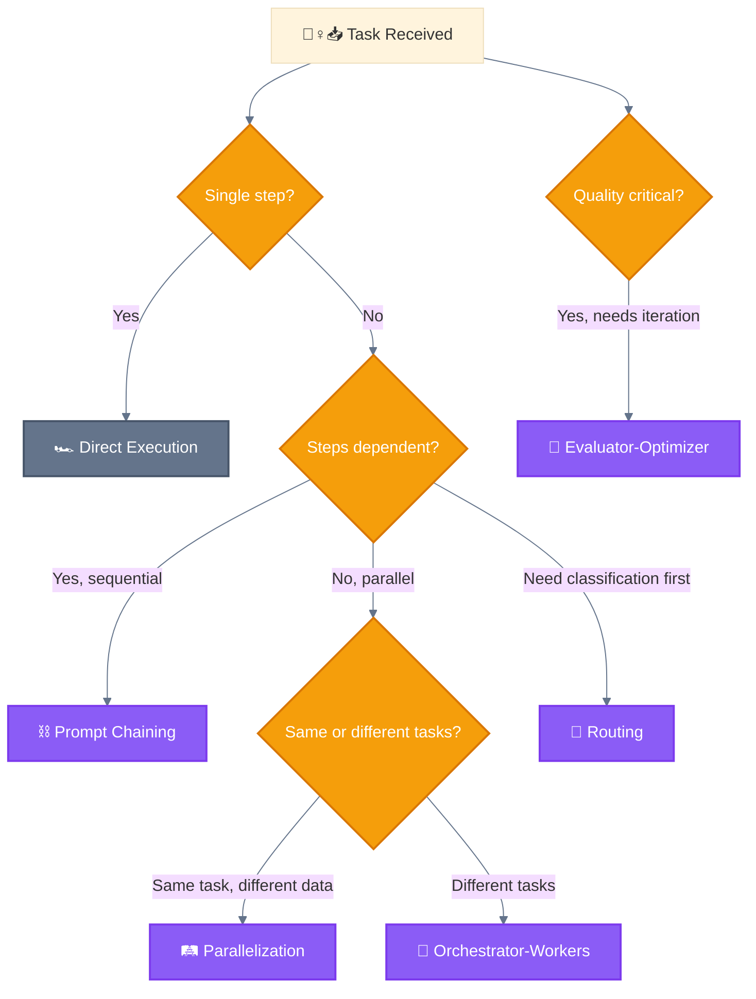
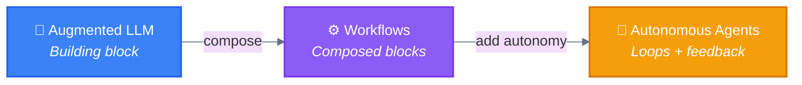

<div align="center">

[🏠 Home](../../README.md) • [📚 Concepts](../README.md) • **⚙️ Workflows**

</div>

---

# Workflows

> **Definition (Anthropic):** Systems where LLMs and tools are orchestrated through **predefined code paths**.
>
> — [Building Effective Agents](https://www.anthropic.com/engineering/building-effective-agents), December 2024

**Key characteristic:** The **CODE** controls the flow, not the LLM

---

## Decision Tree



---

## Workflow Index

| # | Pattern | Emoji | File | Complexity |
|---|---------|-------|------|:----------:|
| — | Building Block | 🧱 | [00-building-block.md](00-building-block.md) | Foundation |
| 0 | Baseline (Direct) | 🏎️ | [01-baseline.md](01-baseline.md) | None |
| 1 | Prompt Chaining | ⛓️ | [02-prompt-chaining.md](02-prompt-chaining.md) | Low |
| 2 | Routing | 🚦 | [03-routing.md](03-routing.md) | Low |
| 3 | Parallelization | 🛤️ | [04-parallelization.md](04-parallelization.md) | Medium |
| 4 | Orchestrator-Workers | 🦑 | [05-orchestrator-workers.md](05-orchestrator-workers.md) | High |
| 5 | Evaluator-Optimizer | 🩻 | [06-evaluator-optimizer.md](06-evaluator-optimizer.md) | Medium |

---

## Workflow Summary

```
┌──────────────────────────┬─────────────┬─────────────┬──────────────┬───────────┐
│ Pattern                  │ Complexity  │ Parallelism │ Human-Loop   │ Iteration │
├──────────────────────────┼─────────────┼─────────────┼──────────────┼───────────┤
│ 0. 🏎️ Baseline           │ None        │ None        │ None         │ None      │
├──────────────────────────┼─────────────┼─────────────┼──────────────┼───────────┤
│ 1. ⛓️ Prompt Chaining     │ Low         │ None        │ Optional     │ Linear    │
│ 2. 🚦 Routing             │ Low         │ None        │ None         │ None      │
│ 3. 🛤️ Parallelization     │ Medium      │ High        │ Optional     │ None      │
│ 4. 🦑 Orchestrator-Workers│ High        │ High        │ Optional     │ As needed │
│ 5. 🩻 Evaluator-Optimizer │ Medium      │ Optional    │ Optional     │ Loop      │
└──────────────────────────┴─────────────┴─────────────┴──────────────┴───────────┘
```

---

## Workflow Variants (Claude Code specific)

> ⚠️ These are patterns we've identified in Claude Code usage, not official Anthropic terminology.

| Variant | Parent | Emoji | Description |
|---------|--------|-------|-------------|
| **Wizard Workflow** | ⛓️ Prompt Chaining | 🧙 | Human checkpoints via AskUserQuestion |
| **Parallel Tool Calling** | 🛤️ Parallelization | 🚂 | Multiple tools in single response |
| **Master-Clone** | 🛤️ Parallelization | 🧬 | Same agent, parallel instances |

→ Variants are documented within their parent workflow files.

---

## Flow Examples

```
⛓️ PROMPT CHAINING
🙋‍♀️📥 ──► 🐔💭 ──► 🐔📤 ──► 🐔💭 ──► 🐔📤 ──► 🐔💭 ──► 🐔📤 ──► 📤💁‍♀️
Input     Step 1    (chain)   Step 2    (chain)   Step 3    Output    User

🦑 ORCHESTRATOR-WORKERS
🙋‍♀️📥 ──► 🐔🔀 ──┬──► 🐦⚡ ──► 🐦📤 ──┐
                ├──► 🐦⚡ ──► 🐦📤 ──┼──► 🐔🌀 ──► 🐔📤 ──► 📤💁‍♀️
                └──► 🐦⚡ ──► 🐦📤 ──┘

🧙 WIZARD WORKFLOW (Human-in-the-Loop)
🙋‍♀️📥 ──► 🐔📋 ──► 🐔📤 ──► 📤💁‍♀️ ──► 🙆‍♀️✅ ──► 🐔▶️ ──► 🐔⚡ ──► 📤💁‍♀️
Request    Plan      Show      User      User      🐔        Execute   Done
                     plan      reviews   approves  continues
```

---

## Anthropic's Progression



---

<div align="center">

**━━━━━━━━━━━━━━━━━━━━━━━━━━━━━━━━━━━━━━━━━━━━━━━━**

[📚 Concepts](../README.md) • [Agents](../agents/)

</div>
