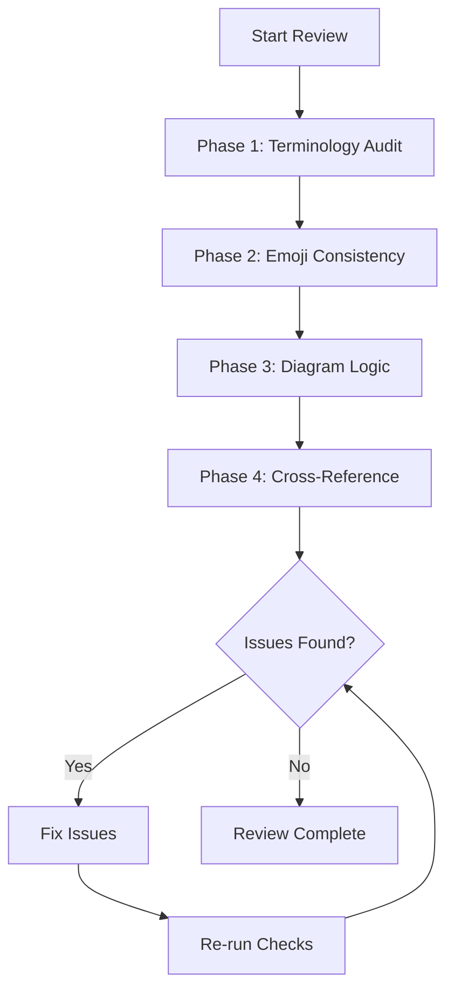

# Documentation Verification Methodology

> Plan de vérification pour assurer la cohérence terminologique et visuelle

---

## Sources of Truth Hierarchy

```
┌─────────────────────────────────────────────────────────────────────────────┐
│  HIERARCHY OF AUTHORITY (from most to least authoritative)                  │
├─────────────────────────────────────────────────────────────────────────────┤
│                                                                             │
│  1. ANTHROPIC PRODUCT DOCS (docs.anthropic.com)                             │
│     └── Claude Code CLI, Agent SDK, API Reference                           │
│     └── Terms: "subagent", "main agent", "skills", "hooks"                  │
│                                                                             │
│  2. ANTHROPIC RESEARCH ("Building Effective Agents" Dec 2024)               │
│     └── Pattern names: Orchestrator-Workers, Evaluator-Optimizer, etc.      │
│     └── Workflow vs Agent distinction                                       │
│                                                                             │
│  3. OUR PEDAGOGICAL LAYER (this repository)                                 │
│     └── Emoji system: 🐔🐦🐉🦑 etc.                                          │
│     └── Visual standards, diagrams, examples                                │
│                                                                             │
└─────────────────────────────────────────────────────────────────────────────┘
```

---

## Key Findings from Official Docs Comparison

### Official Claude Code/Agent SDK Terminology

| Official Term | Our Term | Status | Notes |
|---------------|----------|--------|-------|
| `subagent` (one word) | 🐦 Subagent | ✅ Match | Official is lowercase |
| `main agent` (lowercase) | 🐔 Main Agent | ⚠️ Pedagogical | We capitalize + add emoji |
| `skills` | 📚 Skill | ✅ Match | |
| `slash commands` | 🦴 Slash Command | ✅ Match | Official no hyphen |
| `hooks` | 🪝 Hook | ✅ Match | |
| `Task tool` | 🪺 spawn (= Task tool) | ⚠️ Pedagogical | 🪺 is visual shorthand for Task tool |

### Research Paper Terminology (Building Effective Agents)

| Research Term | Our Term | Status | Notes |
|---------------|----------|--------|-------|
| Orchestrator-Workers | 🦑 Orchestrator-Workers | ✅ Match | Research paper term |
| Evaluator-Optimizer | 🩻 Evaluator-Optimizer | ✅ Match | Research paper term |
| Prompt Chaining | ⛓️ Prompt Chaining | ✅ Match | Also in product docs |
| Routing | 🚦 Routing | ✅ Match | Research paper term |
| Parallelization | 🛤️ Parallelization | ✅ Match | Research paper term |
| Workflows | ⚙️ Workflows | ✅ Match | "predefined code paths" |
| Agents | 🐉 Autonomous Agents | ✅ Match | "dynamic self-direction" |

### Terms NOT in Official Docs (Our Inventions)

| Our Term | Type | Acceptable? |
|----------|------|-------------|
| 🐔 (chicken emoji) | Pedagogical metaphor | ✅ Yes - clearly pedagogical |
| 🐦 (bird emoji) | Pedagogical metaphor | ✅ Yes - clearly pedagogical |
| ACTEUR + ACTION system | Visual standard | ✅ Yes - our creation |
| 5-Layer Architecture | Organization | ✅ Yes - our structure |
| "Main Agent" (capitalized) | Naming convention | ⚠️ Clarify it's our term |

---

## Verification Checklist

### Phase 1: Terminology Audit

```markdown
□ 1.1 Search for unofficial terms
   - [ ] "sub-agent" (should be "subagent")
   - [ ] "Sub Agent" (should be "Subagent")
   - [ ] "Lead Agent" (should be "Main Agent")
   - [ ] "Parent Agent" (should be "Main Agent")
   - [ ] "Child Agent" (should be "Subagent")
   - [ ] "Subagent Orchestration" (should be "Orchestrator-Workers")
   - [ ] "slash-command" (should be "Slash Command")

□ 1.2 Verify pattern names match research paper
   - [ ] Prompt Chaining (not "Chain Prompting")
   - [ ] Routing (not "Router Pattern")
   - [ ] Parallelization (not "Parallel Execution")
   - [ ] Orchestrator-Workers (not "Orchestration")
   - [ ] Evaluator-Optimizer (not "Evaluation Loop")

□ 1.3 Verify component names match product docs
   - [ ] Subagent (not "sub-agent")
   - [ ] Slash Command (not "slash-command")
   - [ ] Skill (not "capability")
   - [ ] Hook (not "trigger")
```

### Phase 2: Emoji Consistency Audit

```markdown
□ 2.1 Actor emojis (WHO)
   - [ ] 🐔 = Main Agent ONLY (never patterns)
   - [ ] 🐦 = Subagent ONLY (never patterns)
   - [ ] 🙋‍♀️/💁‍♀️ = User states
   - [ ] 🐉 = Autonomous Agents ONLY (always with "Autonomous")

□ 2.2 Pattern emojis (WHAT)
   - [ ] 🏎️ = Direct Execution (baseline)
   - [ ] ⛓️ = Prompt Chaining
   - [ ] 🚦 = Routing
   - [ ] 🛤️ = Parallelization
   - [ ] 🦑 = Orchestrator-Workers (NOT actors!)
   - [ ] 🩻 = Evaluator-Optimizer

□ 2.3 Forbidden combinations
   - [ ] No 🐔🦑 (mixing actor + pattern emoji)
   - [ ] No 🐦🦑 (mixing actor + pattern emoji)
   - [ ] No 🐉 without "Autonomous Agents"

□ 2.4 Valid ACTEUR+ACTION combinations
   - [ ] 🐔💭, 🐔🪺, 🐔📤, 🐔🌀, 🐔🔀 (Main Agent actions)
   - [ ] 🐦⚡, 🐦📤, 🐦💭 (Subagent actions)
   - [ ] 🙋‍♀️📥, 💁‍♀️📤, 🙆‍♀️✅ (User actions)
```

### Phase 3: Diagram Logic Audit

```markdown
□ 3.1 Mermaid flowcharts
   - [ ] Arrows point correct direction (data flow)
   - [ ] classDef colors match visual-standards.md
   - [ ] No 🐦 spawning other 🐦 (anti-pattern)
   - [ ] All nodes have appropriate emoji prefix

□ 3.2 Sequence diagrams
   - [ ] Participants use correct emoji
   - [ ] Message labels are clear
   - [ ] Flow is logical (no impossible sequences)

□ 3.3 ASCII diagrams
   - [ ] Consistent box characters (┌ ─ ┐ │ └ ┘)
   - [ ] Alignment is correct
   - [ ] Content is readable
```

### Phase 4: Cross-Reference Audit

```markdown
□ 4.1 Internal links
   - [ ] All [text](path) links resolve
   - [ ] No broken relative paths
   - [ ] Navigation breadcrumbs consistent

□ 4.2 Glossary alignment
   - [ ] All terms in glossary.md match usage in docs
   - [ ] No orphan definitions
   - [ ] No undefined terms in main docs

□ 4.3 Visual standards compliance
   - [ ] All emojis match visual-standards.md
   - [ ] All colors match palette
   - [ ] All Mermaid uses classDef (no inline styles)
```

---

## Grep Commands for Verification

### Terminology Checks

```bash
# Find unofficial terms
grep -rn "sub-agent\|Sub Agent" --include="*.md"
grep -rn "Lead Agent\|Parent Agent\|Child Agent" --include="*.md"
grep -rn "Subagent Orchestration" --include="*.md"
grep -rn "slash-command" --include="*.md"

# Find potentially incorrect emoji usage
grep -rn "🐔🦑\|🐦🦑\|🦑🐔\|🦑🐦" --include="*.md"
grep -rn "🐉 Agent[^s]" --include="*.md"  # Should be "Autonomous Agents"
```

### Consistency Checks

```bash
# Count emoji usage (should be consistent)
grep -roh "🐔" --include="*.md" | wc -l  # Main Agent count
grep -roh "🐦" --include="*.md" | wc -l  # Subagent count
grep -roh "🐉" --include="*.md" | wc -l  # Autonomous Agents count
grep -roh "🦑" --include="*.md" | wc -l  # Orchestrator-Workers count

# Find all pattern references
grep -rn "Orchestrator-Workers\|Evaluator-Optimizer" --include="*.md"
grep -rn "Prompt Chaining\|Parallelization\|Routing" --include="*.md"
```

---

## Decision Rules

### When to use Official vs Pedagogical Terms

```
┌─────────────────────────────────────────────────────────────────────────────┐
│  DECISION MATRIX: Which term to use?                                        │
├─────────────────────────────────────────────────────────────────────────────┤
│                                                                             │
│  CONTEXT                           │ USE                                    │
│  ─────────────────────────────────│────────────────────────────────────────│
│  Quoting official docs             │ Official term (subagent, main agent)  │
│  Explaining concepts visually      │ Pedagogical (🐔 Main Agent, 🐦)       │
│  Mermaid diagrams                  │ Pedagogical with emoji                │
│  Glossary definitions              │ Official + "(Our term: 🐔)"          │
│  Pattern names                     │ Research paper terms (Anthropic)      │
│  Code examples                     │ Official terms (no emojis)            │
│                                                                             │
└─────────────────────────────────────────────────────────────────────────────┘
```

### Emoji Rules Summary

```
┌─────────────────────────────────────────────────────────────────────────────┐
│  EMOJI TAXONOMY - STRICT RULES                                              │
├─────────────────────────────────────────────────────────────────────────────┤
│                                                                             │
│  ACTORS (can combine with actions):                                         │
│    🐔 = Main Agent                                                          │
│    🐦 = Subagent                                                            │
│    🙋‍♀️/💁‍♀️/🙆‍♀️ = User states                                                  │
│                                                                             │
│  PATTERNS (standalone, never combine with actors):                          │
│    🦑 = Orchestrator-Workers pattern                                        │
│    🐉 = Autonomous Agents (ALWAYS with full name)                           │
│    🛤️ = Parallelization                                                     │
│    ⛓️ = Prompt Chaining                                                     │
│    🚦 = Routing                                                             │
│    🩻 = Evaluator-Optimizer                                                 │
│    🏎️ = Direct Execution                                                    │
│                                                                             │
│  VALID: 🐔💭 🐔🪺 🐦⚡ 🐦📤 🙋‍♀️📥                                              │
│  INVALID: 🐔🦑 🐦🐉 🦑🐔                                                     │
│                                                                             │
└─────────────────────────────────────────────────────────────────────────────┘
```

---

## Workflow: Documentation Review Process



---

## File-by-File Review Priority

| Priority | Files | Reason |
|----------|-------|--------|
| **P0 Critical** | `reference/visual-standards.md`, `reference/glossary.md` | Source of truth |
| **P1 High** | `README.md`, `concepts/README.md` | High visibility |
| **P2 Medium** | `concepts/workflows/*.md`, `concepts/agents/*.md` | Core content |
| **P3 Low** | `guides/use-cases/*.md`, `implementation/**/*.md` | Derived content |

---

## Success Criteria

A documentation set passes verification when:

1. **Zero unofficial terms** in main content
2. **100% emoji consistency** with visual-standards.md
3. **All diagrams logically correct** (no anti-patterns)
4. **All internal links resolve**
5. **Glossary covers all terms used**
6. **Clear distinction** between official and pedagogical terms

---

## Maintenance Schedule

| Check | Frequency | Automated? |
|-------|-----------|------------|
| Terminology grep | Per commit | Yes (pre-commit hook) |
| Emoji audit | Weekly | Partially |
| Link validation | Weekly | Yes |
| Full review | Monthly | No |
| Compare with official docs | Quarterly | No |

---

<div align="center">

**Document Version:** 1.0 | **Created:** 2025-11-28 | **Author:** Claude + Thibaut

</div>
