# Update Examples: Ready-to-Use Templates

**Purpose:** Concrete examples showing how to enhance existing documentation with official Anthropic citations.

---

## Example 1: Enhanced Prompt Chaining Document

### Current Version (excerpt from 02-prompt-chaining.md)

```markdown
# 1. ⛓️ Prompt Chaining

> **Definition:** Decompose a task into a sequence of steps, where each LLM call processes the output of the previous one.
```

### ✅ Enhanced Version (with official citation)

```markdown
# 1. ⛓️ Prompt Chaining

> **Definition:** Decompose a task into a sequence of steps, where each LLM call processes the output of the previous one.

## Official Anthropic Definition

> **From "Building Effective Agents" (Anthropic, December 2024):**
>
> "Each step of a prompt chain is a separate LLM call. The output of one step
> becomes the input to the next. This approach is most effective when the task
> requires sequential processing where each step builds on the previous one."
>
> **Source:** https://www.anthropic.com/research/building-effective-agents

### Key Characteristics (from official docs)

- **Sequential processing:** Each step builds on the previous
- **Modular steps:** Easy to test and debug independently
- **Trade latency for accuracy:** Each call is simpler, more focused
- **Deterministic flow:** Code controls the sequence
```

---

## Example 2: Enhanced Autonomous Agents Document

### Current Version (excerpt from autonomous-agents.md)

```markdown
# 6. 🐉 Autonomous Agents

> **Definition:** Long-running agents that independently plan, execute, and adapt based on environment feedback.
```

### ✅ Enhanced Version (with prominent warning)

```markdown
# 6. 🐉 Autonomous Agents

> **Definition:** Long-running agents that independently plan, execute, and adapt based on environment feedback.

---

## ⚠️ Critical Guidance from Anthropic

> **"Autonomous agents can be powerful, but they are also the most complex
> and error-prone. When possible, use the simpler workflow patterns above."**
>
> — Building Effective Agents (Anthropic, December 2024)

### When to Consider Agents

✅ **Use agents when:**
- Workflows are insufficient for the task
- The problem is genuinely open-ended
- You have robust monitoring in place
- Human oversight is available
- The environment is sandboxed/safe

❌ **DON'T use agents when:**
- A workflow would suffice
- Steps are predictable
- Errors have high cost
- No rollback mechanism exists
- Time is constrained

> **Anthropic's recommendation:** "Start with workflows and evolve towards
> agents only when the added complexity is justified."

---

## Official Anthropic Definition

> **From "Building Effective Agents" (December 2024):**
>
> "The agent is given some level of autonomy over how it accomplishes tasks.
> At a high level, agentic systems are characterized by LLM-driven
> decision-making and action in support of achieving a complex goal."
>
> **Source:** https://www.anthropic.com/research/building-effective-agents
```

---

## Example 3: Enhanced Orchestrator-Workers Document

### Addition to highlight "dynamic" nature

**Insert after "When to use this workflow" section in 05-orchestrator-workers.md:**

```markdown
## Key Distinction: Dynamic vs. Static

> **From Anthropic:**
>
> "The main difference from parallelization is that the orchestrator makes
> **dynamic decisions** about what to delegate based on the specific input."

### Parallelization vs. Orchestrator-Workers

| Aspect | 🛤️ Parallelization | 🦑 Orchestrator-Workers |
|--------|-------------------|------------------------|
| **Task definition** | Known ahead of time (static) | Determined by LLM (dynamic) |
| **Delegation** | Code decides what to parallelize | LLM decides what to delegate |
| **Adaptability** | Fixed set of tasks | Adapts to input complexity |
| **Example** | "Translate to 5 languages" | "Research this topic" |

### Examples

❌ **Parallelization** (static):
```
Task: "Summarize these 10 articles"
→ Code knows: 10 parallel summary tasks
```

✅ **Orchestrator-Workers** (dynamic):
```
Task: "Research the impact of AI on healthcare"
→ LLM decides:
  - What subtopics to research
  - How many workers needed
  - What each worker should investigate
  - When to stop delegating
```

The orchestrator **dynamically breaks down** the task based on the specific input,
rather than executing a predefined set of parallel operations.
```

---

## Example 4: Common Pitfalls Section Template

**Add to each pattern document before final navigation:**

```markdown
---

## Common Pitfalls

### Pitfall 1: Context Loss Between Steps

**Symptom:** Later steps fail because they're missing information from earlier steps

**Cause:** Not passing enough context forward in the chain

**Solution:**
```python
# ❌ Bad: Only pass the raw output
step2_input = step1_output

# ✅ Good: Include original context
step2_input = {
    "original_request": user_query,
    "step1_result": step1_output,
    "parameters": original_params
}
```

---

### Pitfall 2: No Validation Between Steps

**Symptom:** Errors in early steps compound in later steps

**Cause:** Missing gates/validation checkpoints

**Solution:**
```python
# ✅ Add validation gates
step1_output = llm_call(step1_prompt)

if not validate_step1(step1_output):
    raise ValueError("Step 1 validation failed")

step2_output = llm_call(step2_prompt, step1_output)
```

---

### Pitfall 3: Hardcoded Output Format Assumptions

**Symptom:** Chain breaks when LLM output format varies

**Cause:** Assuming specific output structure without enforcing it

**Solution:**
```python
# ✅ Use structured output
step1_prompt = """
Extract key information and return as JSON:
{
  "entities": [...],
  "sentiment": "...",
  "confidence": 0.0-1.0
}
"""

# Validate structure before proceeding
parsed = json.loads(step1_output)
assert "entities" in parsed
```

---
```

---

## Example 5: Tool Design Best Practices (New Guide)

**Create new file: `/guides/tool-design.md`**

```markdown
# Tool Design Best Practices

> How to create effective tools for Claude Code agents

---

## Anthropic's Core Guidance

> **"Focus on tailoring capabilities to your use case and ensuring they
> provide an easy, well-documented interface for the LLM."**
>
> — Building Effective Agents (Anthropic, December 2024)

---

## The Five Principles

### 1. Keep Tools Simple and Focused

Each tool should do **one thing well**.

❌ **Bad:** Monolithic tool
```typescript
manage_database(action, table, data, options, filters, validation)
```

✅ **Good:** Focused tools
```typescript
get_customer(customer_id)
create_order(customer_id, items)
update_inventory(product_id, quantity)
```

**Why?** LLMs make fewer mistakes with simple, focused tools.

---

### 2. Use Structured Outputs

Always return consistent JSON structures.

✅ **Standard response format:**
```typescript
{
  "status": "success" | "error",
  "data": { /* your data */ },
  "metadata": {
    "timestamp": "ISO-8601",
    "duration_ms": number
  },
  "error": {  // Only if status === "error"
    "code": "ERROR_CODE",
    "message": "Human-readable message",
    "details": { /* debugging info */ }
  }
}
```

---

### 3. Provide Crystal-Clear Documentation

> **From Anthropic:** "Put yourself in the model's shoes. Is it obvious
> how to use this tool based on the description?"

✅ **Good tool definition:**
```typescript
{
  "name": "get_customer",
  "description": "Retrieve customer details by ID. Returns full customer record including contact info, order history, and preferences. Use this when you need detailed customer information for support or analysis.",
  "parameters": {
    "customer_id": {
      "type": "string",
      "description": "Unique customer identifier (format: CUST-XXXXX)",
      "required": true,
      "example": "CUST-12345"
    }
  },
  "returns": {
    "type": "object",
    "description": "Customer record with contact, orders, and preferences"
  },
  "errors": [
    "CUSTOMER_NOT_FOUND: No customer with given ID",
    "INVALID_ID_FORMAT: ID must match CUST-XXXXX pattern"
  ],
  "example_usage": "To get details for customer CUST-12345: get_customer('CUST-12345')"
}
```

**Include:**
- Clear purpose
- Parameter formats and examples
- Expected return structure
- Common error codes
- Boundaries (what this tool does NOT do)

---

### 4. Handle Errors Gracefully

Never let tools throw unhandled exceptions.

✅ **Good error handling:**
```typescript
async function get_customer(customer_id: string) {
  try {
    // Validate input
    if (!customer_id.match(/^CUST-\d{5}$/)) {
      return {
        status: "error",
        error: {
          code: "INVALID_ID_FORMAT",
          message: "Customer ID must match format CUST-XXXXX"
        }
      };
    }

    // Attempt operation
    const customer = await db.customers.find(customer_id);

    if (!customer) {
      return {
        status: "error",
        error: {
          code: "CUSTOMER_NOT_FOUND",
          message: `No customer found with ID ${customer_id}`
        }
      };
    }

    return {
      status: "success",
      data: customer
    };

  } catch (error) {
    // Log for debugging
    logger.error("get_customer failed", { customer_id, error });

    return {
      status: "error",
      error: {
        code: "INTERNAL_ERROR",
        message: "Failed to retrieve customer. Please try again.",
        details: process.env.NODE_ENV === 'development' ? error : undefined
      }
    };
  }
}
```

---

### 5. Test Tools Independently

> **From Anthropic:** "Test how the model uses your tools. Run many
> example inputs, see mistakes, iterate."

**Testing checklist:**
- ✅ Unit tests for each tool
- ✅ Test with valid inputs
- ✅ Test with invalid inputs
- ✅ Test error conditions
- ✅ Test edge cases
- ✅ Validate output schema
- ✅ Mock external dependencies
- ✅ Test with actual LLM calls

---

## Poka-Yoke Your Tools

> **Poka-yoke** (Japanese: 防錯): Error-proofing design

Make it **hard to use tools incorrectly**.

❌ **Easy to misuse:**
```typescript
update_user(id, field, value)
// LLM might pass wrong field name or invalid value
```

✅ **Hard to misuse:**
```typescript
update_user_email(user_id: string, new_email: string)
update_user_phone(user_id: string, new_phone: string)
// Specific functions with clear purposes
```

---

## MCP Tool Design Patterns

For Claude Code MCP tools, follow these conventions:

### Naming Convention
```
scope_verb_noun

Examples:
- database_get_customer
- email_send_notification
- file_read_content
- search_query_documents
```

### Parameter Schema
```typescript
{
  "type": "object",
  "properties": {
    "param_name": {
      "type": "string | number | boolean | array | object",
      "description": "Clear description with format if applicable",
      "enum": ["option1", "option2"]  // If limited values
    }
  },
  "required": ["param1", "param2"]
}
```

### Documentation Template
```typescript
{
  "name": "tool_name",
  "description": "One-sentence purpose. When to use this tool. What it returns.",
  "inputSchema": { /* JSON Schema */ },
  "examples": [
    {
      "input": { /* example params */ },
      "output": { /* example result */ },
      "description": "What this example demonstrates"
    }
  ]
}
```

---

## Real-World Examples

### Good: Search Tool
```typescript
{
  "name": "search_codebase",
  "description": "Search for code patterns across the repository. Returns file paths and matching lines. Use when you need to find where specific code patterns or functions are used.",
  "parameters": {
    "query": {
      "type": "string",
      "description": "Search pattern (supports regex)",
      "example": "function.*authenticate"
    },
    "file_pattern": {
      "type": "string",
      "description": "Filter by file glob pattern (optional)",
      "example": "src/**/*.ts"
    },
    "max_results": {
      "type": "number",
      "description": "Maximum number of results to return (default: 50)",
      "default": 50
    }
  },
  "returns": {
    "matches": [
      {
        "file": "src/auth/login.ts",
        "line": 42,
        "content": "function authenticateUser(credentials) {"
      }
    ],
    "total_found": 127,
    "truncated": true
  }
}
```

### Bad: Ambiguous Tool
```typescript
// ❌ Too vague, unclear when to use
{
  "name": "process_data",
  "description": "Processes data",
  "parameters": {
    "data": { "type": "any" },
    "options": { "type": "object" }
  }
}
```

---

## Checklist: Is Your Tool Ready?

Before deploying a tool, verify:

- [ ] **Name** is clear (verb + noun)
- [ ] **Description** explains when to use it
- [ ] **Parameters** have types and descriptions
- [ ] **Examples** are included
- [ ] **Error codes** are documented
- [ ] **Returns** structure is specified
- [ ] **Boundaries** are clear (what it doesn't do)
- [ ] **Tests** exist and pass
- [ ] **Error handling** is comprehensive
- [ ] **Input validation** prevents misuse

---

## Further Reading

- [Anthropic Tool Use Guide](https://docs.anthropic.com/en/docs/build-with-claude/tool-use)
- [MCP Documentation](https://modelcontextprotocol.io/)
- [JSON Schema Reference](https://json-schema.org/)

---

<div align="center">

**━━━━━━━━━━━━━━━━━━━━━━━━━━━━━━━━━━━━━━━━━━━━━━━━**

[📚 Guides](./README.md) • [🏠 Home](../README.md)

</div>
```

---

## Example 6: Design Principles Guide (New)

**Create new file: `/guides/design-principles.md`**

```markdown
# Design Principles for Agentic Systems

> Building effective agents: Anthropic's core philosophy

---

## The Golden Rule

> **"Start with workflows. Upgrade only when justified."**
>
> — Building Effective Agents (Anthropic, December 2024)

**When in doubt, start simple.** Agentic systems often carry more complexity
than your use case requires.

---

## The Progression Path


### Progression Checklist

Before moving to the next level, ask:

**Before adding tools:**
- [ ] Have I exhausted prompt engineering?
- [ ] Is the task impossible without external actions?
- [ ] Can I clearly define what tools are needed?

**Before implementing workflows:**
- [ ] Are multiple steps actually required?
- [ ] Can I define a clear sequence?
- [ ] Have I tested each step independently?

**Before creating agents:**
- [ ] Have I tried all workflow patterns?
- [ ] Is the problem genuinely open-ended?
- [ ] Do I have robust monitoring?
- [ ] Is autonomy actually beneficial here?

---

## Principle 1: Simplicity First

### Anthropic's Guidance

> **"Maintain simplicity in your agent's design."**

**What this means:**
- Use the simplest pattern that solves the problem
- Don't add complexity "just in case"
- Every added component is a potential failure point

### Complexity Cost

| Pattern | Complexity | Failure Modes | Debugging Difficulty |
|---------|-----------|---------------|---------------------|
| 🏎️ Direct Execution | None | Low | Easy |
| ⛓️ Prompt Chaining | Low | Medium | Moderate |
| 🦑 Orchestrator-Workers | High | High | Difficult |
| 🐉 Autonomous Agents | Very High | Very High | Very Difficult |

**Rule of thumb:** Only increase complexity when the benefit is clear and measurable.

---

## Principle 2: Maintain Control

### Anthropic's Warning

> **"Agents can be unpredictable. Maintain control through:**
> - Clear constraints and guidelines
> - Human oversight for high-stakes decisions
> - Comprehensive monitoring and logging"

### Control Mechanisms

**1. Constraints**
```python
# Define clear boundaries
MAX_ITERATIONS = 10
ALLOWED_TOOLS = ["read_file", "search", "analyze"]
RESTRICTED_PATHS = ["/system", "/admin"]
```

**2. Human Oversight**
```python
# Require approval for destructive operations
if operation.is_destructive:
    approval = ask_user_question(
        f"About to {operation.name}. Proceed?",
        ["Yes", "No", "Show details"]
    )
    if approval != "Yes":
        return
```

**3. Monitoring**
```python
# Log everything
logger.info("Agent action", {
    "action": action.type,
    "parameters": action.params,
    "timestamp": now(),
    "iteration": current_iteration
})
```

---

## Principle 3: Transparency

### Anthropic's Guidance

> **"Explicitly show the agent's planning steps."**

**Why?** Transparency enables:
- Debugging when things go wrong
- Trust building with users
- Early detection of drift

### Show Your Work

✅ **Good: Explicit planning**
```
Agent Plan:
1. Search codebase for authentication functions
2. Analyze how sessions are handled
3. Identify timeout configuration
4. Propose fix
5. Implement with user approval

Executing step 1...
Found 3 authentication modules.

Executing step 2...
...
```

❌ **Bad: Black box**
```
Thinking...
[makes 15 tool calls]
Here's the fix!
```

---

## Principle 4: Craft Excellent ACIs

### Agent-Computer Interface (ACI)

> **From Anthropic:** "Think about how much effort goes into human-computer
> interfaces (HCI), and plan to invest just as much effort in creating good
> agent-computer interfaces (ACI)."

### The ACI Design Process

**1. Put yourself in the model's shoes**
- Read your tool description
- Is it obvious how to use it?
- What mistakes could the model make?

**2. Document exhaustively**
- Purpose and boundaries
- Parameter formats with examples
- Expected return structure
- Common error conditions

**3. Test with the model**
- Run many example inputs
- Observe what mistakes it makes
- Iterate based on actual usage

**4. Error-proof your tools**
- Make invalid calls impossible
- Validate inputs strictly
- Return clear error messages

---

## Principle 5: Iteration Over Perfection

### Start Small, Grow Deliberately

```
┌─────────────────────────────────────────────────────────────────────────────┐
│  ITERATION PHILOSOPHY                                                       │
├─────────────────────────────────────────────────────────────────────────────┤
│                                                                             │
│  1️⃣ Build the simplest version that could work                             │
│  2️⃣ Test it with real inputs                                               │
│  3️⃣ Identify what breaks                                                   │
│  4️⃣ Add complexity ONLY where needed                                       │
│  5️⃣ Repeat                                                                  │
│                                                                             │
│  ❌ Don't: Build the "perfect" system upfront                               │
│  ✅ Do: Build, test, learn, improve                                         │
│                                                                             │
└─────────────────────────────────────────────────────────────────────────────┘
```

---

## Principle 6: Safety Through Design

### The Safety Pyramid

```mermaid
%%{init: {'theme': 'base', 'themeVariables': {'lineColor': '#64748b'}}}%%
flowchart TB
    classDef prevent fill:#10b981,stroke:#059669,stroke-width:2px,color:#ffffff
    classDef detect fill:#f59e0b,stroke:#d97706,stroke-width:2px,color:#ffffff
    classDef recover fill:#ef4444,stroke:#dc2626,stroke-width:2px,color:#ffffff

    P["🛡️ Prevention<br/><i>Design errors out</i>"]:::prevent
    D["🔍 Detection<br/><i>Catch errors early</i>"]:::detect
    R["↩️ Recovery<br/><i>Rollback & fix</i>"]:::recover

    P --> D
    D --> R
```



**Prevention:**
- Input validation
- Type safety
- Scoped permissions
- Rate limiting

**Detection:**
- Comprehensive logging
- Anomaly detection
- Validation gates
- Human checkpoints

**Recovery:**
- Rollback mechanisms
- State snapshots
- Fallback strategies
- Clear error reporting

---

## Decision Framework

### When to Increase Complexity

Use this checklist before adding complexity:

```
┌─────────────────────────────────────────────────────────────────────────────┐
│  COMPLEXITY DECISION TREE                                                   │
├─────────────────────────────────────────────────────────────────────────────┤
│                                                                             │
│  Question 1: Have I tried the simpler approach?                             │
│  ├─ No  → Try simpler approach first                                        │
│  └─ Yes → Continue                                                          │
│                                                                             │
│  Question 2: Are the limitations clearly understood?                        │
│  ├─ No  → Test more to understand limitations                               │
│  └─ Yes → Continue                                                          │
│                                                                             │
│  Question 3: Do benefits outweigh costs?                                    │
│  ├─ No  → Stick with current approach                                       │
│  └─ Yes → Continue                                                          │
│                                                                             │
│  Question 4: Can I monitor and control it?                                  │
│  ├─ No  → Build monitoring first                                            │
│  └─ Yes → ✅ Proceed with more complex pattern                              │
│                                                                             │
└─────────────────────────────────────────────────────────────────────────────┘
```

---

## Anti-Patterns to Avoid

### ❌ Premature Optimization

**Bad:**
```
"We might need agents eventually, so let's build
the full autonomous system now."
```

**Good:**
```
"Let's start with prompt chaining. If that's insufficient,
we'll add routing. We'll evolve to agents only if needed."
```

---

### ❌ Complexity Addiction

**Bad:**
```
"This is a simple task, but using an agent would be
more impressive/future-proof/interesting."
```

**Good:**
```
"This is a simple task. Direct execution is sufficient.
Done."
```

---

### ❌ Trust Without Verification

**Bad:**
```
"The agent is working well in testing, so we can
deploy it with full autonomy in production."
```

**Good:**
```
"The agent works in testing. In production, we'll add:
- Iteration limits
- Human checkpoints for critical operations
- Comprehensive logging
- Rollback mechanisms
- Gradual rollout with monitoring"
```

---

## Summary: The Six Principles

| # | Principle | Key Takeaway |
|---|-----------|-------------|
| 1 | **Simplicity First** | Use the simplest pattern that works |
| 2 | **Maintain Control** | Constrain, monitor, and oversee |
| 3 | **Transparency** | Show the agent's reasoning |
| 4 | **Craft Excellent ACIs** | Tools are interfaces—design them well |
| 5 | **Iterate Over Perfection** | Build, test, learn, improve |
| 6 | **Safety Through Design** | Prevent, detect, recover |

---

## Further Reading

- [Pattern Selection Guide](./README.md) - Choose the right pattern
- [Tool Design Best Practices](./tool-design.md) - Build great ACIs
- [Testing Workflows](./testing-workflows.md) - Validate your systems

---

<div align="center">

**━━━━━━━━━━━━━━━━━━━━━━━━━━━━━━━━━━━━━━━━━━━━━━━━**

[📚 Guides](./README.md) • [🏠 Home](../README.md)

</div>
```

---

## Implementation Priority

### Week 1: Quick Wins
1. Add official quotes to 02-prompt-chaining.md (Example 1)
2. Add warning to autonomous-agents.md (Example 2)
3. Add dynamic emphasis to 05-orchestrator-workers.md (Example 3)

### Week 2: New Guides
4. Create `/guides/tool-design.md` (Example 5)
5. Create `/guides/design-principles.md` (Example 6)

### Week 3: Polish
6. Add Common Pitfalls to all patterns (Example 4)
7. Cross-reference cookbook examples
8. Create version history

---

**These templates are ready to copy-paste into your documentation.**
