# Documentation Improvements Implementation Plan

> **For Claude:** REQUIRED SUB-SKILL: Use superpowers:executing-plans to implement this plan task-by-task.

**Goal:** Implement 10 documentation improvements identified during massive verification

**Architecture:** Direct file edits to existing markdown files, adding missing examples, explanations, and hyperlinks

**Tech Stack:** Markdown, Mermaid diagrams, JSON examples

---

## Task 1: Add Prompt Hook Examples

**Files:**
- Modify: `implementation/components/hook.md:97-106`

**Step 1: Add detailed prompt hook example after line 106**

Insert after the existing prompt hook section:

```markdown
### Prompt Hook: Security Review Before Write

```json
{
  "hooks": {
    "PreToolUse": [{
      "matcher": "Write|Edit",
      "hooks": [{
        "type": "prompt",
        "prompt": "Review this code change for security vulnerabilities. Check for: 1) SQL injection 2) XSS 3) Hardcoded secrets 4) Unsafe file operations. If any issues found, respond with 'BLOCK: <reason>'. Otherwise respond 'ALLOW'."
      }]
    }]
  }
}
```

**How it works:**
- Triggers before any Write or Edit operation
- Haiku evaluates the code change against security criteria
- Returns BLOCK or ALLOW decision
- Provides context-aware security gate without hardcoded rules

### Prompt Hook: Commit Message Quality Check

```json
{
  "hooks": {
    "PreToolUse": [{
      "matcher": "Bash",
      "hooks": [{
        "type": "prompt",
        "prompt": "If this is a git commit command, verify the commit message follows Conventional Commits format (type(scope): description). If invalid, suggest a better message. Otherwise, allow the command."
      }]
    }]
  }
}
```
```

---

## Task 2: Explain Voting Mechanism

**Files:**
- Modify: `concepts/workflows/04-parallelization.md:90-116`

**Step 1: Add detailed voting explanation after line 116**

Insert after the Voting examples:

```markdown
### How Voting Selection Works

The 🐔 Main Agent evaluates all outputs using one of these strategies:

| Strategy | How It Works | Best For |
|----------|--------------|----------|
| **LLM Judge** | Main Agent compares outputs and selects best | Creative content, subjective quality |
| **Scoring Rubric** | Each output scored against criteria, highest wins | Code review, compliance checks |
| **Consensus** | Majority agreement required | Critical decisions, validation |
| **Weighted Vote** | Outputs weighted by model capability | Mixed model ensemble |

**Example: LLM Judge Selection**

```
Input: "Write a headline for our product launch"

🐦 Version A: "Introducing the Future of AI"
🐦 Version B: "Meet Your New AI Assistant"
🐦 Version C: "AI That Actually Works"

🐔 Judge Prompt: "Compare these 3 headlines for:
- Clarity (0-10)
- Engagement (0-10)
- Brand alignment (0-10)
Select the best and explain why."

🐔 Decision: "Version B wins (8+9+8=25 vs 7+8+7=22 vs 9+7+6=22)"
```

**Example: Scoring Rubric Selection**

```python
# Each subagent returns structured output
results = [
    {"content": "...", "confidence": 0.92},
    {"content": "...", "confidence": 0.87},
    {"content": "...", "confidence": 0.95}
]

# Main Agent selects highest confidence
winner = max(results, key=lambda x: x["confidence"])
```
```

---

## Task 3: Complete Code Reviewer Example

**Files:**
- Modify: `concepts/workflows/05-orchestrator-workers.md:101-126`

**Step 1: Replace the incomplete example with full implementation**

Replace lines 103-125 with:

```markdown
## 🐦 Subagent Definition

```markdown
# .claude/agents/code-reviewer.md

---
name: code-reviewer
description: Reviews code for quality, security, and best practices. Use for PR reviews, code audits, and quality checks.
tools: Read, Grep, Glob
model: sonnet
permissionMode: plan
---

You are a senior code reviewer with expertise in security, performance, and maintainability.

## Your Task

Review the provided code and produce a structured report.

## Review Checklist

1. **Security** - SQL injection, XSS, secrets exposure, auth bypasses
2. **Performance** - O(n²) loops, memory leaks, unnecessary computations
3. **Code Quality** - DRY violations, dead code, unclear naming
4. **Best Practices** - Error handling, logging, testing coverage

## Output Format

Return your review as:

```
## Summary
[1-2 sentence overview]

## Issues Found

### ❌ CRITICAL (must fix before merge)
- [file:line] Issue description
  Recommendation: ...

### ⚠️ WARNING (should address)
- [file:line] Issue description
  Recommendation: ...

### ℹ️ SUGGESTIONS (nice to have)
- [file:line] Issue description
  Recommendation: ...

## Verdict
[ ] ✅ APPROVED - Ready to merge
[ ] ⚠️ APPROVED WITH COMMENTS - Minor issues
[ ] ❌ CHANGES REQUESTED - Must address critical issues
```
```

## Full Orchestration Example

```python
# 🐔 Main Agent orchestrates PR review with specialists

# Step 1: Decompose - identify what experts are needed
changed_files = get_pr_diff()  # ["auth.py", "api.py", "styles.css"]

# Step 2: Assign - spawn appropriate specialists
Task(
    subagent_type="security-reviewer",
    prompt=f"Review these files for security: {changed_files}"
)

Task(
    subagent_type="performance-reviewer",
    prompt=f"Review these files for performance: {changed_files}"
)

Task(
    subagent_type="style-reviewer",
    prompt=f"Review these files for style/quality: {changed_files}"
)

# Step 3: Monitor - wait for all subagents to complete
# (handled automatically by Task tool)

# Step 4: Synthesize - combine into final report
"""
## PR Review: #123 - Add user authentication

### Security Review (🐦 security-reviewer)
❌ CRITICAL: SQL injection in auth.py:45
⚠️ WARNING: Weak password policy

### Performance Review (🐦 performance-reviewer)
⚠️ WARNING: O(n²) loop in api.py:78

### Style Review (🐦 style-reviewer)
ℹ️ INFO: Consider extracting duplicate code

### Final Verdict: ❌ CHANGES REQUESTED
Must fix SQL injection before merge.
"""
```
```

---

## Task 4: Fix Task() Parameters

**Files:**
- Modify: `implementation/components/subagent.md:76-84`

**Step 1: Replace placeholder example with real parameters**

Replace lines 78-84 with:

```markdown
## Usage Examples

### Basic Invocation

```python
# 🐔 Main Agent 🪺 spawns 🐦 subagent via Task tool
Task(
    subagent_type="code-reviewer",
    prompt="Review the authentication module in src/auth/ for security vulnerabilities. Focus on: 1) Input validation 2) Session management 3) Password handling",
    description="Security review of auth module"
)
```

### With Model Override

```python
Task(
    subagent_type="code-reviewer",
    prompt="Quick syntax check of utils.py",
    model="haiku",  # Use faster model for simple tasks
    description="Quick syntax review"
)
```

### Resumable Invocation

```python
# First call - returns agentId
result = Task(
    subagent_type="research-analyst",
    prompt="Research the current state of WebSocket libraries in Python",
    description="WebSocket library research"
)
# result.agentId = "agent-abc123"

# Later - resume with context
Task(
    subagent_type="research-analyst",
    prompt="Now compare the top 3 libraries you found and recommend one",
    resume="agent-abc123",  # Continue previous conversation
    description="WebSocket library comparison"
)
```
```

---

## Task 5: Add Hyperlinks to Glossary

**Files:**
- Modify: `reference/glossary.md` (multiple locations)

**Step 1: Add hyperlinks to key terms**

Update these entries with links:

```markdown
**🧱 Building Block**
: Anthropic's term for the **Augmented LLM** — the foundational unit of all agentic systems. An LLM enhanced with retrieval, tools, and memory.
: ⚠️ **Not to be confused with:** Claude Code Components ([Subagent](../implementation/components/subagent.md), [Slash Command](../implementation/components/slash-command.md), [Skill](../implementation/components/skill.md), [Hook](../implementation/components/hook.md)) which are abstractions built ON TOP of the building block.
: *See also:* [Building Block Pattern](../concepts/workflows/00-building-block.md)

**Built-in Subagents**
: Pre-configured subagents available out of the box in Claude Code. See [Built-in Subagents Reference](built-in-subagents.md).

**Delegation Layer**
: Layer 3 in the architecture. Contains Slash Commands and Skills that define workflows and capabilities.
: *See:* [Delegation Layer](../implementation/architecture/03-delegation-layer.md)

**🩻 Evaluator-Optimizer**
: Anthropic pattern for iterative improvement through generate-evaluate-feedback loops.
: *See:* [Evaluator-Optimizer Pattern](../concepts/workflows/06-evaluator-optimizer.md)

**Execution Layer**
: Layer 4 in the architecture. Where Subagents and Tools perform actual work.
: *See:* [Execution Layer](../implementation/architecture/04-execution-layer.md)

**Hook**
: Shell command or prompt triggered by Claude Code events. Types: `command` (shell) or `prompt` (LLM-based).
: *See:* [Hook Component](../implementation/components/hook.md)

**🧬 Master-Clone**
: Claude Code pattern for spawning multiple isolated subagents handling independent domains. Variant of 🛤️ Parallelization.
: *See:* [Master-Clone in Parallelization](../concepts/workflows/04-parallelization.md#variant--master-clone)

**🖥️ Multi-Window Context**
: Claude Code pattern for checkpointing and resuming long workflows. Implementation of 🐉 Autonomous Agents.
: *See:* [Multi-Window Context](../concepts/agents/multi-window-context.md)

**🚦 Routing**
: Anthropic pattern for directing inputs to specialized handlers based on classification.
: *See:* [Routing Pattern](../concepts/workflows/03-routing.md)

**📚 Skill**
: Reusable methodology/capability that enhances agent behavior. Model-invoked (Claude decides when to use).
: *See:* [Skill Component](../implementation/components/skill.md)

**Subagent**
: Specialized agent 🪺 spawned via Task tool. Cannot spawn other subagents.
: *See:* [Subagent Component](../implementation/components/subagent.md)

**🧙 Wizard Workflows**
: Claude Code pattern for multi-step processes with explicit user confirmation at each phase.
: *See:* [Wizard Workflow in Prompt Chaining](../concepts/workflows/02-prompt-chaining.md#variant--wizard-workflows)
```

---

## Task 6: Implement Checkpoint JSON Structure

**Files:**
- Modify: `concepts/agents/multi-window-context.md:101-116`

**Step 1: Expand checkpoint structure with implementation details**

Replace lines 101-117 with:

```markdown
## Checkpoint Data Structure

### Basic Structure

```json
{
  "workflow_id": "wf_2025_001",
  "current_phase": 2,
  "completed_tasks": ["task_1", "task_2"],
  "pending_tasks": ["task_3", "task_4"],
  "state": {
    "variables": {},
    "context_summary": "..."
  },
  "resume_point": "checkpoint_2",
  "timestamp": "2025-11-28T10:00:00Z"
}
```

### Full Implementation Example

```json
{
  "workflow_id": "locale-gen-2025-001",
  "workflow_type": "multi-locale-generation",
  "version": "1.0",

  "progress": {
    "current_phase": 2,
    "total_phases": 4,
    "phase_name": "locale_generation",
    "percent_complete": 45
  },

  "completed_tasks": [
    {
      "id": "task_001",
      "name": "generate_en_US",
      "status": "completed",
      "output_files": ["locales/en-US.json"],
      "completed_at": "2025-11-28T09:30:00Z"
    },
    {
      "id": "task_002",
      "name": "generate_fr_FR",
      "status": "completed",
      "output_files": ["locales/fr-FR.json"],
      "completed_at": "2025-11-28T09:45:00Z"
    }
  ],

  "pending_tasks": [
    {
      "id": "task_003",
      "name": "generate_de_DE",
      "status": "pending",
      "dependencies": ["task_001"]
    },
    {
      "id": "task_004",
      "name": "generate_es_ES",
      "status": "pending",
      "dependencies": ["task_001"]
    }
  ],

  "state": {
    "primary_locale": "en-US",
    "target_locales": ["fr-FR", "de-DE", "es-ES", "ja-JP"],
    "similarity_threshold": 0.7,
    "context_summary": "Generating locale files for e-commerce app. Primary locale (en-US) completed with 245 strings. French translation done. German and Spanish pending."
  },

  "subagent_states": {
    "agent-abc123": {
      "type": "locale-generator",
      "last_task": "fr-FR",
      "can_resume": true
    }
  },

  "resume_instructions": "Load checkpoint, spawn locale-generator for de-DE and es-ES in parallel, then proceed to validation phase.",

  "metadata": {
    "created_at": "2025-11-28T09:00:00Z",
    "updated_at": "2025-11-28T09:50:00Z",
    "checkpoint_number": 3,
    "session_id": "session-xyz789"
  }
}
```

### Loading a Checkpoint

```python
# At session start, check for existing checkpoint
checkpoint_file = ".claude/checkpoints/locale-gen-2025-001.json"

if file_exists(checkpoint_file):
    checkpoint = load_json(checkpoint_file)

    # Resume from saved state
    print(f"Resuming workflow: {checkpoint['workflow_id']}")
    print(f"Progress: {checkpoint['progress']['percent_complete']}%")
    print(f"Next: {checkpoint['resume_instructions']}")

    # Continue pending tasks
    for task in checkpoint['pending_tasks']:
        if task['status'] == 'pending':
            execute_task(task)
```
```

---

## Task 7: Add Built-in Subagent Usage Examples

**Files:**
- Modify: `reference/built-in-subagents.md:118-142`

**Step 1: Add real-world usage examples section before Selection Guide**

Insert after line 117:

```markdown
## Real-World Usage Examples

### Example 1: Research Before Implementation

```python
# User: "Add dark mode to the app"

# Step 1: Explore - understand current styling
Task(
    subagent_type="Explore",
    prompt="Find all CSS/styling files and identify the current theming approach. Look for: 1) CSS variables 2) Theme providers 3) Color constants",
    description="Explore theming approach"
)
# Returns: "Found Tailwind config at tailwind.config.js, CSS variables in globals.css..."

# Step 2: Plan - design the implementation
Task(
    subagent_type="Plan",
    prompt="Based on the Tailwind setup found, create a plan to implement dark mode using CSS variables and Tailwind's dark: variant",
    description="Plan dark mode implementation"
)
# Returns detailed implementation plan

# Step 3: Implement - make the changes
Task(
    subagent_type="general-purpose",
    prompt="Implement dark mode following the plan. Create theme toggle component, update Tailwind config, add dark variants to key components.",
    description="Implement dark mode"
)
```

### Example 2: Code Investigation

```python
# User: "Why is the API slow?"

# Quick search for performance issues
Task(
    subagent_type="Explore",
    prompt="Search for potential performance issues: 1) N+1 queries 2) Missing indexes 3) Synchronous operations that should be async 4) Large data fetches without pagination. Thoroughness: very thorough",
    description="Performance investigation"
)
# Returns: "Found N+1 query in users.py:45, missing index on orders.created_at..."
```

### Example 3: Multi-File Refactoring

```python
# User: "Rename UserService to AccountService across the codebase"

# First explore the scope
Task(
    subagent_type="Explore",
    prompt="Find all files referencing UserService - imports, instantiations, type annotations, tests",
    description="Find UserService references"
)
# Returns: "Found 23 references in 12 files..."

# Then execute the refactoring
Task(
    subagent_type="general-purpose",
    prompt="Rename UserService to AccountService in all 12 files identified. Update: class name, file name, imports, type hints, and test references. Ensure tests still pass.",
    description="Execute rename refactoring"
)
```

### Example 4: Documentation Generation

```python
# User: "Generate API documentation for the auth module"

# Research the module structure
Task(
    subagent_type="Plan",
    prompt="Analyze src/auth/ module: identify all public functions, classes, their parameters, return types, and existing docstrings. Create an outline for comprehensive API docs.",
    description="Analyze auth module for docs"
)
# Returns structured analysis

# Generate the documentation
Task(
    subagent_type="general-purpose",
    prompt="Generate API documentation for src/auth/ based on the analysis. Include: function signatures, parameter descriptions, return values, usage examples, and error handling.",
    description="Generate API docs"
)
```
```

---

## Task 8: Add Hook Event Use Case Examples

**Files:**
- Modify: `implementation/components/hook.md:67-81`

**Step 1: Replace the hook events table with expanded version**

Replace lines 67-81 with:

```markdown
## Hook Events

| Event | Trigger | Use Case | Example |
|-------|---------|----------|---------|
| `PreToolUse` | Before tool execution | Validation, security gates | Block writes to protected files |
| `PostToolUse` | After tool completion | Cleanup, formatting, logging | Auto-lint after file write |
| `PermissionRequest` | Permission dialogs | Auto-allow trusted tools | Skip prompts for Read operations |
| `UserPromptSubmit` | Before processing input | Pre-processing, context injection | Add project context to prompts |
| `SessionStart` | Session starts/resumes | Environment setup, status check | Run git status, check deps |
| `SessionEnd` | Session ends | Cleanup, reporting | Save session summary |
| `Stop` | Claude finishes response | Post-response actions | Notify completion |
| `SubagentStop` | Subagent completes | Subagent result handling | Log subagent outputs |
| `PreCompact` | Before context compaction | State preservation | Save important context |
| `Notification` | Notifications sent | Custom notification handling | Send to Slack/Discord |

### Event Examples

**PreToolUse: Block Protected Files**
```json
{
  "PreToolUse": [{
    "matcher": "Write|Edit",
    "hooks": [{
      "type": "command",
      "command": "if echo \"$TOOL_INPUT\" | grep -q '.env\\|secrets\\|credentials'; then echo 'BLOCK: Protected file'; exit 2; fi"
    }]
  }]
}
```

**PostToolUse: Auto-format on Save**
```json
{
  "PostToolUse": [{
    "matcher": "Write",
    "hooks": [{
      "type": "command",
      "command": "prettier --write \"$FILE_PATH\" 2>/dev/null || true"
    }]
  }]
}
```

**SessionStart: Project Context**
```json
{
  "SessionStart": [{
    "hooks": [{
      "type": "command",
      "command": "echo '=== Project Status ===' && git status -sb && echo '=== Recent Changes ===' && git log --oneline -3"
    }]
  }]
}
```

**UserPromptSubmit: Add Context**
```json
{
  "UserPromptSubmit": [{
    "hooks": [{
      "type": "prompt",
      "prompt": "Before processing, check if this request relates to our authentication system. If so, remind about our security requirements: all auth changes require review, no plaintext passwords, use bcrypt for hashing."
    }]
  }]
}
```
```

---

## Task 9: Detail Master-Clone Pattern

**Files:**
- Modify: `concepts/workflows/04-parallelization.md:172-198`

**Step 1: Expand Master-Clone section with technical details**

Replace lines 172-199 with:

```markdown
## Variant: 🧬 Master-Clone

Spawn multiple isolated 🐦 instances handling independent domains with no shared state.

### Key Characteristics

| Property | Value |
|----------|-------|
| **Isolation** | Complete - each clone has own context |
| **State Sharing** | None - clones cannot communicate |
| **Best For** | Independent domains, parallel generation |
| **Merge Strategy** | Combine all outputs (no conflict resolution needed) |

### Diagram

```mermaid
%%{init: {'theme': 'base', 'themeVariables': {'lineColor': '#64748b'}}}%%
flowchart TB
    classDef main fill:#8b5cf6,stroke:#7c3aed,stroke-width:2px,color:#ffffff
    classDef subagent fill:#ec4899,stroke:#db2777,stroke-width:2px,color:#ffffff
    classDef state fill:#10b981,stroke:#059669,stroke-width:2px,color:#ffffff

    MA["🐔 Main Agent"]:::main

    MA -->|"Context: fr-FR"| C1["🐦 Clone: fr-FR"]:::subagent
    MA -->|"Context: es-ES"| C2["🐦 Clone: es-ES"]:::subagent
    MA -->|"Context: de-DE"| C3["🐦 Clone: de-DE"]:::subagent

    C1 -->|9 files| R1[Result: fr-FR]
    C2 -->|9 files| R2[Result: es-ES]
    C3 -->|9 files| R3[Result: de-DE]

    R1 --> MERGE["✅ Merge Results"]:::state
    R2 --> MERGE
    R3 --> MERGE

    MERGE --> MA
```



### Why Isolation Matters

```
┌─────────────────────────────────────────────────────────────────────────────┐
│  🧬 MASTER-CLONE ISOLATION PRINCIPLE                                        │
├─────────────────────────────────────────────────────────────────────────────┤
│                                                                             │
│  Each clone operates in COMPLETE ISOLATION:                                 │
│                                                                             │
│  ✅ Own context window (no pollution from other clones)                     │
│  ✅ Own tool results (reads/writes don't interfere)                         │
│  ✅ Own decision making (no cross-influence)                                │
│  ✅ Independent failures (one clone failing doesn't affect others)          │
│                                                                             │
│  This enables:                                                              │
│  - Parallel processing of UNRELATED domains                                 │
│  - No need for conflict resolution                                          │
│  - Simple merge (concatenate all outputs)                                   │
│                                                                             │
└─────────────────────────────────────────────────────────────────────────────┘
```

### Implementation Example

```python
# 🐔 Main Agent spawns isolated clones for locale generation

# Define independent domains (no overlap)
locales = ["fr-FR", "es-ES", "de-DE", "ja-JP"]
base_content = read_file("locales/en-US.json")

# Spawn clones in parallel - each gets ISOLATED context
for locale in locales:
    Task(
        subagent_type="locale-generator",
        prompt=f"""Generate {locale} translation for this content:

{base_content}

Requirements:
- Maintain JSON structure exactly
- Translate all string values
- Keep keys in English
- Preserve placeholders like {{name}}
- Output ONLY the JSON, no explanations

Save to: locales/{locale}.json""",
        description=f"Generate {locale} locale"
    )

# Results: 4 independent locale files, no conflicts
# Each clone saw only its locale, worked independently
```

### When to Use Master-Clone

| Use Case | Why Master-Clone? |
|----------|-------------------|
| **Multi-locale generation** | Each locale is independent domain |
| **Multi-platform builds** | iOS, Android, Web don't share state |
| **Parallel documentation** | Each doc section is self-contained |
| **A/B test generation** | Variants shouldn't influence each other |
| **Multi-tenant operations** | Tenant data must be isolated |

### When NOT to Use

- Domains have dependencies (use Orchestrator-Workers instead)
- Results need conflict resolution (use Voting instead)
- Shared state is required (use sequential processing)
```

---

## Task 10: Add End-to-End Resumable Subagent Example

**Files:**
- Modify: `implementation/components/subagent.md:119-134`

**Step 1: Replace basic resumable example with end-to-end workflow**

Replace lines 120-134 with:

```markdown
## Resumable Subagents

Subagents can be resumed to continue previous conversations, maintaining full context.

### How It Works

```mermaid
%%{init: {'theme': 'base', 'themeVariables': {'lineColor': '#64748b'}}}%%
sequenceDiagram
    participant MA as 🐔 Main Agent
    participant SA as 🐦 Subagent
    participant FS as 💾 File System

    MA->>SA: Task(prompt="Research X")
    SA->>SA: Work on task...
    SA-->>MA: Return result + agentId
    SA->>FS: Save transcript (agent-{id}.jsonl)

    Note over MA,FS: Later...

    MA->>SA: Task(resume="abc123", prompt="Continue with Y")
    FS-->>SA: Load previous transcript
    SA->>SA: Resume with full context
    SA-->>MA: Return continued result
```



### End-to-End Example: Research Project

```python
# === SESSION 1: Initial Research ===

# Start a research task
result1 = Task(
    subagent_type="research-analyst",
    prompt="""Research the current state of Python async web frameworks.

    Investigate:
    1. FastAPI - features, performance, ecosystem
    2. Starlette - relationship to FastAPI
    3. AIOHTTP - comparison points
    4. Litestar - newer alternative

    Create a comparison matrix and initial recommendation.""",
    description="Async framework research"
)

# Result includes agentId for later resumption
print(result1)
# Output:
# {
#   "content": "## Python Async Web Frameworks Analysis\n\n### FastAPI...",
#   "agentId": "agent-research-abc123"
# }

# Transcript saved to: agent-research-abc123.jsonl
```

```python
# === SESSION 2: Continue with Deeper Analysis ===

# Resume the same subagent with its full context
result2 = Task(
    subagent_type="research-analyst",
    prompt="""Based on your previous research, now:

    1. Deep dive into FastAPI's dependency injection system
    2. Compare its approach to Flask/Django
    3. Provide code examples showing the pattern

    Build on what you learned in the previous analysis.""",
    resume="agent-research-abc123",  # Continue previous conversation
    description="Deep dive into FastAPI DI"
)

# The subagent remembers:
# - Previous framework comparison
# - Initial recommendation
# - All research context
# Output builds naturally on previous work
```

```python
# === SESSION 3: Final Recommendation ===

# Continue to final recommendation
result3 = Task(
    subagent_type="research-analyst",
    prompt="""Now provide final recommendation:

    1. Which framework for our e-commerce API?
    2. Migration path from current Flask app
    3. Team training requirements
    4. Timeline estimate

    Use all your research to justify the recommendation.""",
    resume="agent-research-abc123",
    description="Final framework recommendation"
)

# Subagent has full context of:
# - Session 1: Initial research and comparison
# - Session 2: Deep dive into DI patterns
# - Session 3: Can make informed recommendation
```

### Transcript Storage

Resumable subagents store their conversation history:

```
project/
├── agent-research-abc123.jsonl    # Research analyst transcript
├── agent-reviewer-def456.jsonl    # Code reviewer transcript
└── .claude/
    └── agents/
        └── research-analyst.md    # Agent definition
```

### Best Practices

| Practice | Reason |
|----------|--------|
| **Use descriptive prompts** | Context carries forward, be specific |
| **Resume same subagent type** | Different types have different capabilities |
| **Check agentId exists** | Transcript might be cleaned up |
| **Build on previous work** | Reference "your previous analysis" |
| **Don't restart unnecessarily** | Resuming is more efficient than re-researching |
```

---

## Execution Checklist

- [ ] Task 1: Prompt hook examples in hook.md
- [ ] Task 2: Voting mechanism in parallelization.md
- [ ] Task 3: Code reviewer example in orchestrator-workers.md
- [ ] Task 4: Task() parameters in subagent.md
- [ ] Task 5: Hyperlinks in glossary.md
- [ ] Task 6: Checkpoint JSON in multi-window-context.md
- [ ] Task 7: Built-in subagent examples in built-in-subagents.md
- [ ] Task 8: Hook event examples in hook.md
- [ ] Task 9: Master-Clone details in parallelization.md
- [ ] Task 10: Resumable subagent example in subagent.md

---

**Plan complete and saved to `docs/plans/2025-11-28-documentation-improvements.md`.**

**Execution approach: Subagent-Driven (parallel implementation)**
