<div align="center">

[🏠 Home](../../README.md) • [📘 Guides](../README.md) • [🎯 Use Cases](./) • **Customer Support**

</div>

---

# Use Case: Customer Support Automation

> Source: Anthropic Agent SDK + industry patterns

---

## Problem

Handle customer inquiries at scale:
- Route to appropriate department
- Escalate complex issues
- Maintain conversation context

---

## Solution Architecture

```mermaid
%%{init: {'theme': 'base', 'themeVariables': {'lineColor': '#64748b'}}}%%
flowchart TB
    classDef main fill:#8b5cf6,stroke:#7c3aed,stroke-width:2px,color:#ffffff
    classDef subagent fill:#ec4899,stroke:#db2777,stroke-width:2px,color:#ffffff
    classDef wizard fill:#14b8a6,stroke:#0d9488,stroke-width:2px,color:#ffffff
    classDef state fill:#10b981,stroke:#059669,stroke-width:2px,color:#ffffff

    TICKET["🙋‍♀️📥 Customer Ticket"] --> TRIAGE["🐔 Triage Agent"]:::main

    TRIAGE --> CLASSIFY{"🚦 Issue Type?"}

    CLASSIFY -->|"Billing"| BILLING["🐦 Billing Agent"]:::subagent
    CLASSIFY -->|"Technical"| TECH["🐦 Tech Support"]:::subagent
    CLASSIFY -->|"General"| GEN["🐦 General Support"]:::subagent
    CLASSIFY -->|"Complex"| ESCALATE["🧙 Human Escalation"]:::wizard

    BILLING --> KB["🔌 Knowledge Base"]
    TECH --> KB
    GEN --> KB

    KB --> RESOLVE["✅ Resolution"]:::state
    ESCALATE --> HUMAN["🙋‍♀️ Human Agent"]
```



---

## Patterns Used

| Pattern | Role |
|---------|------|
| 🚦 Routing | Classify ticket type |
| 🦑 Orchestrator-Workers | Specialized handlers |
| 🧙 Wizard Workflows | Human escalation path |

---

## Escalation Criteria

```python
ESCALATE_IF = [
    "sentiment == negative AND attempts > 2",
    "mentions: lawyer, sue, legal",
    "technical_complexity > threshold",
    "customer_tier == enterprise"
]
```

---

## Subagent Definitions

### 🐔 Triage Agent (Main)

```markdown
# .claude/agents/triage-agent.md
---
name: triage-agent
description: Classifies and routes customer inquiries
tools: Read, Grep
model: haiku
---

You are the first point of contact for customer inquiries.

## Classification Rules
1. **Billing**: Payment, invoice, subscription, refund
2. **Technical**: Bug, error, not working, how to
3. **General**: Account, feedback, feature request
4. **Complex**: Legal mentions, escalation requests, VIP customers

## Actions
- Route to appropriate specialist
- Flag for escalation if criteria met
- Log classification for analytics
```

### 🐦 Billing Agent

```markdown
# .claude/agents/billing-agent.md
---
name: billing-agent
description: Handles billing and payment inquiries
tools: Read, Grep, WebFetch
model: sonnet
---

You handle all billing-related inquiries.

## Capabilities
- Explain invoice details
- Process refund requests (flag for approval)
- Update payment methods
- Answer subscription questions

## Knowledge Sources
- 🔌 Knowledge Base for policies
- Billing FAQ documentation

## Escalation Triggers
- Refund > $500 → Manager approval
- Disputed charges → Specialist team
- Legal mentions → Immediate escalation
```

### 🐦 Technical Support Agent

```markdown
# .claude/agents/tech-support-agent.md
---
name: tech-support-agent
description: Handles technical issues and troubleshooting
tools: Read, Grep, Glob, WebFetch
model: sonnet
---

You provide technical support for product issues.

## Troubleshooting Process
1. Identify the issue clearly
2. Check known issues database
3. Guide through common solutions
4. Collect diagnostic information
5. Escalate if unresolved after 3 attempts

## Knowledge Sources
- 🔌 Knowledge Base for documentation
- Known issues database
- Troubleshooting guides
```

### 🐦 General Support Agent

```markdown
# .claude/agents/general-support-agent.md
---
name: general-support-agent
description: Handles general inquiries and feedback
tools: Read, Grep
model: haiku
---

You handle general customer inquiries.

## Capabilities
- Account information
- Feature requests (log for product team)
- General feedback
- Navigation help

## Tone
- Friendly and helpful
- Patient and clear
- Empathetic to frustrations
```

---

## Routing Logic

```python
def classify_ticket(ticket):
    # Sentiment analysis
    sentiment = analyze_sentiment(ticket.content)

    # Keyword matching
    if any(kw in ticket.content.lower() for kw in LEGAL_KEYWORDS):
        return "escalate"

    if any(kw in ticket.content.lower() for kw in BILLING_KEYWORDS):
        return "billing"

    if any(kw in ticket.content.lower() for kw in TECH_KEYWORDS):
        return "technical"

    # Check escalation criteria
    if ticket.customer_tier == "enterprise":
        return "escalate"

    if sentiment == "negative" and ticket.previous_attempts > 2:
        return "escalate"

    return "general"
```

---

## Escalation Flow

```mermaid
%%{init: {'theme': 'base', 'themeVariables': {'lineColor': '#64748b'}}}%%
flowchart LR
    classDef wizard fill:#14b8a6,stroke:#0d9488,stroke-width:2px,color:#ffffff
    classDef human fill:#ef4444,stroke:#dc2626,stroke-width:2px,color:#ffffff

    DETECT["Escalation Trigger"] --> WIZARD["🧙 Confirm Escalation"]:::wizard
    WIZARD --> PREPARE["Prepare Handoff"]
    PREPARE --> SUMMARY["Generate Summary"]
    SUMMARY --> HUMAN["🙋‍♀️ Human Agent"]:::human
```



### Handoff Summary Template

```markdown
## Escalation Summary

**Ticket ID**: #12345
**Customer**: John Smith (Enterprise tier)
**Issue Type**: Technical
**Escalation Reason**: Unresolved after 3 attempts

### Conversation Summary
- Customer reported login issues starting 3 days ago
- Tried: Password reset, cache clear, browser change
- None resolved the issue

### Technical Details
- Browser: Chrome 120
- OS: Windows 11
- Error: "Authentication timeout"

### Suggested Next Steps
1. Check account status in admin panel
2. Review authentication logs
3. Consider temporary bypass if urgent
```

---

## Why This Pattern Works

| Benefit | Explanation |
|---------|-------------|
| **Scalability** | Handles volume without human bottleneck |
| **Specialization** | Domain experts for each issue type |
| **Quality Control** | Clear escalation paths for complex issues |
| **Customer Experience** | Fast resolution for common issues |

---

<div align="center">

**━━━━━━━━━━━━━━━━━━━━━━━━━━━━━━━━━━━━━━━━━━━━━━━━**

[← Personal Assistant](intelligent-personal-assistant.md) • [🎯 Use Cases](./) • [Data Migration →](data-pipeline-migration.md)

</div>
