<div align="center">

[🏠 Home](../../README.md) • [📘 Guides](../README.md) • [🎯 Use Cases](./) • **Data Migration**

</div>

---

# Use Case: Data Pipeline Migration

> Source: Best practices from production systems

---

## Problem

Migrate data between systems safely:
- Destructive operations require confirmation
- Long-running needs checkpoints
- Rollback capability required

---

## Solution Architecture

```mermaid
%%{init: {'theme': 'base', 'themeVariables': {'lineColor': '#64748b'}}}%%
flowchart TB
    classDef wizard fill:#14b8a6,stroke:#0d9488,stroke-width:2px,color:#ffffff
    classDef checkpoint fill:#f59e0b,stroke:#d97706,stroke-width:2px,color:#ffffff
    classDef state fill:#10b981,stroke:#059669,stroke-width:2px,color:#ffffff
    classDef error fill:#ef4444,stroke:#dc2626,stroke-width:2px,color:#ffffff

    START["🙋‍♀️📥 /migrate source target"] --> WIZARD["🧙 Wizard: Confirm"]:::wizard

    WIZARD -->|"❓ Approved"| P1["🏗️ Phase 1: Analyze"]
    P1 --> C1["🖥️ Checkpoint"]:::checkpoint

    C1 --> P2["🔗 Phase 2: Schema"]
    P2 --> C2["🖥️ Checkpoint"]:::checkpoint

    C2 --> P3["📝 Phase 3: Migrate"]
    P3 --> C3["🖥️ Checkpoint"]:::checkpoint

    C3 --> P4["🔮 Phase 4: Verify"]
    P4 --> DONE["✅ Complete"]:::state

    P3 -->|"Error"| ROLLBACK["❌ Rollback"]:::error
    ROLLBACK --> C2
```



---

## Patterns Used

| Pattern | Purpose |
|---------|---------|
| 🧙 Wizard Workflows | **Mandatory** for destructive operations |
| 🖥️ Multi-Window Context | Resume after interruption |
| 🚂 Parallel Tool Calling | Migrate independent tables concurrently |

---

## Phase Breakdown

### Phase 1: Analysis

```
Tasks:
- Connect to source database
- Inventory tables and schemas
- Estimate data volumes
- Identify dependencies
- Generate migration plan

Output: migration_plan.json
```

### Phase 2: Schema Migration

```
Tasks:
- Create target schemas
- Set up foreign key mappings
- Create indexes
- Validate schema compatibility

Output: schema_mapping.json
Checkpoint: Schema state saved
```

### Phase 3: Data Migration

```
Tasks:
- Migrate tables in dependency order
- Checkpoint after each table
- Validate row counts
- Transform data as needed

Output: Per-table migration logs
Checkpoint: After each table
```

### Phase 4: Verification

```
Tasks:
- Compare source vs target counts
- Validate sample data integrity
- Run consistency checks
- Generate migration report

Output: verification_report.md
```

---

## Checkpoint Data Structure

```json
{
  "migration_id": "mig_2025_001",
  "current_phase": 3,
  "tables_completed": ["users", "orders"],
  "tables_pending": ["products", "reviews"],
  "rollback_point": "checkpoint_2",
  "started_at": "2025-11-28T10:00:00Z",
  "last_checkpoint": "2025-11-28T14:30:00Z",
  "status": "in_progress"
}
```

---

## Implementation

### Migration Slash Command

```markdown
# .claude/commands/migrate.md
---
description: Migrate data between database systems
argument-hint: <source> <target>
---

Perform data migration from $ARGUMENTS.

⚠️ DESTRUCTIVE OPERATION - Requires confirmation

## Pre-flight Checklist
1. Verify source connectivity
2. Verify target connectivity
3. Check target is empty or confirm overwrite
4. Estimate migration time
5. Present summary to user

## Phases
Execute migration in 4 phases with checkpoints.
```

### Migration Orchestrator

```markdown
# .claude/agents/migration-orchestrator.md
---
name: migration-orchestrator
description: Orchestrates multi-phase data migrations
tools: Read, Write, Bash, Grep, Glob
model: opus
permissionMode: acceptEdits
---

You coordinate data migrations across phases.

## Critical Rules
1. ALWAYS checkpoint before destructive operations
2. NEVER proceed without user confirmation for destructive phases
3. Log all operations for audit
4. Test rollback capability before proceeding
```

---

## Wizard Confirmation Flow

```mermaid
%%{init: {'theme': 'base', 'themeVariables': {'lineColor': '#64748b'}}}%%
sequenceDiagram
    participant U as 🙋‍♀️ User
    participant W as 🧙 Wizard
    participant M as 🐔 Migration Agent

    U->>W: /migrate prod-db staging-db
    W->>W: Analyze scope
    W->>U: "Migrate 24 tables, ~5.2M rows?"
    U->>W: Confirm
    W->>M: Proceed with migration
    M->>U: Phase 1 complete, checkpoint saved
    M->>U: Phase 2 complete, checkpoint saved
    M->>U: Phase 3 in progress...
```



---

## Rollback Strategy

### Automatic Rollback Triggers

```python
ROLLBACK_TRIGGERS = [
    "foreign_key_violation",
    "data_integrity_error",
    "connection_lost_during_write",
    "user_interrupt"
]
```

### Rollback Process

```mermaid
%%{init: {'theme': 'base', 'themeVariables': {'lineColor': '#64748b'}}}%%
flowchart LR
    classDef error fill:#ef4444,stroke:#dc2626,stroke-width:2px,color:#ffffff
    classDef checkpoint fill:#f59e0b,stroke:#d97706,stroke-width:2px,color:#ffffff

    ERROR["❌ Error Detected"]:::error --> IDENTIFY["Identify last checkpoint"]
    IDENTIFY --> LOAD["🖥️ Load checkpoint"]:::checkpoint
    LOAD --> RESTORE["Restore to checkpoint state"]
    RESTORE --> NOTIFY["Notify user"]
```



---

## Parallel Table Migration

For independent tables (no foreign key dependencies):

```mermaid
%%{init: {'theme': 'base', 'themeVariables': {'lineColor': '#64748b'}}}%%
flowchart TB
    classDef main fill:#8b5cf6,stroke:#7c3aed,stroke-width:2px,color:#ffffff
    classDef subagent fill:#ec4899,stroke:#db2777,stroke-width:2px,color:#ffffff

    ORCH["🐔 Migration Orchestrator"]:::main

    ORCH -->|🪺 Task| T1["🐦 Migrate: users"]:::subagent
    ORCH -->|🪺 Task| T2["🐦 Migrate: products"]:::subagent
    ORCH -->|🪺 Task| T3["🐦 Migrate: categories"]:::subagent

    T1 --> C1["✅ users complete"]
    T2 --> C2["✅ products complete"]
    T3 --> C3["✅ categories complete"]

    C1 & C2 & C3 --> NEXT["Proceed to dependent tables"]
```



---

## Why This Pattern Works

| Benefit | Explanation |
|---------|-------------|
| **Safety** | Wizard confirmation prevents accidents |
| **Resilience** | Checkpoints enable recovery |
| **Efficiency** | Parallel migration for independent tables |
| **Auditability** | Full logging for compliance |

---

<div align="center">

**━━━━━━━━━━━━━━━━━━━━━━━━━━━━━━━━━━━━━━━━━━━━━━━━**

[← Customer Support](customer-support-automation.md) • [🎯 Use Cases](./)

</div>
