<div align="center">

[🏠 Home](../../README.md) • [📘 Guides](../README.md) • [🎯 Use Cases](./) • **Personal Assistant**

</div>

---

# Use Case: Intelligent Personal Assistant

> Source: [Anthropic Agent SDK Documentation](https://www.anthropic.com/engineering/building-agents-with-the-claude-agent-sdk)

---

## Problem

Handle diverse user requests efficiently:
- Calendar management
- Email composition
- Task tracking
- Web research

---

## Solution Architecture

```mermaid
%%{init: {'theme': 'base', 'themeVariables': {'lineColor': '#64748b'}}}%%
flowchart TB
    classDef main fill:#8b5cf6,stroke:#7c3aed,stroke-width:2px,color:#ffffff
    classDef skill fill:#8b5cf6,stroke:#7c3aed,stroke-width:2px,color:#ffffff
    classDef tool fill:#f59e0b,stroke:#d97706,stroke-width:2px,color:#ffffff

    USER["🙋‍♀️📥 User Request"] --> ROUTER["🐔 Main Agent"]:::main

    ROUTER --> CLASSIFY{"🚦 Classify Intent"}

    CLASSIFY -->|"Calendar"| CAL["📚 Calendar Skill"]:::skill
    CLASSIFY -->|"Email"| EMAIL["📚 Email Skill"]:::skill
    CLASSIFY -->|"Tasks"| TASK["📚 Task Skill"]:::skill
    CLASSIFY -->|"Research"| RESEARCH["📚 Research Skill"]:::skill

    CAL --> T1["🔌 Google Calendar API"]:::tool
    EMAIL --> T2["🔌 Gmail API"]:::tool
    TASK --> T3["💁‍♀️ TodoWrite"]:::tool
    RESEARCH --> T4["🔌 Perplexity"]:::tool
```



---

## Patterns Used

| Pattern | Implementation |
|---------|----------------|
| 🚦 Routing | Intent classification to skill selection |
| 📚 Progressive Skills | Load capability based on request type |

---

## Skill Definitions

### Calendar Management

```markdown
# .claude/skills/calendar-management/SKILL.md
---
description: Manage calendar events, scheduling, and availability
---

## When to Use
- User mentions: meeting, schedule, calendar, availability, book

## Capabilities
- Create/update/delete events
- Check availability
- Schedule meetings with multiple participants
- Set reminders
- Handle recurring events

## Tool Integration
Use 🔌 Google Calendar MCP for all calendar operations.

## Response Format
Always confirm:
- Event title
- Date and time
- Participants (if any)
- Location (if applicable)
```

### Email Composition

```markdown
# .claude/skills/email-composition/SKILL.md
---
description: Draft and send professional emails
---

## When to Use
- User mentions: email, send, write to, draft, reply

## Capabilities
- Draft new emails
- Reply to threads
- Schedule send
- Manage attachments

## Tone Guidelines
- Professional by default
- Match recipient relationship
- Concise and clear

## Tool Integration
Use 🔌 Gmail MCP for email operations.
```

### Task Management

```markdown
# .claude/skills/task-management/SKILL.md
---
description: Track and organize tasks and todos
---

## When to Use
- User mentions: task, todo, remind me, don't forget, track

## Capabilities
- Create tasks with deadlines
- Organize into projects
- Set priorities
- Track progress

## Tool Integration
Use 💁‍♀️ TodoWrite for task tracking.

## Response Format
- Confirm task creation
- Show current task list when relevant
- Remind of upcoming deadlines
```

### Web Research

```markdown
# .claude/skills/web-research/SKILL.md
---
description: Research topics and find information online
---

## When to Use
- User mentions: find, search, look up, research, what is

## Capabilities
- Web search with source verification
- Deep research with multiple sources
- Fact-checking
- Summary generation

## Tool Integration
Use 🔌 Perplexity for AI-powered search.
Use 🔌 WebSearch for general queries.

## Response Format
- Cite sources
- Distinguish facts from opinions
- Indicate confidence level
```

---

## Intent Classification

```python
INTENT_PATTERNS = {
    "calendar": ["meeting", "schedule", "calendar", "availability", "book", "appointment"],
    "email": ["email", "send", "write to", "draft", "reply", "forward"],
    "tasks": ["task", "todo", "remind", "don't forget", "track", "checklist"],
    "research": ["find", "search", "look up", "research", "what is", "explain"]
}

def classify_intent(user_message):
    for intent, keywords in INTENT_PATTERNS.items():
        if any(kw in user_message.lower() for kw in keywords):
            return intent
    return "general"
```

---

## Example Interactions

### Calendar Request

```
User: "Schedule a meeting with Sarah tomorrow at 2pm"

🐔 Main Agent → 🚦 Classify → "calendar"
📚 Calendar Skill loaded
🔌 Google Calendar API → Create event

Response: "Meeting with Sarah scheduled for tomorrow at 2:00 PM.
I've sent an invite to sarah@example.com."
```

### Research Request

```
User: "What are the latest developments in quantum computing?"

🐔 Main Agent → 🚦 Classify → "research"
📚 Research Skill loaded
🔌 Perplexity → Search and synthesize

Response: "Here are the latest developments in quantum computing:
1. [Finding 1 with source]
2. [Finding 2 with source]
..."
```

---

## Why This Pattern Works

| Benefit | Explanation |
|---------|-------------|
| **Efficiency** | Only load skills when needed |
| **Specialization** | Each skill has domain expertise |
| **Extensibility** | Easy to add new skills |
| **Clarity** | Clear intent → clear capability |

---

<div align="center">

**━━━━━━━━━━━━━━━━━━━━━━━━━━━━━━━━━━━━━━━━━━━━━━━━**

[← Multi-Locale Generation](multi-locale-generation.md) • [🎯 Use Cases](./) • [Customer Support →](customer-support-automation.md)

</div>
