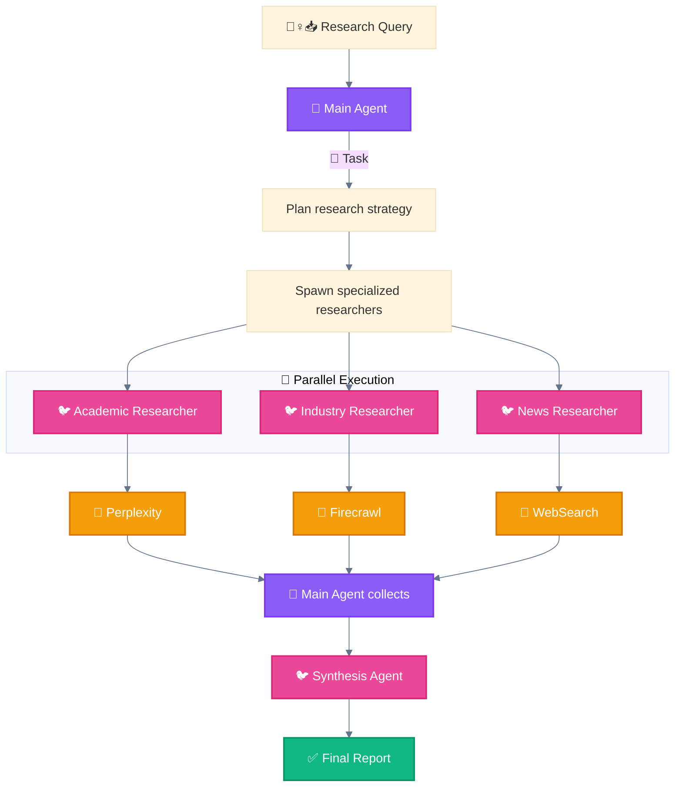

<div align="center">

[🏠 Home](../../README.md) • [📘 Guides](../README.md) • [🎯 Use Cases](./) • **Multi-Agent Research**

</div>

---

# Use Case: Multi-Agent Research System

> Source: [Anthropic Engineering Blog](https://www.anthropic.com/engineering/multi-agent-research-system) - June 2025

---

## Problem

Synthesizing comprehensive research from multiple sources requires:
- Parallel information gathering
- Domain specialization
- Quality synthesis

---

## Solution Architecture



---

## Patterns Used

| Pattern | Role |
|---------|------|
| 🦑 Orchestrator-Workers | 🐔 Main Agent spawns specialized researchers |
| 🚂 Parallel Tool Calling | Multiple researchers work simultaneously |
| 🧬 Master-Clone | Each researcher has isolated context |

---

## Implementation

### 🐔 Main Agent Prompt

```python
main_agent_prompt = """
You coordinate research by:
1. Breaking query into research domains
2. Spawning domain-specific researchers
3. Collecting and synthesizing results
"""
```

### 🐦 Researcher Subagent

```python
researcher_prompt = """
You research {domain} using available tools.
Return structured findings with citations.
"""
```

### Subagent Definition

```markdown
# .claude/agents/academic-researcher.md
---
name: academic-researcher
description: Researches academic papers and scholarly sources
tools: Read, WebFetch, WebSearch
model: sonnet
---

You are an academic research specialist. Your task is to:
1. Search for relevant academic papers
2. Extract key findings and citations
3. Return structured research notes

Focus on peer-reviewed sources and cite properly.
```

---

## Why This Works

| Aspect | Benefit |
|--------|---------|
| **Specialization** | Each subagent focuses on one domain |
| **Parallelism** | Independent searches run concurrently |
| **Isolation** | Subagents don't pollute each other's context |
| **Synthesis** | 🐔 Main Agent has full picture for final output |

---

## Flow Summary

```
🙋‍♀️📥 Research Query
    │
    ▼
🐔 Main Agent (Plan strategy)
    │
    ├──► 🐦 Academic Researcher ──► 🔌 Perplexity
    ├──► 🐦 Industry Researcher ──► 🔌 Firecrawl
    └──► 🐦 News Researcher ──► 🔌 WebSearch
            │
            ▼
    🐔 Main Agent (Collect results)
            │
            ▼
    🐦 Synthesis Agent
            │
            ▼
    ✅ Final Report
```

---

<div align="center">

**━━━━━━━━━━━━━━━━━━━━━━━━━━━━━━━━━━━━━━━━━━━━━━━━**

[🎯 Use Cases](./) • [Production Code Review →](production-code-review.md)

</div>
