<div align="center">

[🏠 Home](../../README.md) • [📘 Guides](../README.md) • [🎯 Use Cases](./) • **Multi-Locale Generation**

</div>

---

# Use Case: Multi-Locale Content Generation

> Source: AthenaKNW project architecture

---

## Problem

Generate localized content for 200 locales:
- Primary locales set the standard
- Variants document differences
- Content must be unique (< 70% similarity)

---

## Solution Architecture

```mermaid
%%{init: {'theme': 'base', 'themeVariables': {'lineColor': '#64748b'}}}%%
flowchart TB
    classDef wizard fill:#14b8a6,stroke:#0d9488,stroke-width:2px,color:#ffffff
    classDef subagent fill:#ec4899,stroke:#db2777,stroke-width:2px,color:#ffffff
    classDef checkpoint fill:#f59e0b,stroke:#d97706,stroke-width:2px,color:#ffffff
    classDef state fill:#10b981,stroke:#059669,stroke-width:2px,color:#ffffff

    CMD["🦴 /generate fr"] --> WIZARD["🧙 Confirm Scope"]:::wizard

    WIZARD -->|"❓ User approves"| PRIMARY["🐦 Generate fr-FR"]:::subagent

    PRIMARY --> CHECK1["🖥️ Checkpoint"]:::checkpoint
    CHECK1 --> VARIANTS["🧬 Master-Clone Variants"]

    subgraph ISOLATED["Isolated Contexts"]
        V1["🐦 fr-CA"]:::subagent
        V2["🐦 fr-BE"]:::subagent
        V3["🐦 fr-CH"]:::subagent
    end

    VARIANTS --> V1 & V2 & V3
    V1 & V2 & V3 --> CHECK2["🖥️ Validation"]:::checkpoint
    CHECK2 --> DONE["✅ 4 locales generated"]:::state
```



---

## Patterns Used

| Stage | Pattern | Purpose |
|-------|---------|---------|
| Entry | 🧙 Wizard Workflows | Confirm scope before generation |
| Primary | 🦑 Orchestrator-Workers | Generate reference locale |
| Variants | 🧬 Master-Clone | Parallel, isolated generation |
| Throughout | 🖥️ Multi-Window Context | Resume on interruption |

---

## Key Constraints

```
⚠️ Variants use `differs_from: fr-FR` to document differences
⚠️ Each file must be standalone useful
⚠️ Similarity between same-language locales < 70%
```

---

## Implementation

### Slash Command

```markdown
# .claude/commands/generate.md
---
description: Generate localization files for specified locales
argument-hint: [locale]
---

Generate localization files for: $ARGUMENTS

1. First, identify if this is a single locale or language cluster
2. Check LOCALES-200.csv for valid locales
3. If language cluster (e.g., "fr"), generate all related locales
4. Generate primary locale first, then variants
5. Validate similarity < 70%
```

### Primary Generator Subagent

```markdown
# .claude/agents/locale-generator.md
---
name: locale-generator
description: Generates primary locale content
tools: Read, Write, Grep, Glob
model: opus
permissionMode: acceptEdits
---

Generate comprehensive content for the specified locale.
This content serves as the reference for all variants.

Output structure:
- locale/{code}/content.md
- locale/{code}/metadata.yaml
```

### Variant Generator

```markdown
# .claude/agents/variant-generator.md
---
name: variant-generator
description: Generates locale variants based on primary
tools: Read, Write, Grep, Glob
model: sonnet
permissionMode: acceptEdits
---

Generate variant content that:
1. References primary locale as baseline
2. Documents specific differences
3. Is standalone useful
4. Maintains < 70% similarity
```

---

## Workflow Flow

```
🙋‍♀️📥 /generate fr
        │
        ▼
🧙 Wizard: "Generate fr-FR, fr-CA, fr-BE, fr-CH?"
        │
   [User confirms]
        │
        ▼
🐦 Generate fr-FR (primary)
        │
        ▼
🖥️ Checkpoint 1
        │
        ▼
┌───────┼───────┐
│       │       │
▼       ▼       ▼
🐦 fr-CA  🐦 fr-BE  🐦 fr-CH
        │
        ▼
🖥️ Validation Checkpoint
        │
        ▼
✅ 4 locales generated
```

---

## Checkpoint Structure

```json
{
  "workflow_id": "gen_fr_2025_001",
  "language_cluster": "fr",
  "primary_locale": "fr-FR",
  "primary_status": "completed",
  "variants": {
    "fr-CA": "pending",
    "fr-BE": "pending",
    "fr-CH": "pending"
  },
  "current_phase": "variants",
  "resume_point": "checkpoint_1"
}
```

---

<div align="center">

**━━━━━━━━━━━━━━━━━━━━━━━━━━━━━━━━━━━━━━━━━━━━━━━━**

[← Production Code Review](production-code-review.md) • [🎯 Use Cases](./) • [Personal Assistant →](intelligent-personal-assistant.md)

</div>
