<div align="center">

[🏠 Home](../../README.md) • [📘 Guides](../README.md) • [🎯 Use Cases](./) • **Production Code Review**

</div>

---

# Use Case: Production Code Review

> Source: Derived from Anthropic patterns + VoltAgent community

---

## Problem

Large PRs need multiple review perspectives:
- Security vulnerabilities
- Performance bottlenecks
- Style consistency
- Test coverage

---

## Solution Architecture

```mermaid
%%{init: {'theme': 'base', 'themeVariables': {'lineColor': '#64748b'}}}%%
flowchart TB
    classDef main fill:#8b5cf6,stroke:#7c3aed,stroke-width:2px,color:#ffffff
    classDef subagent fill:#ec4899,stroke:#db2777,stroke-width:2px,color:#ffffff
    classDef parallel fill:#3b82f6,stroke:#2563eb,stroke-width:2px,color:#ffffff
    classDef state fill:#10b981,stroke:#059669,stroke-width:2px,color:#ffffff

    PR["🙋‍♀️📥 PR Submitted"] --> ORCH["🐔 Review Orchestrator"]:::main

    ORCH -->|"Analyze scope"| SIZE{PR Size?}

    SIZE -->|"Small"| DIRECT["🏎️ Direct Review"]
    SIZE -->|"Medium"| PARALLEL["🚂 Parallel Read"]:::parallel
    SIZE -->|"Large"| SUBAGENT["🦑 Specialized Reviews"]

    subgraph SPECIALISTS["Specialist Subagents"]
        SEC["🐦 Security"]:::subagent
        PERF["🐦 Performance"]:::subagent
        STYLE["🐦 Style"]:::subagent
        TEST["🐦 Test Coverage"]:::subagent
    end

    SUBAGENT --> SEC & PERF & STYLE & TEST
    SEC & PERF & STYLE & TEST --> MERGE["🐔 Merge Findings"]:::main
    MERGE --> REPORT["✅ Review Report"]:::state

    DIRECT --> REPORT
    PARALLEL --> REPORT
```



---

## Patterns by PR Size

| PR Size | Files | Pattern | Rationale |
|---------|-------|---------|-----------|
| Small | 1-3 | 🏎️ Direct Execution | No overhead needed |
| Medium | 4-10 | 🚂 Parallel Tool Calling | Read all files concurrently |
| Large | 10+ | 🦑 Orchestrator-Workers | Specialized reviewers |

---

## Subagent Definitions

### Security Reviewer

```markdown
# .claude/agents/security-reviewer.md
---
name: security-reviewer
description: Reviews code for OWASP Top 10 and security vulnerabilities
tools: Read, Grep, Glob
model: sonnet
---

Focus on:
- SQL injection, XSS, command injection
- Authentication/authorization flaws
- Sensitive data exposure
- Dependency vulnerabilities

Return findings in format:
- **Severity**: Critical/High/Medium/Low
- **Location**: file:line
- **Issue**: Description
- **Recommendation**: Fix suggestion
```

### Performance Reviewer

```markdown
# .claude/agents/performance-reviewer.md
---
name: performance-reviewer
description: Identifies performance bottlenecks and optimization opportunities
tools: Read, Grep, Glob
model: sonnet
---

Focus on:
- N+1 queries
- Memory leaks
- Inefficient algorithms
- Unnecessary re-renders (React)

Return findings with complexity analysis (O notation).
```

### Style Reviewer

```markdown
# .claude/agents/style-reviewer.md
---
name: style-reviewer
description: Ensures code follows project style guidelines
tools: Read, Grep, Glob
model: haiku
---

Check against:
- Naming conventions
- File organization
- Comment quality
- Consistent formatting
```

### Test Coverage Reviewer

```markdown
# .claude/agents/test-reviewer.md
---
name: test-reviewer
description: Evaluates test coverage and quality
tools: Read, Grep, Glob, Bash
model: sonnet
---

Evaluate:
- Coverage of new/changed code
- Edge case handling
- Test isolation
- Mocking appropriateness
```

---

## Orchestrator Logic

```python
def review_pr(pr_files):
    file_count = len(pr_files)

    if file_count <= 3:
        # Small PR: Direct review
        return direct_review(pr_files)

    elif file_count <= 10:
        # Medium PR: Parallel read
        return parallel_read_review(pr_files)

    else:
        # Large PR: Specialized subagents
        results = []
        results.append(Task("security-reviewer", pr_files))
        results.append(Task("performance-reviewer", pr_files))
        results.append(Task("style-reviewer", pr_files))
        results.append(Task("test-reviewer", pr_files))
        return merge_findings(results)
```

---

## Output Format

```markdown
# Code Review Report

## Summary
- Files reviewed: 24
- Critical issues: 2
- High issues: 5
- Medium issues: 12

## Security Findings
### Critical: SQL Injection in user_service.py:45
...

## Performance Findings
### High: N+1 Query in orders_controller.py:89
...

## Style Issues
...

## Test Coverage
- New code coverage: 78%
- Suggested additional tests: 3
```

---

<div align="center">

**━━━━━━━━━━━━━━━━━━━━━━━━━━━━━━━━━━━━━━━━━━━━━━━━**

[← Multi-Agent Research](multi-agent-research.md) • [🎯 Use Cases](./) • [Multi-Locale Generation →](multi-locale-generation.md)

</div>
