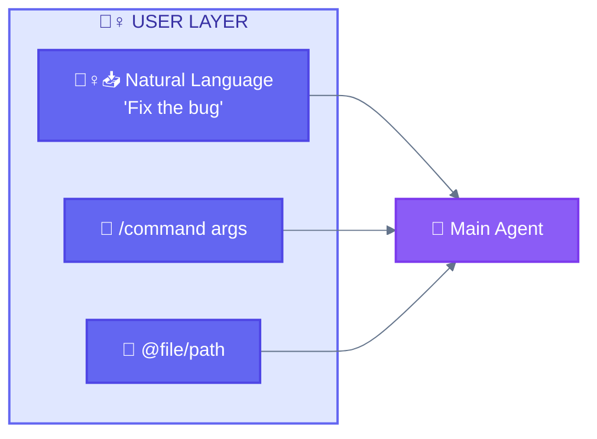

<div align="center">

[🏠 Home](../../README.md) • [🔧 Implementation](../README.md) • [🏛️ Architecture](./) • **🙋‍♀️ Layer 1: User**

</div>

---

# 🙋‍♀️ Layer 1: User Layer

> Entry point for all interactions with the system.

---

## Purpose

The User Layer is where all human interaction begins. It normalizes various input types before they reach the 🐔 Main Agent.

---

## Components

| Component | Emoji | Description | Example |
|-----------|-------|-------------|---------|
| **Natural Language** | 🙋‍♀️ | Free-form requests | "Fix the authentication bug" |
| **Slash Commands** | 🦴 | Structured invocations | `/generate fr-FR` |
| **File References** | 📁 | Code/doc references | `@src/auth.ts` |

---

## Diagram



---

## Key Behaviors

- All input normalized before reaching 🐔 Main Agent
- 🦴 Slash commands expand to full prompts
- File references inject content

---

## Input Types

### 🙋‍♀️📥 Natural Language

```
"Fix the authentication bug in the login module"
"Add dark mode support to the settings page"
"Refactor the payment service for better performance"
```

Free-form requests that Claude interprets and routes appropriately.

### 🦴 Slash Commands

```
/generate fr-FR          # Single locale
/generate fr es de       # Multiple locales
/review-pr 123          # Review PR
/deploy staging         # Deploy to environment
```

Structured commands that expand to predefined prompts with `$ARGUMENTS` substitution.

### 📁 File References

```
@src/auth.ts            # Reference specific file
@package.json           # Reference config file
@docs/api.md           # Reference documentation
```

File contents are injected into context for the 🐔 Main Agent.

---

## Layer Position

```
┌─────────────────────────────────────────────────────┐
│  🙋‍♀️ LAYER 1: USER LAYER  ◄─── YOU ARE HERE       │
│  Human input, 🦴 /commands, natural language        │
└─────────────────────────┬───────────────────────────┘
                          │
                          ▼
┌─────────────────────────────────────────────────────┐
│  🐔 LAYER 2: MAIN AGENT LAYER                       │
│  Claude Code - orchestration, decision-making       │
└─────────────────────────────────────────────────────┘
```

---

<div align="center">

**━━━━━━━━━━━━━━━━━━━━━━━━━━━━━━━━━━━━━━━━━━━━━━━━**

[🏛️ Architecture](./) • [🐔 Main Agent Layer →](02-main-agent-layer.md)

</div>
