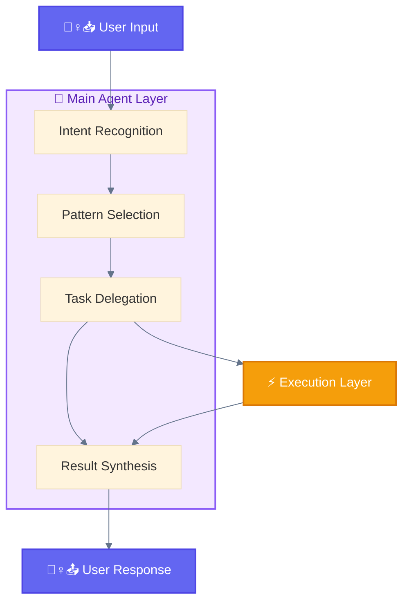
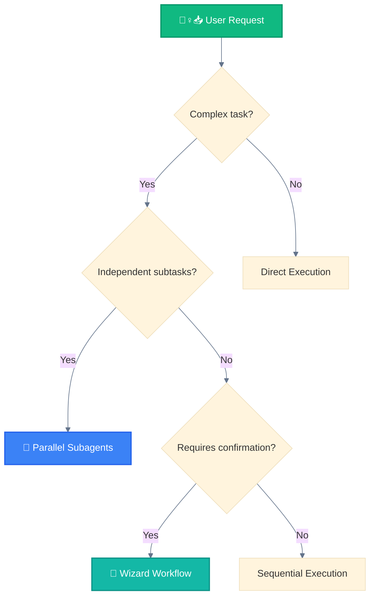

<div align="center">

[🏠 Home](../../README.md) • [🔧 Implementation](../README.md) • [🏛️ Architecture](./) • **🐔 Layer 2: Main Agent**

</div>

---

# 🐔 Layer 2: Main Agent Layer

> Central orchestrator that interprets intent and coordinates execution.

---

## Purpose

The Main Agent Layer is the brain of the system. It receives normalized input from the User Layer, determines the appropriate execution strategy, and coordinates all downstream work.

---

## Responsibilities

| Responsibility | Description |
|----------------|-------------|
| **Intent Recognition** | Understand what user wants |
| **Pattern Selection** | Choose appropriate execution pattern |
| **Task Delegation** | Spawn 🐦 subagents or use 🔧🔌💁‍♀️ tools |
| **Result Synthesis** | Combine results into coherent response |

---

## Critical Rule

> **The 🐔 Main Agent is the ONLY entity that can spawn 🐦 Subagents.**
>
> 🐦 Subagents cannot spawn other subagents. All delegation flows through the 🐔 Main Agent.

---

## Diagram



---

## Decision Points



---

## Processing Pipeline

### 1. Intent Recognition

```
Input: "Fix the login bug and add tests"
 │
 ├─► Bug fix task identified
 └─► Test addition task identified
```

### 2. Pattern Selection

| Scenario | Pattern Selected |
|----------|------------------|
| Single simple task | Direct Execution |
| Independent tasks | 🚂 Parallel Subagents |
| Dependent tasks | Sequential Chain |
| High-risk changes | 🧙 Wizard Confirmation |

### 3. Task Delegation

```python
# Simple task
🐔 Main Agent → 🔧 Built-in Tools

# Complex task
🐔 Main Agent → 🪺 Task(subagent_type="code-reviewer")

# Parallel tasks
🐔 Main Agent → [🪺 Task(...), 🪺 Task(...), 🪺 Task(...)]
```

### 4. Result Synthesis

```
🐦 Subagent 1 → Result 1 ─┐
🐦 Subagent 2 → Result 2 ─┼─► 🐔 Merge → 💁‍♀️📤 Final Response
🐦 Subagent 3 → Result 3 ─┘
```

---

## Layer Position

```
┌─────────────────────────────────────────────────────┐
│  🙋‍♀️ LAYER 1: USER LAYER                           │
│  Human input, 🦴 /commands, natural language        │
└─────────────────────────┬───────────────────────────┘
                          │
                          ▼
┌─────────────────────────────────────────────────────┐
│  🐔 LAYER 2: MAIN AGENT LAYER  ◄─── YOU ARE HERE   │
│  Claude Code - orchestration, decision-making       │
└─────────────────────────┬───────────────────────────┘
                          │
                          ▼
┌─────────────────────────────────────────────────────┐
│  🔀 LAYER 3: DELEGATION LAYER                       │
│  🦴 Slash Commands, 📚 Skills - workflow definition │
└─────────────────────────────────────────────────────┘
```

---

<div align="center">

**━━━━━━━━━━━━━━━━━━━━━━━━━━━━━━━━━━━━━━━━━━━━━━━━**

[← 🙋‍♀️ User Layer](01-user-layer.md) • [🏛️ Architecture](./) • [🔀 Delegation Layer →](03-delegation-layer.md)

</div>
