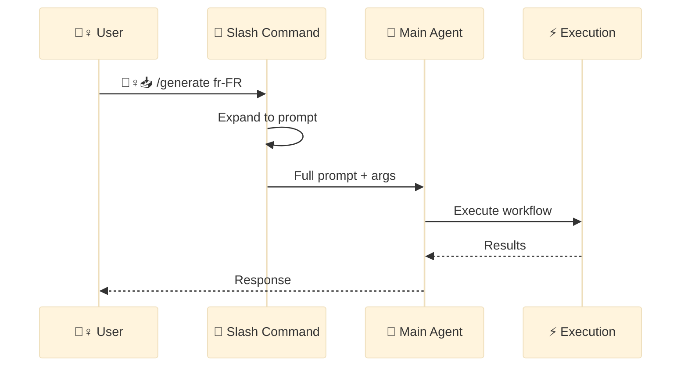
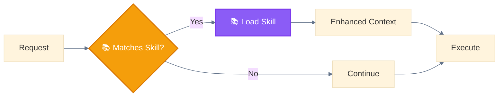

<div align="center">

[🏠 Home](../../README.md) › [🔧 Implementation](../README.md) › [🏛️ Architecture](./) › **🔀 Layer 3: Delegation**

[← 🐔 Main Agent Layer](02-main-agent-layer.md) ━━━━━━━━━━━━━━━●━━━━━━━━━━━━━━━━━━━━ [⚡ Execution Layer →](04-execution-layer.md)

</div>

---

# 🔀 Layer 3: Delegation Layer

> Defines workflows and provides reusable capabilities to the 🐔 Main Agent.

---

## Purpose

The Delegation Layer provides structured workflows (🦴 Slash Commands) and contextual methodologies (📚 Skills) that enhance the 🐔 Main Agent's capabilities.

---

## Components

| Component | Emoji | Role | Triggered By |
|-----------|-------|------|--------------|
| **Slash Commands** | 🦴 | Define multi-step workflows | User `/command` |
| **Skills** | 📚 | Provide methodologies | Context matching |

---

## 🦴 Slash Command Flow



### How Slash Commands Work

1. **User invokes**: `/generate fr-FR`
2. **System loads**: `.claude/commands/generate.md`
3. **Expands template**: `$ARGUMENTS` → `fr-FR`
4. **Passes to 🐔 Main Agent**: Full expanded prompt

### Example Command File

```markdown
# .claude/commands/generate.md

---
description: Generate localization files for specified locales
argument-hint: [locale]
---

Generate localization files for: $ARGUMENTS

1. Check LOCALES-200.csv for valid locales
2. Create files for each locale
3. Run validation
```

---

## 📚 Skill Loading



### How Skills Work

1. **Detection**: Claude analyzes request context
2. **Matching**: Compares against skill descriptions
3. **Loading**: Injects skill content into context
4. **Application**: Follows methodology during execution

### Example Skill File

```markdown
# .claude/skills/test-driven-development/SKILL.md

---
description: Use when implementing features - write tests first, then code
---

# Test-Driven Development

## Methodology
1. RED: Write a failing test
2. GREEN: Write minimal code to pass
3. REFACTOR: Clean up while tests pass
```

---

## Delegation vs Execution

| Aspect | 🔀 Delegation Layer | ⚡ Execution Layer |
|--------|---------------------|-------------------|
| **What it does** | Defines HOW to do things | Actually DOES things |
| **Components** | 🦴 Commands, 📚 Skills | 🐦 Subagents, 🔧🔌💁‍♀️ Tools |
| **Nature** | Instructions, templates | Actions, operations |
| **Triggered by** | User or context | 🐔 Main Agent |

---

## Layer Position

```
┌─────────────────────────────────────────────────────┐
│  🐔 LAYER 2: MAIN AGENT LAYER                       │
│  Claude Code - orchestration, decision-making       │
└─────────────────────────┬───────────────────────────┘
                          │
                          ▼
┌─────────────────────────────────────────────────────┐
│  🔀 LAYER 3: DELEGATION LAYER  ◄─── YOU ARE HERE   │
│  🦴 Slash Commands, 📚 Skills - workflow definition │
└─────────────────────────┬───────────────────────────┘
                          │
                          ▼
┌─────────────────────────────────────────────────────┐
│  ⚡ LAYER 4: EXECUTION LAYER                        │
│  🐦 Subagents, 🔧 Built-in, 🔌 External, 💁‍♀️ User   │
└─────────────────────────────────────────────────────┘
```

---

<div align="center">

[← 🐔 Main Agent Layer](02-main-agent-layer.md) ━━━━━━━━━━━━━━━●━━━━━━━━━━━━━━━━━━━━ [⚡ Execution Layer →](04-execution-layer.md)

</div>
