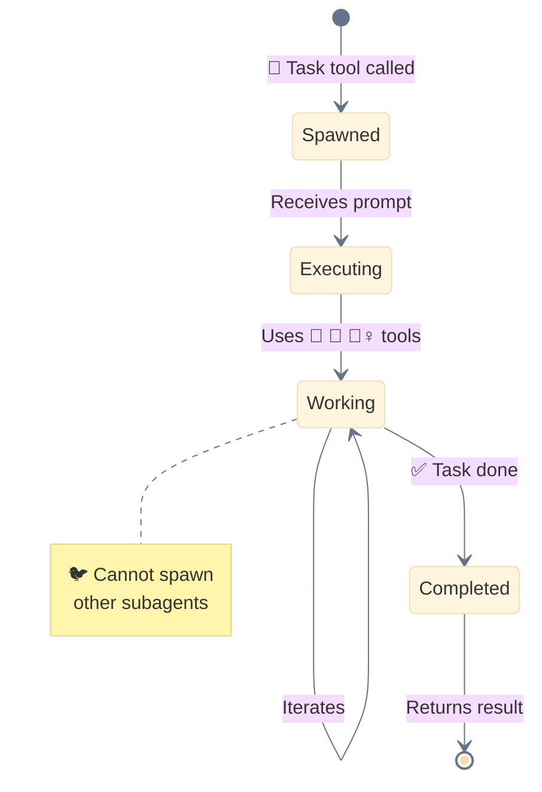
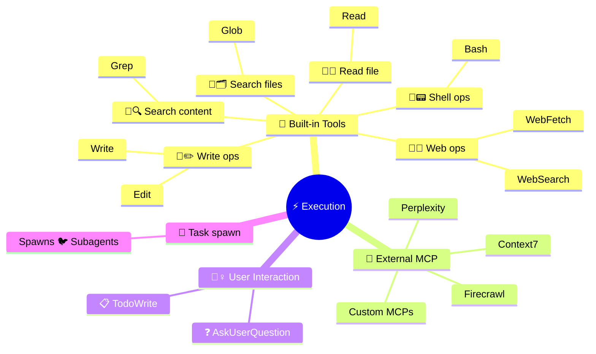
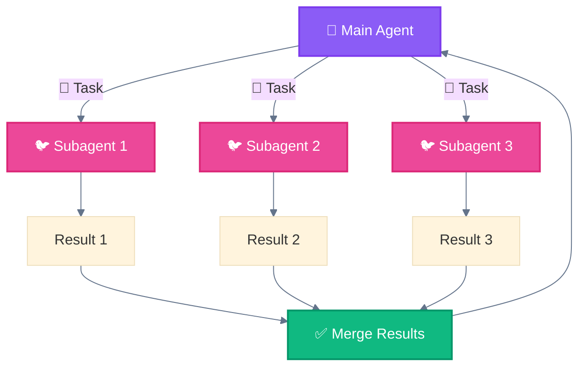

<div align="center">

[🏠 Home](../../README.md) • [🔧 Implementation](../README.md) • [🏛️ Architecture](./) • **⚡ Layer 4: Execution**

</div>

---

# ⚡ Layer 4: Execution Layer

> Where actual work happens - code execution, file operations, API calls.

---

## Purpose

The Execution Layer performs the actual work. It contains all the tools and subagents that carry out tasks delegated by the 🐔 Main Agent.

---

## Components

| Component | Emoji | Function | Spawned By |
|-----------|-------|----------|------------|
| **Subagents** | 🐦 | Autonomous task execution | Task tool (🪺 spawn) |
| **Built-in Tools** | 🔧 | Core operations (Read, Write, Bash...) | 🐔 Main Agent / 🐦 Subagents |
| **MCP Tools** | 🔌 | External services (Context7, Perplexity...) | 🐔 Main Agent / 🐦 Subagents |
| **User Interaction** | 💁‍♀️ | Human-in-the-loop (❓ AskUser, 📋 Todo) | 🐔 Main Agent / 🐦 Subagents |

---

## 🐦 Subagent Lifecycle



---

## Tool Categories



---

## 🔧 Built-in Tools Reference

| Tool | Emoji | Operation |
|------|-------|-----------|
| `Read` | 🔧👀 | Read file contents |
| `Write` | 🔧✏️ | Create/overwrite files |
| `Edit` | 🔧✏️ | Modify existing files |
| `Glob` | 🔧🗂️ | Search files by pattern |
| `Grep` | 🔧🔍 | Search content in files |
| `Bash` | 🔧📟 | Execute shell commands |
| `WebFetch` | 🔧🌐 | Fetch URL content |
| `WebSearch` | 🔧🌐 | Search the web |

---

## 🔌 MCP Tools (External)

| Tool | Purpose |
|------|---------|
| **Context7** | Up-to-date library documentation |
| **Perplexity** | AI-powered web search |
| **Firecrawl** | Web scraping and crawling |
| **Custom MCPs** | Project-specific integrations |

---

## 💁‍♀️ User Interaction Tools

| Tool | Emoji | Purpose |
|------|-------|---------|
| `AskUserQuestion` | ❓ | Request clarification |
| `TodoWrite` | 📋 | Track task progress |

---

## 🚂 Parallel Execution



### Parallel Execution Rules

1. **Independence**: Tasks must not depend on each other
2. **No Cross-Communication**: 🐦 Subagents cannot communicate directly
3. **Single Orchestrator**: Only 🐔 Main Agent coordinates
4. **Result Aggregation**: All results flow back to 🐔 Main Agent

---

## Critical Rule

> **🐦 Subagents CANNOT spawn other 🐦 Subagents.**
>
> All delegation must flow through the 🐔 Main Agent.

### ❌ Wrong Pattern

```
🐔 Main Agent → 🐦 Subagent 1 → 🐦 Subagent 2  ❌ INVALID
```

### ✅ Correct Pattern

```
🐔 Main Agent → 🐦 Subagent 1
              → 🐦 Subagent 2
              → 🐦 Subagent 3
```

---

## Layer Position

```
┌─────────────────────────────────────────────────────┐
│  🔀 LAYER 3: DELEGATION LAYER                       │
│  🦴 Slash Commands, 📚 Skills - workflow definition │
└─────────────────────────┬───────────────────────────┘
                          │
                          ▼
┌─────────────────────────────────────────────────────┐
│  ⚡ LAYER 4: EXECUTION LAYER  ◄─── YOU ARE HERE    │
│  🐦 Subagents, 🔧 Built-in, 🔌 External, 💁‍♀️ User   │
└─────────────────────────┬───────────────────────────┘
                          │
                          ▼
┌─────────────────────────────────────────────────────┐
│  💾 LAYER 5: STATE LAYER                            │
│  Memory, Files, Context - persistence               │
└─────────────────────────────────────────────────────┘
```

---

<div align="center">

**━━━━━━━━━━━━━━━━━━━━━━━━━━━━━━━━━━━━━━━━━━━━━━━━**

[← 🔀 Delegation Layer](03-delegation-layer.md) • [🏛️ Architecture](./) • [💾 State Layer →](05-state-layer.md)

</div>
