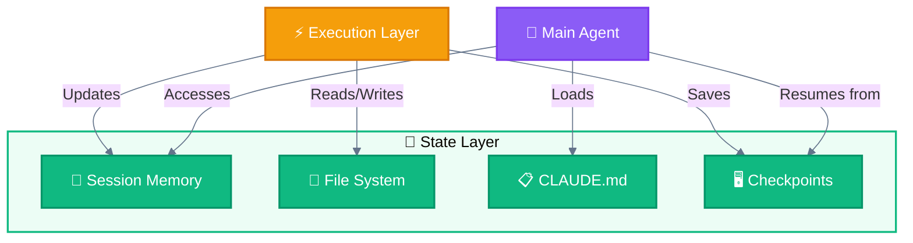
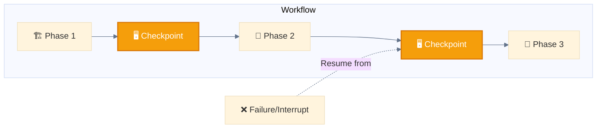
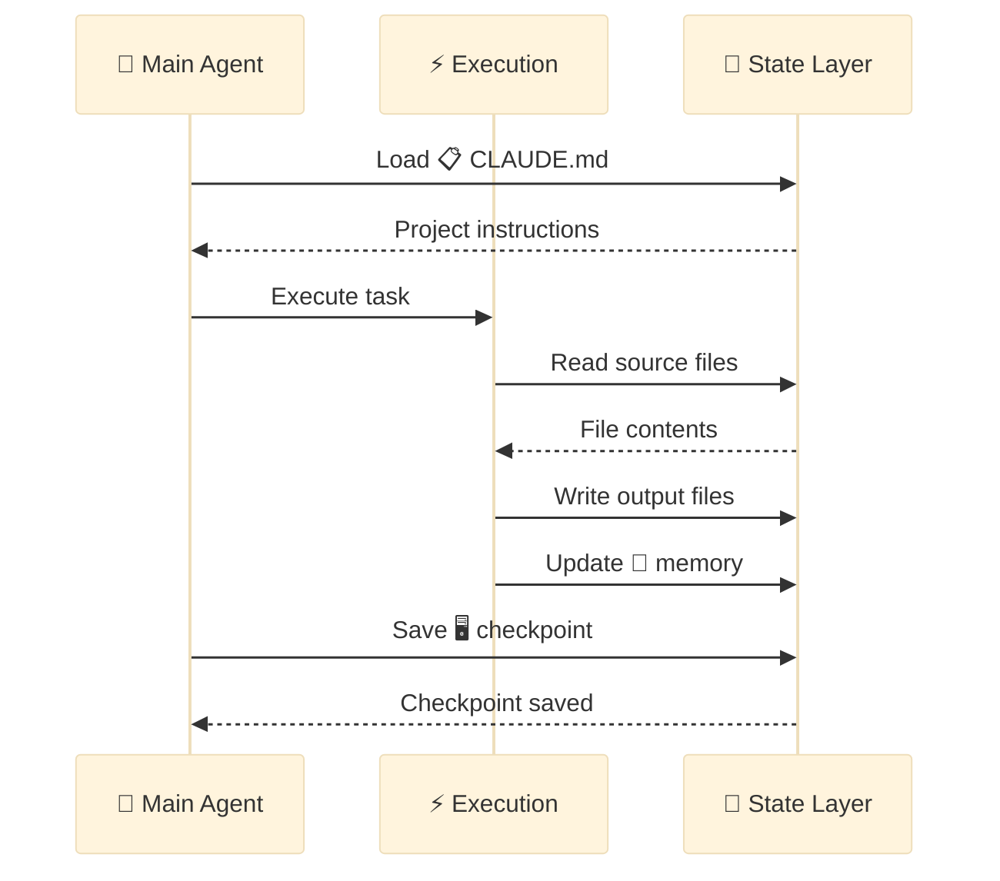

<div align="center">

[🏠 Home](../../README.md) • [🔧 Implementation](../README.md) • [🏛️ Architecture](./) • **💾 Layer 5: State**

</div>

---

# 💾 Layer 5: State Layer

> Persistence, memory, and context management across interactions.

---

## Purpose

The State Layer manages all persistent data and context. It enables sessions to maintain state, resume from interruptions, and share information across components.

---

## Components

| Component | Emoji | Type | Scope |
|-----------|-------|------|-------|
| **Memory** | 💾 | In-session context | Conversation |
| **Files** | 📁 | Persistent storage | Project |
| **CLAUDE.md** | 📋 | Project instructions | Project |
| **Checkpoints** | 🖥️ | Resume points | Workflow |

---

## State Flow Diagram



---

## 💾 Session Memory

In-session context that persists throughout a conversation.

### What It Stores

- Conversation history
- Current task state
- Intermediate results
- User preferences from session

### Scope

- **Lifetime**: Single conversation session
- **Access**: 🐔 Main Agent and 🐦 Subagents
- **Persistence**: Lost when session ends

---

## 📁 File System

Persistent storage for project files and outputs.

### Operations

| Operation | Tool | Description |
|-----------|------|-------------|
| Read | 🔧👀 `Read` | Load file contents |
| Write | 🔧✏️ `Write` | Create/overwrite files |
| Edit | 🔧✏️ `Edit` | Modify existing files |
| Search | 🔧🗂️ `Glob` | Find files by pattern |
| Search | 🔧🔍 `Grep` | Find content in files |

### Scope

- **Lifetime**: Permanent (until deleted)
- **Access**: All layers via tools
- **Persistence**: Project-level

---

## 📋 CLAUDE.md

Project-specific instructions loaded at session start.

### Hierarchy

```
~/.claude/CLAUDE.md           # Global (user-level)
./CLAUDE.md                   # Project root
./src/CLAUDE.md              # Directory-specific
```

### Purpose

- Define project conventions
- Specify coding standards
- Configure tool preferences
- Set workflow defaults

---

## 🖥️ Checkpoints

Resume points for long-running workflows.



### Checkpoint Data Structure

```json
{
  "workflow_id": "wf_2025_001",
  "current_phase": 2,
  "completed_tasks": ["task_1", "task_2"],
  "pending_tasks": ["task_3", "task_4"],
  "state": {
    "variables": {},
    "context_summary": "..."
  },
  "resume_point": "checkpoint_2",
  "timestamp": "2025-11-28T10:00:00Z"
}
```

### Use Cases

| Scenario | Why Checkpoints? |
|----------|------------------|
| **Large-scale generation** | 1000+ files exceed context limits |
| **Long research tasks** | Days of research need persistence |
| **Multi-day workflows** | Cannot complete in single session |
| **Error recovery** | Resume after failures |
| **Team handoffs** | Different operators continue work |

---

## State Interaction Example



---

## Layer Position

```
┌─────────────────────────────────────────────────────┐
│  ⚡ LAYER 4: EXECUTION LAYER                        │
│  🐦 Subagents, 🔧 Built-in, 🔌 External, 💁‍♀️ User   │
└─────────────────────────┬───────────────────────────┘
                          │
                          ▼
┌─────────────────────────────────────────────────────┐
│  💾 LAYER 5: STATE LAYER  ◄─── YOU ARE HERE        │
│  Memory, Files, Context - persistence               │
└─────────────────────────────────────────────────────┘
```

---

<div align="center">

**━━━━━━━━━━━━━━━━━━━━━━━━━━━━━━━━━━━━━━━━━━━━━━━━**

[← ⚡ Execution Layer](04-execution-layer.md) • [🏛️ Architecture](./)

</div>
