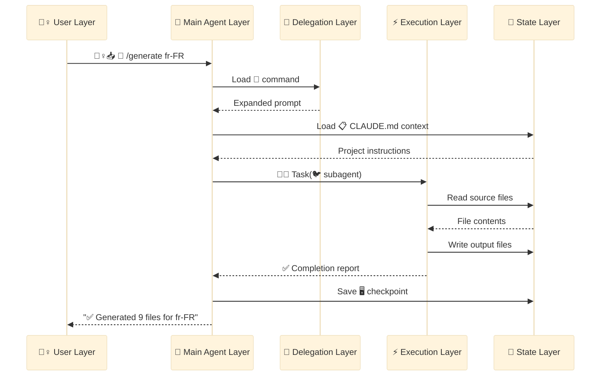
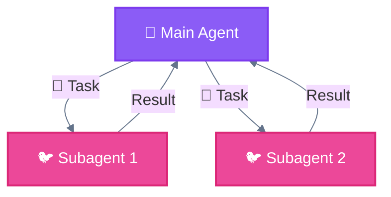

<div align="center">

[🏠 Home](../../README.md) • [🔧 Implementation](../README.md) • **🏛️ Architecture**

</div>

---

# Layer Architecture

> Understanding the 5-layer system architecture of Claude Code agentic systems

---

## Overview

Claude Code operates through a layered architecture where each layer has specific responsibilities and communication patterns.

```
┌─────────────────────────────────────────────────────────────────────────────┐
│                         5-LAYER ARCHITECTURE                                │
├─────────────────────────────────────────────────────────────────────────────┤
│                                                                             │
│  ┌─────────────────────────────────────────────────────────────────────┐   │
│  │  🙋‍♀️ LAYER 1: USER LAYER                                            │   │
│  │  Human input, 🦴 /commands, natural language prompts                │   │
│  └────────────────────────────────┬────────────────────────────────────┘   │
│                                   │                                         │
│                                   ▼                                         │
│  ┌─────────────────────────────────────────────────────────────────────┐   │
│  │  🐔 LAYER 2: MAIN AGENT LAYER                                       │   │
│  │  Claude Code - orchestration, decision-making, routing              │   │
│  └────────────────────────────────┬────────────────────────────────────┘   │
│                                   │                                         │
│                    ┌──────────────┼──────────────┐                         │
│                    ▼              ▼              ▼                          │
│  ┌─────────────────────────────────────────────────────────────────────┐   │
│  │  🔀 LAYER 3: DELEGATION LAYER                                       │   │
│  │  🦴 Slash Commands, 📚 Skills - workflow definition                 │   │
│  └────────────────────────────────┬────────────────────────────────────┘   │
│                                   │                                         │
│                                   ▼                                         │
│  ┌─────────────────────────────────────────────────────────────────────┐   │
│  │  ⚡ LAYER 4: EXECUTION LAYER                                        │   │
│  │  🐦 Subagents, 🔧 Built-in, 🔌 External (MCP), 💁‍♀️ Interaction        │   │
│  └────────────────────────────────┬────────────────────────────────────┘   │
│                                   │                                         │
│                                   ▼                                         │
│  ┌─────────────────────────────────────────────────────────────────────┐   │
│  │  💾 LAYER 5: STATE LAYER                                            │   │
│  │  Memory, Files, Context - persistence and state management          │   │
│  └─────────────────────────────────────────────────────────────────────┘   │
│                                                                             │
└─────────────────────────────────────────────────────────────────────────────┘
```

---

## Layer Index

| # | Layer | Emoji | File | Role |
|---|-------|-------|------|------|
| 1 | User Layer | 🙋‍♀️ | [01-user-layer.md](01-user-layer.md) | Entry point |
| 2 | Main Agent Layer | 🐔 | [02-main-agent-layer.md](02-main-agent-layer.md) | Orchestration |
| 3 | Delegation Layer | 🔀 | [03-delegation-layer.md](03-delegation-layer.md) | Workflow definition |
| 4 | Execution Layer | ⚡ | [04-execution-layer.md](04-execution-layer.md) | Actual work |
| 5 | State Layer | 💾 | [05-state-layer.md](05-state-layer.md) | Persistence |

---

## Layer Responsibilities Matrix

| Layer | Emoji | Input | Process | Output |
|-------|-------|-------|---------|--------|
| **User** | 🙋‍♀️ | Human action | Normalize | Prompt/Command |
| **Main Agent** | 🐔 | Prompt | Orchestrate | Delegation calls |
| **Delegation** | 🔀 | Command/Context | Define workflow | Structured task |
| **Execution** | ⚡ | Task | Execute (🔧🔌💁‍♀️) | Results |
| **State** | 💾 | Data | Persist | Stored state |

---

## Complete Layer Interaction



---

## Anti-Patterns

### ❌ Wrong: 🐦 Subagent Spawning 🐦 Subagent


### ✅ Correct: 🐔 Main Agent Orchestrates All



---

## Critical Rule

> **The 🐔 Main Agent is the ONLY entity that can spawn 🐦 Subagents.**
>
> 🐦 Subagents cannot spawn other subagents. All delegation flows through the 🐔 Main Agent.

---

<div align="center">

**━━━━━━━━━━━━━━━━━━━━━━━━━━━━━━━━━━━━━━━━━━━━━━━━**

[🔧 Implementation](../README.md) • [📦 Components](../components/)

</div>
