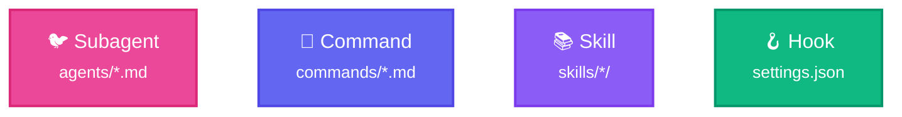
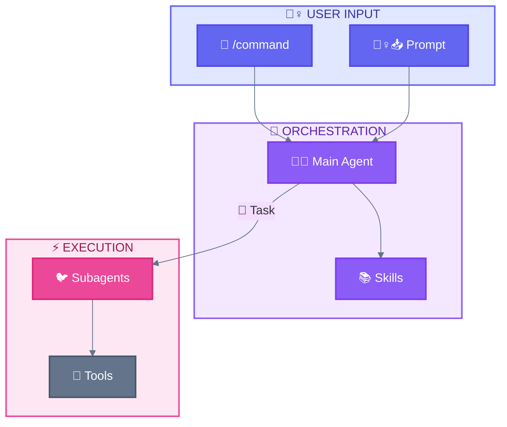

<div align="center">

[🏠 Home](../../README.md) • [🔧 Implementation](../README.md) • **📦 Components**

</div>

---

# Claude Code Components

> The 4 abstractions to organize agent capabilities

---

## Components Overview



---

## Component Index

| Component | Emoji | File | Purpose |
|-----------|-------|------|---------|
| **Subagent** | 🐦 | [subagent.md](subagent.md) | Autonomous execution |
| **Slash Command** | 🦴 | [slash-command.md](slash-command.md) | User-invoked workflows |
| **Skill** | 📚 | [skill.md](skill.md) | Reusable patterns |
| **Hook** | 🪝 | [hook.md](hook.md) | Automated triggers |

---

## Components Comparison

| Aspect | 🐦 Subagent | 🦴 Slash Command | 📚 Skill | 🪝 Hook |
|--------|-------------|------------------|----------|---------|
| **Invoked by** | Task (🪺) | 🙋‍♀️ User (`/`) | Context | Events |
| **Autonomy** | High | Low | Medium | Auto |
| **Context** | Isolated | Main | Main | System |
| **Spawn subagents** | ❌ | Via 🐔 | Via 🐔 | ❌ |
| **Location** | `agents/*.md` | `commands/*.md` | `skills/*/` | `settings.json` |

---

## Component Relationships



---

## File Location Reference

```
.claude/
├── agents/                    # 🐦 Subagent definitions
│   └── *.md                   # One file per subagent type
├── commands/                  # 🦴 Slash Command definitions
│   └── *.md                   # One file per command (name from filename)
├── skills/                    # 📚 Skill definitions
│   └── skill-name/            # One directory per skill (name from dir)
│       └── SKILL.md           # Skill content
└── settings.json              # 🪝 Hooks and configuration
```

---

<div align="center">

**━━━━━━━━━━━━━━━━━━━━━━━━━━━━━━━━━━━━━━━━━━━━━━━━**

[🔧 Implementation](../README.md) • [🏛️ Architecture](../architecture/)

</div>
