<div align="center">

[🏠 Home](../../README.md) • [🔧 Implementation](../README.md) • [📦 Components](./) • **🪝 Hook**

</div>

---

# 🪝 Hook

> A **Hook** is a shell command that executes automatically in response to specific Claude Code events.

---

## Key Characteristics

| Property | Value |
|----------|-------|
| **Invocation** | Automatic on event trigger |
| **Location** | `.claude/settings.json` |
| **Types** | `command` (shell) or `prompt` (LLM-based) |

---

## Configuration

```json
{
  "hooks": {
    "PreToolUse": [{
      "matcher": "Write",
      "hooks": [{ "type": "command", "command": "echo 'Writing...'" }]
    }],
    "PostToolUse": [{
      "matcher": "Bash",
      "hooks": [{ "type": "command", "command": "npm run lint --fix" }]
    }],
    "SessionStart": [{
      "hooks": [{ "type": "command", "command": "git status --short" }]
    }]
  }
}
```

---

## Mermaid Representation

```mermaid
%%{init: {'theme': 'base', 'themeVariables': {'lineColor': '#64748b'}}}%%
sequenceDiagram
    participant U as 🙋‍♀️ User
    participant H1 as 🪝 Pre-Hook
    participant A as 🐔 Main Agent
    participant T as 🔧 Tool
    participant H2 as 🪝 Post-Hook

    U->>H1: 🙋‍♀️📥 Prompt received
    H1->>A: Context injected
    A->>T: 🐔🔧 Execute tool
    T->>H2: Tool completed
    H2->>U: 💁‍♀️📤 Final response
```



---

## Hook Events

| Event | Trigger | Use Case | Example |
|-------|---------|----------|---------|
| `PreToolUse` | Before tool execution | Validation, security gates | Block writes to protected files |
| `PostToolUse` | After tool completion | Cleanup, formatting, logging | Auto-lint after file write |
| `PermissionRequest` | Permission dialogs | Auto-allow trusted tools | Skip prompts for Read operations |
| `UserPromptSubmit` | Before processing input | Pre-processing, context injection | Add project context to prompts |
| `SessionStart` | Session starts/resumes | Environment setup, status check | Run git status, check deps |
| `SessionEnd` | Session ends | Cleanup, reporting | Save session summary |
| `Stop` | Claude finishes response | Post-response actions | Notify completion |
| `SubagentStop` | Subagent completes | Subagent result handling | Log subagent outputs |
| `PreCompact` | Before context compaction | State preservation | Save important context |
| `Notification` | Notifications sent | Custom notification handling | Send to Slack/Discord |

---

### Event Examples

**PreToolUse: Block Protected Files**
```json
{
  "PreToolUse": [{
    "matcher": "Write|Edit",
    "hooks": [{
      "type": "command",
      "command": "if echo \"$TOOL_INPUT\" | grep -q '.env\\|secrets\\|credentials'; then echo 'BLOCK: Protected file'; exit 2; fi"
    }]
  }]
}
```

**PostToolUse: Auto-format on Save**
```json
{
  "PostToolUse": [{
    "matcher": "Write",
    "hooks": [{
      "type": "command",
      "command": "prettier --write \"$FILE_PATH\" 2>/dev/null || true"
    }]
  }]
}
```

**SessionStart: Project Context**
```json
{
  "SessionStart": [{
    "hooks": [{
      "type": "command",
      "command": "echo '=== Project Status ===' && git status -sb && echo '=== Recent Changes ===' && git log --oneline -3"
    }]
  }]
}
```

**UserPromptSubmit: Add Context**
```json
{
  "UserPromptSubmit": [{
    "hooks": [{
      "type": "prompt",
      "prompt": "Before processing, check if this request relates to our authentication system. If so, remind about our security requirements: all auth changes require review, no plaintext passwords, use bcrypt for hashing."
    }]
  }]
}
```

---

## Hook Types

### Command Hook

```json
{
  "type": "command",
  "command": "npm run lint --fix"
}
```

Executes a shell command directly.

### Prompt Hook

```json
{
  "type": "prompt",
  "prompt": "Check if this code follows our style guide"
}
```

Uses LLM (via Haiku) for context-aware evaluation.

### Prompt Hook: Security Review Before Write

```json
{
  "hooks": {
    "PreToolUse": [{
      "matcher": "Write|Edit",
      "hooks": [{
        "type": "prompt",
        "prompt": "Review this code change for security vulnerabilities. Check for: 1) SQL injection 2) XSS 3) Hardcoded secrets 4) Unsafe file operations. If any issues found, respond with 'BLOCK: <reason>'. Otherwise respond 'ALLOW'."
      }]
    }]
  }
}
```

**How it works:**
- Triggers before any Write or Edit operation
- Haiku evaluates the code change against security criteria
- Returns BLOCK or ALLOW decision
- Provides context-aware security gate without hardcoded rules

### Prompt Hook: Commit Message Quality Check

```json
{
  "hooks": {
    "PreToolUse": [{
      "matcher": "Bash",
      "hooks": [{
        "type": "prompt",
        "prompt": "If this is a git commit command, verify the commit message follows Conventional Commits format (type(scope): description). If invalid, suggest a better message. Otherwise, allow the command."
      }]
    }]
  }
}
```

---

## Matcher Patterns

```json
{
  "hooks": {
    "PreToolUse": [
      {
        "matcher": "Write",
        "hooks": [...]
      },
      {
        "matcher": "Edit",
        "hooks": [...]
      }
    ]
  }
}
```

- Match specific tools with `matcher`
- Omit `matcher` to match all tools
- Multiple matchers can be defined

---

## Example: Auto-lint on Write

```json
{
  "hooks": {
    "PostToolUse": [{
      "matcher": "Write",
      "hooks": [{
        "type": "command",
        "command": "npx eslint --fix $FILE_PATH"
      }]
    }]
  }
}
```

---

## Example: Git Status on Session Start

```json
{
  "hooks": {
    "SessionStart": [{
      "hooks": [{
        "type": "command",
        "command": "git status --short && git log --oneline -5"
      }]
    }]
  }
}
```

---

## Tips

- Use `PreToolUse` for validation/blocking
- Use `PostToolUse` for cleanup/formatting
- Consider performance impact of hooks
- Test hooks thoroughly before production

---

<div align="center">

**━━━━━━━━━━━━━━━━━━━━━━━━━━━━━━━━━━━━━━━━━━━━━━━━**

[← 📚 Skill](skill.md) • [📦 Components](./)

</div>
