<div align="center">

[🏠 Home](../../README.md) • [🔧 Implementation](../README.md) • [📦 Components](./) • **🪝 Hook**

</div>

---

# 🪝 Hook

> A **Hook** is a shell command that executes automatically in response to specific Claude Code events.

---

## Key Characteristics

| Property | Value |
|----------|-------|
| **Invocation** | Automatic on event trigger |
| **Location** | `.claude/settings.json` |
| **Types** | `command` (shell) or `prompt` (LLM-based) |

---

## Configuration

```json
{
  "hooks": {
    "PreToolUse": [{
      "matcher": "Write",
      "hooks": [{ "type": "command", "command": "echo 'Writing...'" }]
    }],
    "PostToolUse": [{
      "matcher": "Bash",
      "hooks": [{ "type": "command", "command": "npm run lint --fix" }]
    }],
    "SessionStart": [{
      "hooks": [{ "type": "command", "command": "git status --short" }]
    }]
  }
}
```

---

## Mermaid Representation

```mermaid
%%{init: {'theme': 'base', 'themeVariables': {'lineColor': '#64748b'}}}%%
sequenceDiagram
    participant U as 🙋‍♀️ User
    participant H1 as 🪝 Pre-Hook
    participant A as 🐔 Main Agent
    participant T as 🔧 Tool
    participant H2 as 🪝 Post-Hook

    U->>H1: 🙋‍♀️📥 Prompt received
    H1->>A: Context injected
    A->>T: 🐔🔧 Execute tool
    T->>H2: Tool completed
    H2->>U: 💁‍♀️📤 Final response
```



---

## Hook Events

| Event | Trigger | Use Case |
|-------|---------|----------|
| `PreToolUse` | Before tool execution | Validation, blocking |
| `PostToolUse` | After tool completion | Cleanup, formatting |
| `PermissionRequest` | Permission dialogs | Auto-allow/deny |
| `UserPromptSubmit` | Before processing input | Pre-processing |
| `SessionStart` | Session starts/resumes | Environment setup |
| `SessionEnd` | Session ends | Cleanup |
| `Stop` | Claude finishes | Post-response actions |
| `SubagentStop` | Subagent completes | Subagent cleanup |
| `PreCompact` | Before compact | Lifecycle management |
| `Notification` | Notifications sent | Custom notifications |

---

## Hook Types

### Command Hook

```json
{
  "type": "command",
  "command": "npm run lint --fix"
}
```

Executes a shell command directly.

### Prompt Hook

```json
{
  "type": "prompt",
  "prompt": "Check if this code follows our style guide"
}
```

Uses LLM (via Haiku) for context-aware evaluation.

---

## Matcher Patterns

```json
{
  "hooks": {
    "PreToolUse": [
      {
        "matcher": "Write",
        "hooks": [...]
      },
      {
        "matcher": "Edit",
        "hooks": [...]
      }
    ]
  }
}
```

- Match specific tools with `matcher`
- Omit `matcher` to match all tools
- Multiple matchers can be defined

---

## Example: Auto-lint on Write

```json
{
  "hooks": {
    "PostToolUse": [{
      "matcher": "Write",
      "hooks": [{
        "type": "command",
        "command": "npx eslint --fix $FILE_PATH"
      }]
    }]
  }
}
```

---

## Example: Git Status on Session Start

```json
{
  "hooks": {
    "SessionStart": [{
      "hooks": [{
        "type": "command",
        "command": "git status --short && git log --oneline -5"
      }]
    }]
  }
}
```

---

## Tips

- Use `PreToolUse` for validation/blocking
- Use `PostToolUse` for cleanup/formatting
- Consider performance impact of hooks
- Test hooks thoroughly before production

---

<div align="center">

**━━━━━━━━━━━━━━━━━━━━━━━━━━━━━━━━━━━━━━━━━━━━━━━━**

[← 📚 Skill](skill.md) • [📦 Components](./)

</div>
