<div align="center">

[🏠 Home](../../README.md) • [🔧 Implementation](../README.md) • [📦 Components](./) • **🦴 Slash Command**

</div>

---

# 🦴 Slash Command

> A **Slash Command** is a user-invokable workflow that starts with `/` and triggers predefined prompt sequences.

---

## Key Characteristics

| Property | Value |
|----------|-------|
| **Invocation** | 🙋‍♀️ User types `/command-name` |
| **Location** | `.claude/commands/*.md` |
| **Variables** | `$ARGUMENTS` for user input |
| **Execution** | Synchronous, within main conversation |

---

## File Structure

```markdown
# .claude/commands/generate.md

---
description: Generate localization files for specified locales
argument-hint: [locale]
---

Generate localization files for: $ARGUMENTS

1. First, identify if this is a single locale or language cluster
2. Check LOCALES-200.csv for valid locales
3. ...
```

> **Note**: Command name comes from filename (`generate.md` → `/generate`).

---

## Frontmatter Reference

| Field | Required | Description |
|-------|----------|-------------|
| `description` | Recommended | Brief description (shown in `/help`) |
| `argument-hint` | No | Expected arguments hint |
| `allowed-tools` | No | Tools without permission prompts |
| `model` | No | Specific model to use |
| `disable-model-invocation` | No | Prevent programmatic invocation |

---

## Usage Examples

```bash
/generate fr-FR              # Single locale
/generate fr                 # Language cluster
/generate fr es de           # Multiple clusters
```

---

## Mermaid Representation

```mermaid
%%{init: {'theme': 'base', 'themeVariables': {'lineColor': '#64748b'}}}%%
flowchart LR
    classDef user fill:#6366f1,stroke:#4f46e5,stroke-width:2px,color:#ffffff
    classDef main fill:#8b5cf6,stroke:#7c3aed,stroke-width:2px,color:#ffffff

    U["🙋‍♀️📥 /generate fr-FR"]:::user --> CMD["🦴 Slash Command"]:::user
    CMD --> MA["🐔💭 Main Agent"]:::main
    MA --> W["Workflow Execution"]
    W --> R["💁‍♀️📤 Result"]
```



---

## Advanced: Nested Commands

Commands can reference other files in the `.claude/commands/` directory:

```markdown
# .claude/commands/full-review.md

---
description: Run comprehensive review pipeline
---

Execute the following reviews in sequence:
1. First run /security-review on $ARGUMENTS
2. Then run /performance-review on the same files
3. Finally run /style-check
```

---

## Tips

- Keep commands focused on single concerns
- Use `argument-hint` for better discoverability
- Consider permission modes for destructive operations
- Document expected inputs and outputs

---

<div align="center">

**━━━━━━━━━━━━━━━━━━━━━━━━━━━━━━━━━━━━━━━━━━━━━━━━**

[← 🐦 Subagent](subagent.md) • [📦 Components](./) • [📚 Skill →](skill.md)

</div>
