<div align="center">

[🏠 Home](../../README.md) • [🔧 Implementation](../README.md) • [📦 Components](./) • **🐦 Subagent**

</div>

---

# 🐦 Subagent

> A **Subagent** is an independent worker spawned by the 🐔 Main Agent via the `Task` tool (🪺 spawn action) to handle specific, isolated tasks.

---

## Key Characteristics

| Property | Value |
|----------|-------|
| **Invocation** | `Task` tool with `subagent_type` parameter (🪺 spawn) |
| **Location** | `.claude/agents/*.md` |
| **Autonomy** | Full - executes independently |
| **Spawning** | ❌ Cannot spawn other subagents |
| **Context** | Isolated from main conversation |
| **Permissions** | Controlled via `permissionMode` frontmatter |

---

## File Structure

```markdown
# .claude/agents/code-reviewer.md

---
name: code-reviewer
description: Reviews code for quality, security, and best practices
tools: Read, Write, Grep, Glob
model: sonnet
permissionMode: acceptEdits
skills: test-driven-development, code-review
---

You are a code review specialist. Your task is to...
```

> **Note**: `tools` and `skills` are comma-separated strings, not YAML lists.

---

## Frontmatter Reference

| Field | Required | Description |
|-------|----------|-------------|
| `name` | Yes | Unique identifier (lowercase, hyphens) |
| `description` | Yes | Natural language description for discovery |
| `tools` | No | Comma-separated tool list. Omit to inherit all tools |
| `model` | No | `sonnet`, `opus`, `haiku`, or `inherit` (default: configured subagent model) |
| `permissionMode` | No | Controls permission handling (see below) |
| `skills` | No | Comma-separated skill names to auto-load |

---

## Permission Modes

| Mode | Behavior | Use Case |
|------|----------|----------|
| `default` | Asks permission for each tool | Read-only, validation |
| `acceptEdits` | Auto-approves Write/Edit | Generation after 🧙 user confirmation |
| `bypassPermissions` | All tools auto-approved | Trusted autonomous workflows |
| `plan` | Read-only planning mode | Research without modifications |
| `ignore` | Skip permission prompts entirely | Batch processing |

> **Best Practice**: Use `acceptEdits` after 🧙 Wizard confirmation to enable autonomous generation without repeated permission prompts.

---

## Usage Example

```python
# 🐔 Main Agent 🪺 spawns 🐦 subagent via Task tool
Task(
    subagent_type="code-reviewer",
    prompt="Review the authentication module for security issues"
)
```

---

## Mermaid Representation

```mermaid
%%{init: {'theme': 'base', 'themeVariables': {'lineColor': '#64748b'}}}%%
sequenceDiagram
    participant U as 🙋‍♀️ User
    participant MA as 🐔 Main Agent
    participant SA as 🐦 Subagent
    participant T as 🔧 Tools

    U->>MA: "Review my code"
    MA->>SA: 🪺 Task(subagent_type="code-reviewer")
    SA->>T: Read, Grep, Glob
    T-->>SA: Results
    SA-->>MA: 🐦📤 Review Report
    MA-->>U: 💁‍♀️📤 "Here's the review..."
```



---

## Built-in Subagents

| Subagent | Model | Tools | Purpose |
|----------|-------|-------|---------|
| **General-purpose** | Sonnet | All tools | Complex multi-step tasks |
| **Plan** | Sonnet | Read, Glob, Grep, Bash | Research (read-only) |
| **Explore** | Haiku | Glob, Grep, Read, Bash | Fast codebase searching |

**Explore Thoroughness:** `quick` → `medium` → `very thorough`

---

## Resumable Subagents

```python
# Initial invocation returns agentId
Task(subagent_type="code-analyzer", prompt="Review auth module")
# Returns: agentId = "abc123"

# Resume with previous context
Task(
    subagent_type="code-analyzer",
    prompt="Now analyze authorization logic",
    resume="abc123"
)
```

---

## Critical Rule

> **🐦 Subagents cannot spawn other subagents.**
>
> All delegation must go through the 🐔 Main Agent.

---

<div align="center">

**━━━━━━━━━━━━━━━━━━━━━━━━━━━━━━━━━━━━━━━━━━━━━━━━**

[📦 Components](./) • [🦴 Slash Command →](slash-command.md)

</div>
