# Pattern 3: Parallel Tool Calling


-✅-10b981?style=flat-square)
-✅_ParallelAgent-10b981?style=flat-square)


> Maximize performance by executing independent tool calls simultaneously.

---

## Overview

Claude 4.x models excel at parallel tool execution. When multiple operations have no dependencies, executing them in parallel dramatically reduces latency and improves efficiency.

## Sequential vs Parallel

```mermaid
%%{init: {'theme': 'base', 'themeVariables': { 'primaryColor': '#8b5cf6', 'primaryTextColor': '#ffffff', 'primaryBorderColor': '#7c3aed', 'lineColor': '#a78bfa'}}}%%
flowchart LR
    subgraph Sequential["🐢 Sequential - Slow"]
        S1[📄 Read file1] --> S2[📄 Read file2] --> S3[📄 Read file3]
        S4["⏱️ ~3 round trips<br/>~3x latency"]
    end

    subgraph Parallel["🚀 Parallel - Fast"]
        P1[📄 Read file1]
        P2[📄 Read file2]
        P3[📄 Read file3]
        P4["⚡ ~1 round trip<br/>~1x latency"]
    end

    P1 & P2 & P3 --> P4

    style Sequential fill:#ef4444,stroke:#dc2626,stroke-width:2px,color:#ffffff
    style Parallel fill:#10b981,stroke:#059669,stroke-width:2px,color:#ffffff
```



## Decision Flow

```mermaid
%%{init: {'theme': 'base', 'themeVariables': { 'primaryColor': '#8b5cf6', 'primaryTextColor': '#ffffff', 'primaryBorderColor': '#7c3aed', 'lineColor': '#a78bfa'}}}%%
flowchart TD
    Start[🎯 Multiple Tool Calls Needed]:::startNode --> Check{🔍 Dependencies<br/>between calls?}:::decisionNode

    Check -->|No dependencies| Parallel[🚀 Execute in Parallel]:::parallelNode
    Check -->|Has dependencies| Sequential[📋 Execute Sequentially]:::seqNode

    Parallel --> PE["✅ Example:<br/>Read 5 files simultaneously"]:::exampleNode
    Sequential --> SE["✅ Example:<br/>mkdir && cp files"]:::exampleNode

    PE --> Done[📊 Aggregate Results]:::resultNode
    SE --> Done

    classDef startNode fill:#6366f1,stroke:#4f46e5,stroke-width:2px,color:#ffffff
    classDef decisionNode fill:#f59e0b,stroke:#d97706,stroke-width:2px,color:#ffffff
    classDef parallelNode fill:#10b981,stroke:#059669,stroke-width:2px,color:#ffffff
    classDef seqNode fill:#8b5cf6,stroke:#7c3aed,stroke-width:2px,color:#ffffff
    classDef exampleNode fill:#ec4899,stroke:#db2777,stroke-width:2px,color:#ffffff
    classDef resultNode fill:#14b8a6,stroke:#0d9488,stroke-width:2px,color:#ffffff
```



## When to Parallelize

### Parallelize (No Dependencies)

| Operation | Example |
|-----------|---------|
| Reading multiple files | `Read file1, file2, file3` |
| Searching different patterns | `Grep pattern1, pattern2` |
| Running independent commands | `git status`, `npm test` |
| Fetching multiple URLs | `WebFetch url1, url2` |

### Keep Sequential (Has Dependencies)

| Operation | Example |
|-----------|---------|
| Create then use | `mkdir dir && cp file dir/` |
| Write then read | `Write file && Read file` |
| Build then test | `npm build && npm test` |
| Commit flow | `git add && git commit && git push` |

## Configuration Prompt

Add this to your system prompt for maximum parallelization:

```xml
<use_parallel_tool_calls>
If you intend to call multiple tools and there are no dependencies
between the tool calls, make all of the independent calls in parallel.

Prioritize calling tools simultaneously whenever actions can be done
in parallel rather than sequentially.

Example: When reading 3 files, run 3 tool calls in parallel to read
all 3 files into context at the same time.

Maximize use of parallel tool calls where possible to increase speed
and efficiency.

However, if some tool calls depend on previous calls to inform
dependent values like parameters, do NOT call these tools in parallel
and instead call them sequentially.

Never use placeholders or guess missing parameters in tool calls.
</use_parallel_tool_calls>
```

## Reducing Parallelization

If parallel execution causes issues (e.g., rate limits, system bottlenecks):

```xml
<sequential_execution>
Execute operations sequentially with brief pauses between each step
to ensure stability. Only parallelize when explicitly beneficial.
</sequential_execution>
```

## Practical Examples

### Research Task


### Code Review


### Multi-File Edit

```mermaid
%%{init: {'theme': 'base', 'themeVariables': { 'primaryColor': '#8b5cf6', 'primaryTextColor': '#ffffff', 'primaryBorderColor': '#7c3aed', 'lineColor': '#a78bfa'}}}%%
flowchart TD
    Read["📖 Read all files (parallel)"]:::readNode
    Read --> R1[📄 file1.ts]:::fileNode
    Read --> R2[📄 file2.ts]:::fileNode
    Read --> R3[📄 file3.ts]:::fileNode

    R1 & R2 & R3 --> Analyze[🔍 Analyze patterns]:::analyzeNode
    Analyze --> Edit["✏️ Edit files (can be parallel<br/>if changes are independent)"]:::editNode

    classDef readNode fill:#6366f1,stroke:#4f46e5,stroke-width:2px,color:#ffffff
    classDef fileNode fill:#8b5cf6,stroke:#7c3aed,stroke-width:2px,color:#ffffff
    classDef analyzeNode fill:#f59e0b,stroke:#d97706,stroke-width:2px,color:#ffffff
    classDef editNode fill:#10b981,stroke:#059669,stroke-width:2px,color:#ffffff
```



## Claude 4.x Behavior

### Sonnet 4.5
- **Highly aggressive** parallel tool calling
- May fire multiple operations simultaneously by default
- Can bottleneck system performance if not managed

### Opus 4.5
- **Balanced** parallel execution
- More conservative than Sonnet
- Better at identifying true dependencies

## Performance Impact

| Scenario | Sequential | Parallel | Improvement |
|----------|------------|----------|-------------|
| Read 5 files | ~5 round trips | ~1 round trip | **5x faster** |
| Search 3 patterns | ~3 round trips | ~1 round trip | **3x faster** |
| Complex research | ~10 round trips | ~3-4 round trips | **2.5-3x faster** |

## Anti-Patterns

### Don't: Guess Missing Parameters

```
# BAD - Guessing file content before reading
Edit file.ts with changes based on assumed content

# GOOD - Read first, then edit
Read file.ts → Analyze → Edit file.ts
```

### Don't: Parallel Dependent Operations

```
# BAD - Parallel when dependent
mkdir new-dir | cp file.txt new-dir/

# GOOD - Sequential for dependencies
mkdir new-dir && cp file.txt new-dir/
```

### Don't: Over-Parallelize API Calls

```
# BAD - May hit rate limits
Parallel: 50 API calls simultaneously

# GOOD - Batch reasonably
Parallel: 5 API calls, then next 5, etc.
```

## Best Practices

### Do

- Parallelize all independent read operations
- Batch search queries when exploring codebases
- Run independent validation checks simultaneously
- Use parallel git commands for status gathering

### Don't

- Parallelize operations with data dependencies
- Guess or use placeholders for unknown parameters
- Over-parallelize to the point of system strain
- Ignore rate limits on external services

## SDK Example

```typescript
// Claude will automatically parallelize these independent reads
const result = await query({
  prompt: "Analyze the authentication system",
  // Claude identifies these as independent and runs in parallel:
  // - Glob for auth files
  // - Grep for 'password' patterns
  // - Read package.json for dependencies
});
```

---

## References

- [Claude 4.5 Best Practices: Parallel Tool Calling](https://docs.anthropic.com/docs/en/build-with-claude/prompt-engineering/claude-4-best-practices#optimize-parallel-tool-calling)
- [Anthropic Engineering: Advanced Tool Use](https://www.anthropic.com/engineering/advanced-tool-use)
