# Pattern 4: Master-Clone Architecture


-✅_Dynamic-10b981?style=flat-square)
-✅_Custom_agents-10b981?style=flat-square)


> Dynamic task delegation through self-spawning agents with full context inheritance.

---

## Overview

Instead of rigid custom subagents with predefined delegation rules, the Master-Clone pattern allows the main agent to dynamically spawn clones of itself. Each clone inherits full context (e.g., via `CLAUDE.md`) and can flexibly handle any task.

## Architecture



```mermaid
%%{init: {'theme': 'base', 'themeVariables': { 'primaryColor': '#8b5cf6', 'primaryTextColor': '#ffffff', 'primaryBorderColor': '#7c3aed', 'lineColor': '#a78bfa'}}}%%
flowchart TB
    subgraph Master["👑 Master Agent"]
        M1[📚 Full CLAUDE.md context]
        M2[🔍 Task Analysis]
        M3[🎛️ Clone Orchestration]
    end

    subgraph Clones["🧬 Spawned Clones"]
        C1["🔬 Clone 1<br/>Task: Research API"]
        C2["⚡ Clone 2<br/>Task: Implement feature"]
        C3["🧪 Clone 3<br/>Task: Write tests"]
    end

    subgraph Features["✨ Key Features"]
        F1[Dynamic spawning via Task tool]
        F2[Full context inheritance]
        F3[No rigid workflow definition]
        F4[Flexible task distribution]
    end

    M1 --> M2
    M2 --> M3
    M3 -->|spawn| C1 & C2 & C3
    C1 & C2 & C3 -->|results| M3

    Features -.-> Master

    style Master fill:#6366f1,stroke:#4f46e5,stroke-width:2px,color:#ffffff
    style Clones fill:#ec4899,stroke:#db2777,stroke-width:2px,color:#ffffff
    style Features fill:#10b981,stroke:#059669,stroke-width:2px,color:#ffffff
```

## Master-Clone vs Custom Subagents

```mermaid
%%{init: {'theme': 'base', 'themeVariables': { 'primaryColor': '#8b5cf6', 'primaryTextColor': '#ffffff', 'primaryBorderColor': '#7c3aed', 'lineColor': '#a78bfa'}}}%%
graph TB
    subgraph Custom["📦 Custom Subagents"]
        CS1[Rigid delegation rules]
        CS2[Predefined workflows]
        CS3[Manual configuration per agent]
        CS4[Limited to defined capabilities]
        CS5[Requires upfront design]
    end

    subgraph MasterClone["👑 Master-Clone"]
        MC1[Dynamic task assignment]
        MC2[Context-aware delegation]
        MC3[Self-organizing behavior]
        MC4[Maximum flexibility]
        MC5[Adapts to any task]
    end

    Custom -->|"🚀 Evolution"| MasterClone

    style Custom fill:#f59e0b,stroke:#d97706,stroke-width:2px,color:#ffffff
    style MasterClone fill:#10b981,stroke:#059669,stroke-width:2px,color:#ffffff
```



### Comparison Table

| Aspect | Custom Subagents | Master-Clone |
|--------|-----------------|--------------|
| **Configuration** | Explicit per agent | Inherited from master |
| **Task Matching** | Description-based | Dynamic analysis |
| **Flexibility** | Limited to design | Unlimited |
| **Context** | Isolated by design | Full inheritance |
| **Maintenance** | Update each agent | Update master only |
| **Use Case** | Known, repeatable tasks | Novel, complex workflows |

## When to Use

### Master-Clone (Preferred)

- Complex tasks requiring flexible decomposition
- Novel problems without predefined workflows
- Tasks needing full codebase context
- When you want maximum adaptability

### Custom Subagents (Alternative)

- Well-defined, repeatable workflows
- Security-critical tool restrictions
- Performance optimization (smaller context)
- Team standardization needs

## Implementation

### Basic Pattern

```mermaid
%%{init: {'theme': 'base', 'themeVariables': { 'primaryColor': '#8b5cf6', 'primaryTextColor': '#ffffff', 'primaryBorderColor': '#7c3aed', 'lineColor': '#a78bfa', 'actorBkg': '#6366f1', 'actorTextColor': '#ffffff', 'actorBorder': '#4f46e5', 'signalColor': '#a78bfa', 'activationBkgColor': '#c4b5fd', 'activationBorderColor': '#7c3aed'}}}%%
sequenceDiagram
    participant U as 👤 User
    participant M as 👑 Master Agent
    participant T as 🛠️ Task Tool
    participant C1 as 🧬 Clone 1
    participant C2 as 🧬 Clone 2

    U->>M: Complex request
    M->>M: Analyze and decompose

    par Parallel Clone Spawning
        M->>T: spawn Clone 1 for subtask A
        M->>T: spawn Clone 2 for subtask B
    end

    T->>C1: Execute with full context
    T->>C2: Execute with full context

    C1-->>M: Results A
    C2-->>M: Results B

    M->>M: Synthesize results
    M->>U: Complete response
```



### Using Task Tool

```typescript
// Master spawns clones via Task tool
Task({
  description: "Research authentication patterns",
  prompt: `
    You have full access to the codebase context.

    Research how authentication is currently implemented:
    1. Find all auth-related files
    2. Analyze the patterns used
    3. Document the flow

    Return a structured summary.
  `,
  subagent_type: "general-purpose"  // Clone with full capabilities
});
```

### Parallel Clone Spawning

```typescript
// Spawn multiple clones in parallel
// (All in single message for true parallelism)

Task({
  description: "Research API layer",
  prompt: "Analyze API endpoints and patterns...",
  subagent_type: "general-purpose"
});

Task({
  description: "Research data layer",
  prompt: "Analyze database models and queries...",
  subagent_type: "general-purpose"
});

Task({
  description: "Research test coverage",
  prompt: "Analyze test patterns and coverage...",
  subagent_type: "general-purpose"
});
```

## Context Inheritance

### CLAUDE.md as Context Source

```markdown
# Project Context (CLAUDE.md)

## Architecture
- TypeScript monorepo
- React frontend, Node backend
- PostgreSQL database

## Conventions
- Use functional components
- Prefer composition over inheritance
- Test with Jest + React Testing Library

## Key Files
- src/auth/* - Authentication system
- src/api/* - API routes
- src/db/* - Database models
```

Each spawned clone receives this full context, enabling informed decisions without explicit configuration.

## Advanced Patterns

### Hierarchical Clones

```mermaid
%%{init: {'theme': 'base', 'themeVariables': { 'primaryColor': '#8b5cf6', 'primaryTextColor': '#ffffff', 'primaryBorderColor': '#7c3aed', 'lineColor': '#a78bfa'}}}%%
flowchart TB
    M[👑 Master]:::masterNode --> C1[🎛️ Clone: Coordinator]:::coordNode
    C1 --> C1A[🔬 Sub-clone: Research]:::subNode
    C1 --> C1B[⚡ Sub-clone: Implement]:::subNode
    M --> C2[✅ Clone: Validator]:::validatorNode

    classDef masterNode fill:#6366f1,stroke:#4f46e5,stroke-width:3px,color:#ffffff
    classDef coordNode fill:#ec4899,stroke:#db2777,stroke-width:2px,color:#ffffff
    classDef subNode fill:#8b5cf6,stroke:#7c3aed,stroke-width:2px,color:#ffffff
    classDef validatorNode fill:#10b981,stroke:#059669,stroke-width:2px,color:#ffffff
```



### Iterative Refinement

```mermaid
%%{init: {'theme': 'base', 'themeVariables': { 'primaryColor': '#8b5cf6', 'primaryTextColor': '#ffffff', 'primaryBorderColor': '#7c3aed', 'lineColor': '#a78bfa'}}}%%
stateDiagram-v2
    [*] --> Master: 🚀 Start
    Master --> Clone1: 📝 Spawn for draft
    Clone1 --> Master: ✅ Return draft
    Master --> Clone2: 🔍 Spawn for review
    Clone2 --> Master: 💬 Return feedback
    Master --> Clone3: ✨ Spawn for refinement
    Clone3 --> Master: 🎯 Return final
    Master --> [*]: Complete
```



## Best Practices

### Do

- Use `general-purpose` subagent type for full capabilities
- Provide clear, specific prompts to clones
- Spawn clones in parallel when tasks are independent
- Let master synthesize and validate results

### Don't

- Over-decompose simple tasks
- Create artificial dependencies between clones
- Ignore clone results without synthesis
- Use Master-Clone for simple, well-defined tasks

## Trade-offs

| Advantage | Disadvantage |
|-----------|--------------|
| Maximum flexibility | Higher token usage |
| No upfront configuration | Less predictable behavior |
| Adapts to novel tasks | Harder to standardize |
| Full context in each clone | Potential context duplication |

## Combining with Other Patterns

### Master-Clone + Skills

Clones can leverage skills for specialized operations while maintaining full context.

### Master-Clone + Parallel Tools

Each clone can parallelize its own tool calls for maximum efficiency.

### Master-Clone + Wizard Workflow

Master can implement wizard-style checkpoints while delegating work to clones.

---

## References

- [How I Use Claude Code Features](https://blog.sshh.io/p/how-i-use-every-claude-code-feature) - Master-Clone architecture discussion
- [Claude Code: Task Tool](https://code.claude.com/docs/en/sub-agents)
