# Pattern 6: Programmatic Tool Orchestration


-✅-10b981?style=flat-square)
-✅_Workflow_Agents-10b981?style=flat-square)


> Write code to orchestrate multiple tool calls instead of sequential inference passes.

---

## Overview

Instead of invoking tools sequentially with multiple model inference passes, Claude can write Python scripts that orchestrate multiple tool calls in a sandboxed environment. This reduces latency, improves accuracy, and enables complex workflows with explicit control flow.

## Traditional vs Programmatic

```mermaid
%%{init: {'theme': 'base', 'themeVariables': { 'primaryColor': '#8b5cf6', 'primaryTextColor': '#ffffff', 'primaryBorderColor': '#7c3aed', 'lineColor': '#a78bfa'}}}%%
flowchart LR
    subgraph Traditional["🐢 Traditional - Multiple Inferences"]
        T1["🔄 Inference 1:<br/>Call tool 1"]
        T2["🔄 Inference 2:<br/>Call tool 2"]
        T3["🔄 Inference 3:<br/>Call tool 3"]
        T4["🔄 Inference 4:<br/>Synthesize"]
        T1 --> T2 --> T3 --> T4
    end

    subgraph Programmatic["🚀 Programmatic - Single Script"]
        P1[📝 Write Python script]
        P2[⚡ Script executes<br/>multiple tools]
        P3[📊 Return aggregated<br/>results]
        P1 --> P2 --> P3
    end

    style Traditional fill:#ef4444,stroke:#dc2626,stroke-width:2px,color:#ffffff
    style Programmatic fill:#10b981,stroke:#059669,stroke-width:2px,color:#ffffff
```



## Benefits

```mermaid
%%{init: {'theme': 'base', 'themeVariables': { 'primaryColor': '#8b5cf6', 'primaryTextColor': '#ffffff'}}}%%
mindmap
  root((🚀 Programmatic<br/>Orchestration))
    ⚡ Performance
      Reduced inference passes
      Lower latency
      Better accuracy
    🎛️ Control
      Explicit loops
      Conditionals
      Error handling
    🛡️ Reliability
      Deterministic execution
      No reasoning drift
      Predictable behavior
    📈 Efficiency
      Batch operations
      Parallel execution
      Resource optimization
```



| Benefit | Description |
|---------|-------------|
| **Reduced Inference** | Single script vs multiple round trips |
| **Explicit Control** | Loops, conditionals, error handling in code |
| **Deterministic** | Same input = same output (no reasoning variance) |
| **Complex Logic** | Patterns difficult to express via sequential calls |

## Example: Code Review Orchestrator

```python
# Claude generates and executes this script
import subprocess
import json

def run_tool(command):
    """Execute a tool command and return output."""
    result = subprocess.run(command, shell=True, capture_output=True, text=True)
    return result.stdout

def orchestrate_code_review():
    # Step 1: Get all changed files
    changed_files = run_tool("git diff --name-only main").strip().split('\n')

    results = []

    for file in changed_files:
        if not file.endswith(('.ts', '.js', '.py')):
            continue

        file_result = {
            "file": file,
            "issues": []
        }

        # Step 2: Read file content
        content = run_tool(f"cat {file}")

        # Step 3: Run linter
        lint_output = run_tool(f"eslint {file} --format json 2>/dev/null")
        if lint_output:
            try:
                lint_issues = json.loads(lint_output)
                file_result["lint"] = lint_issues
            except json.JSONDecodeError:
                file_result["lint"] = "Parse error"

        # Step 4: Check for security patterns
        security_patterns = ['eval(', 'exec(', 'dangerouslySetInnerHTML']
        for pattern in security_patterns:
            if pattern in content:
                file_result["issues"].append(f"Security: Found {pattern}")

        # Step 5: Check for TODO/FIXME
        todos = run_tool(f"grep -n 'TODO\\|FIXME' {file}")
        if todos:
            file_result["todos"] = todos.strip().split('\n')

        results.append(file_result)

    return results

# Execute and return results
review_results = orchestrate_code_review()
print(json.dumps(review_results, indent=2))
```

## Example: Data Processing Pipeline

```python
import json
import os

def process_data_files():
    """Process all JSON files in data/ directory."""

    data_dir = "data"
    output_dir = "processed"
    os.makedirs(output_dir, exist_ok=True)

    summary = {
        "processed": 0,
        "errors": 0,
        "total_records": 0
    }

    for filename in os.listdir(data_dir):
        if not filename.endswith('.json'):
            continue

        filepath = os.path.join(data_dir, filename)

        try:
            # Read and parse
            with open(filepath, 'r') as f:
                data = json.load(f)

            # Transform
            processed = []
            for record in data:
                # Apply transformations
                transformed = {
                    "id": record.get("id"),
                    "name": record.get("name", "").upper(),
                    "valid": bool(record.get("email"))
                }
                processed.append(transformed)

            # Write output
            output_path = os.path.join(output_dir, f"processed_{filename}")
            with open(output_path, 'w') as f:
                json.dump(processed, f, indent=2)

            summary["processed"] += 1
            summary["total_records"] += len(processed)

        except Exception as e:
            summary["errors"] += 1
            print(f"Error processing {filename}: {e}")

    return summary

result = process_data_files()
print(json.dumps(result, indent=2))
```

## When to Use

### Use Programmatic Orchestration

- **Batch operations** on multiple files/items
- **Complex conditionals** based on intermediate results
- **Retry logic** with error handling
- **Aggregation** of multiple tool outputs
- **Loops** with dynamic iteration
- **Performance-critical** workflows

### Keep Traditional Tool Calls

- **Simple single operations**
- **Interactive decisions** needed mid-flow
- **User confirmation** required between steps
- **Exploratory tasks** with uncertain paths

## Comparison

| Aspect | Traditional | Programmatic |
|--------|-------------|--------------|
| **Latency** | N × inference time | 1 × inference + execution |
| **Control Flow** | Implicit (model decides) | Explicit (code defines) |
| **Error Handling** | Model must reason | Standard try/catch |
| **Debugging** | Hard to trace | Standard debugging |
| **Reproducibility** | May vary | Deterministic |

## Advanced Patterns

### Parallel Execution in Script

```python
from concurrent.futures import ThreadPoolExecutor
import subprocess

def analyze_file(filepath):
    # Run analysis on single file
    return subprocess.run(
        f"analyze {filepath}",
        shell=True,
        capture_output=True,
        text=True
    ).stdout

def parallel_analysis(files):
    with ThreadPoolExecutor(max_workers=5) as executor:
        results = list(executor.map(analyze_file, files))
    return results
```

### Pipeline Pattern

```python
def pipeline(data):
    """Process data through multiple stages."""

    # Stage 1: Validate
    validated = [item for item in data if validate(item)]

    # Stage 2: Transform
    transformed = [transform(item) for item in validated]

    # Stage 3: Enrich
    enriched = [enrich(item) for item in transformed]

    # Stage 4: Filter
    final = [item for item in enriched if meets_criteria(item)]

    return final
```

### State Machine

```python
class WorkflowStateMachine:
    def __init__(self):
        self.state = "init"
        self.data = {}

    def transition(self, event):
        transitions = {
            ("init", "start"): "collecting",
            ("collecting", "complete"): "processing",
            ("processing", "done"): "finished",
            ("processing", "error"): "error_handling",
            ("error_handling", "retry"): "processing",
        }

        next_state = transitions.get((self.state, event))
        if next_state:
            self.state = next_state
            return True
        return False

    def run(self):
        while self.state != "finished":
            if self.state == "collecting":
                self.data = self.collect_data()
                self.transition("complete")
            elif self.state == "processing":
                try:
                    self.process_data()
                    self.transition("done")
                except Exception:
                    self.transition("error")
            # ... etc
```

## Best Practices

### Do

- Keep scripts focused and single-purpose
- Include error handling for robustness
- Return structured JSON for easy parsing
- Use standard Python patterns
- Document complex logic

### Don't

- Write overly complex monolithic scripts
- Ignore error cases
- Use external dependencies not available
- Create side effects without clear intent

## Environment Constraints

| Platform | Available | Notes |
|----------|-----------|-------|
| **Claude.ai** | Yes | Sandboxed Python environment |
| **API** | Yes | Code execution tool required |
| **Claude Code** | Yes | Full system access |

---

## References

- [Anthropic Engineering: Advanced Tool Use](https://www.anthropic.com/engineering/advanced-tool-use)
- [Code Execution Tool](https://docs.anthropic.com/docs/en/agents-and-tools/tool-use/code-execution-tool)
