# Pattern 7: Wizard-Style Workflows


-⚠️-f59e0b?style=flat-square)
-✅_Tool_Confirm-10b981?style=flat-square)
-10b981?style=flat-square)


> **Partial support on some platforms**: Claude, Gemini ADK, and LangGraph have native human-in-the-loop. Others require custom implementation.

> Multi-step processes with explicit user confirmation at each phase.

---

## Overview

Wizard-style workflows break complex tasks into discrete steps with explicit user confirmation between phases. This pattern is ideal for guided processes where user input, validation, or approval is needed at checkpoints.

## Architecture

```mermaid
%%{init: {'theme': 'base', 'themeVariables': { 'primaryColor': '#8b5cf6', 'primaryTextColor': '#ffffff', 'primaryBorderColor': '#7c3aed', 'lineColor': '#a78bfa'}}}%%
stateDiagram-v2
    [*] --> Analysis: 📥 User Request

    Analysis --> Confirmation1: 📊 Present findings
    Confirmation1 --> Planning: ✅ User approves
    Confirmation1 --> Analysis: 🔄 User requests changes

    Planning --> Confirmation2: 📋 Present plan
    Confirmation2 --> Implementation: ✅ User approves
    Confirmation2 --> Planning: 🔄 User requests changes

    Implementation --> Confirmation3: 👀 Show changes
    Confirmation3 --> Verification: ✅ User approves
    Confirmation3 --> Implementation: 🔄 User requests changes

    Verification --> [*]: 🎉 Complete
```



## Typical Workflow Phases


## When to Use

### Good Fit for Wizard Pattern

| Scenario | Why |
|----------|-----|
| **Destructive operations** | User should confirm before data loss |
| **Complex refactoring** | Plan review prevents wrong direction |
| **Deployment pipelines** | Checkpoints catch issues early |
| **Data migrations** | Validation between stages |
| **Multi-stakeholder tasks** | Different approvers for different phases |

### Poor Fit for Wizard Pattern

| Scenario | Better Alternative |
|----------|-------------------|
| Simple single-step tasks | Direct execution |
| Exploratory research | Autonomous agent |
| Time-sensitive automation | Parallel execution |
| Repetitive batch operations | Programmatic orchestration |

## Implementation

### Basic Wizard Structure

```python
class WizardWorkflow:
    def __init__(self):
        self.phase = "analysis"
        self.context = {}
        self.history = []

    def run_phase(self):
        """Execute current phase and wait for confirmation."""

        if self.phase == "analysis":
            findings = self.analyze()
            return {
                "phase": "analysis",
                "findings": findings,
                "prompt": "Review findings. Approve to continue or request changes.",
                "options": ["approve", "modify", "cancel"]
            }

        elif self.phase == "planning":
            plan = self.create_plan()
            return {
                "phase": "planning",
                "plan": plan,
                "prompt": "Review plan. Approve to implement or request changes.",
                "options": ["approve", "modify", "cancel"]
            }

        elif self.phase == "implementation":
            changes = self.implement()
            return {
                "phase": "implementation",
                "changes": changes,
                "prompt": "Review changes. Approve to finalize or rollback.",
                "options": ["approve", "rollback", "cancel"]
            }

    def handle_response(self, response):
        """Process user response and transition state."""

        self.history.append({
            "phase": self.phase,
            "response": response
        })

        if response == "approve":
            self.advance_phase()
        elif response == "modify":
            # Stay in current phase with modifications
            pass
        elif response == "rollback":
            self.rollback()
        elif response == "cancel":
            self.cancel()

    def advance_phase(self):
        phases = ["analysis", "planning", "implementation", "verification", "complete"]
        current_idx = phases.index(self.phase)
        if current_idx < len(phases) - 1:
            self.phase = phases[current_idx + 1]
```

### Confirmation Points

```mermaid
%%{init: {'theme': 'base', 'themeVariables': { 'primaryColor': '#8b5cf6', 'primaryTextColor': '#ffffff', 'primaryBorderColor': '#7c3aed', 'lineColor': '#a78bfa'}}}%%
flowchart LR
    subgraph Checkpoint["🚦 Confirmation Checkpoint"]
        S[📊 Summary of work done]
        O[🔘 Options presented]
        W[⏳ Wait for user input]
    end

    Work[⚡ Phase Work]:::workNode --> Checkpoint
    Checkpoint --> Next[✅ Next Phase]:::nextNode
    Checkpoint --> Redo[🔄 Redo Phase]:::redoNode
    Checkpoint --> Cancel[❌ Cancel Workflow]:::cancelNode

    style Checkpoint fill:#f59e0b,stroke:#d97706,stroke-width:2px,color:#ffffff
    classDef workNode fill:#6366f1,stroke:#4f46e5,stroke-width:2px,color:#ffffff
    classDef nextNode fill:#10b981,stroke:#059669,stroke-width:2px,color:#ffffff
    classDef redoNode fill:#8b5cf6,stroke:#7c3aed,stroke-width:2px,color:#ffffff
    classDef cancelNode fill:#ef4444,stroke:#dc2626,stroke-width:2px,color:#ffffff
```



## Example: Database Migration Wizard

```markdown
## Phase 1: Analysis

I've analyzed your database schema and found:

**Tables to migrate**: 12
**Total records**: ~50,000
**Foreign key relationships**: 8
**Estimated time**: 5-10 minutes

**Potential issues identified**:
- `users.legacy_id` column has NULL values (235 records)
- `orders.status` uses string enum, new schema uses integer

**Options**:
1. **Approve** - Continue to planning phase
2. **Investigate** - Show me the problematic records
3. **Cancel** - Abort migration

---

## Phase 2: Planning (after approval)

**Migration Plan**:

1. Create backup of current database
2. Add new columns with defaults
3. Run data transformation scripts
4. Validate data integrity
5. Switch foreign keys
6. Remove legacy columns

**Rollback strategy**: Restore from backup created in step 1

**Options**:
1. **Approve** - Execute migration
2. **Modify** - Adjust the plan
3. **Cancel** - Abort migration
```

## Best Practices

### Phase Design

```mermaid
%%{init: {'theme': 'base', 'themeVariables': { 'primaryColor': '#8b5cf6', 'primaryTextColor': '#ffffff'}}}%%
mindmap
  root((🧙 Wizard Phases))
    🔍 Analysis
      Gather information
      Identify risks
      Present findings
    📋 Planning
      Detail steps
      Estimate impact
      Define rollback
    ⚡ Implementation
      Execute changes
      Log actions
      Handle errors
    ✅ Verification
      Validate results
      Run tests
      Document outcome
```



### Confirmation Prompts

**Good prompt**:
```
I've identified 3 security vulnerabilities in the auth module:

1. SQL injection in login query (CRITICAL)
2. Missing rate limiting (HIGH)
3. Weak password hashing (MEDIUM)

Estimated fix time: 2 hours

Options:
- [Approve] Continue with fixes
- [Details] Show me the vulnerable code
- [Prioritize] Fix critical only
- [Cancel] Stop and discuss
```

**Poor prompt**:
```
Found issues. Continue? (y/n)
```

### State Persistence

For long wizards, persist state between interactions:

```json
{
  "wizard_id": "migration-2025-01-15",
  "current_phase": "planning",
  "context": {
    "tables_analyzed": 12,
    "issues_found": 2,
    "user_decisions": [
      {"phase": "analysis", "decision": "approve", "timestamp": "..."}
    ]
  },
  "can_rollback": true
}
```

## Do's and Don'ts

### Do

- Provide clear summaries at each checkpoint
- Offer meaningful options (not just yes/no)
- Include rollback capability
- Show progress indicators
- Persist state for long workflows

### Don't

- Create too many micro-checkpoints
- Require approval for trivial steps
- Hide important information
- Make cancellation difficult
- Lose context between phases

## Combining with Other Patterns

### Wizard + Subagents

```mermaid
%%{init: {'theme': 'base', 'themeVariables': { 'primaryColor': '#8b5cf6', 'primaryTextColor': '#ffffff', 'primaryBorderColor': '#7c3aed', 'lineColor': '#a78bfa'}}}%%
flowchart TB
    W[🧙 Wizard Controller]:::wizardNode --> Phase1[🔍 Phase 1]:::phase1Node
    Phase1 --> |spawn| SA1[🤖 Analysis Subagent]:::subagentNode
    SA1 --> |results| W
    W --> Confirm1{✅ User Confirms}:::confirmNode
    Confirm1 --> Phase2[⚡ Phase 2]:::phase2Node
    Phase2 --> |spawn| SA2[🤖 Implementation Subagent]:::subagentNode

    classDef wizardNode fill:#6366f1,stroke:#4f46e5,stroke-width:3px,color:#ffffff
    classDef phase1Node fill:#8b5cf6,stroke:#7c3aed,stroke-width:2px,color:#ffffff
    classDef phase2Node fill:#ec4899,stroke:#db2777,stroke-width:2px,color:#ffffff
    classDef subagentNode fill:#14b8a6,stroke:#0d9488,stroke-width:2px,color:#ffffff
    classDef confirmNode fill:#f59e0b,stroke:#d97706,stroke-width:2px,color:#ffffff
```



### Wizard + Skills

Each phase can leverage specialized skills for its domain:

- Analysis phase → `code-analysis` skill
- Planning phase → `architecture` skill
- Implementation phase → `refactoring` skill

---

## References

- [Claude Code: Plan Mode](https://code.claude.com/docs/en/common-workflows#use-plan-mode-for-safe-code-analysis)
- [Agent Skills: Wizard Workflows](https://leehanchung.github.io/blogs/2025/10/26/claude-skills-deep-dive/)
